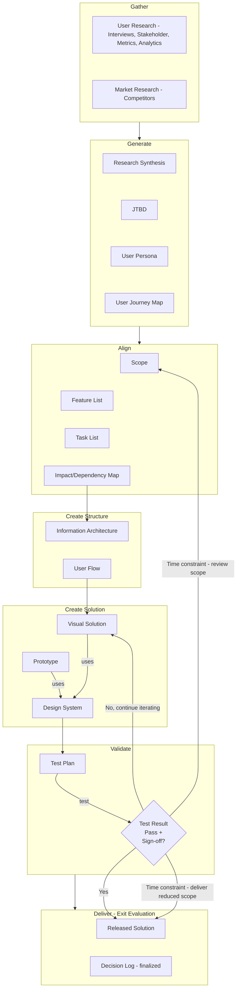

# DPA - Design Process for AI

Structured design process framework for teams building products with AI assistance.

## Process Flow

## Folder Structure

This directory contains design process guides and templates:

- **decision-log.md** - How to document design decisions and trade-offs
- **pr-workflow.md** - Pull request process for change request implementations
- **naming-conventions.md** - Code and file naming standards
- **visual-guidelines.md** - Design system visual standards
- **user-personas.md** - User persona documentation guide
- **competitive-analysis.md** - Competitive research framework
- **index.md** - Guide index and navigation

**Last Reviewed**: 2026-01-07

## Work Types & Entry Points

Different work types enter the process at different phases. All maintain same quality standards once engaged.

| Work Type | Entry Phase | Rationale |
|-----------|-------------|-----------|
| **New Feature** | Phase 1 (Discover) | Requires complete research foundation |
| **Redesign** | Phase 1 (Discover) | Verify existing research validity |
| **Enhancement** | Phase 2 (Define) | Leverage existing research, update scope |
| **Bug Fix** | Phase 3 (Explore) | Direct to solution, validate before ship |

**Rule:** Start where research/artifacts exist. Never skip validation.

## Phases

### Phase 1: Discover
Research and insight generation.

| Sub-Phase | Purpose | Artifacts | Output |
|-----------|---------|-----------|--------|
| **1.1 Gather** | Build research foundation | User Research (interviews, surveys, analytics) Market Research (competitors, trends) | `TBD` |
| **1.2 Generate** | Transform data into actionable insights | User Persona Journey Map JTBD | `TBD` |

### Phase 2: Define
Scope and structure.

| Sub-Phase | Purpose | Artifacts | Output |
|-----------|---------|-----------|--------|
| **2.1 Align** | Establish scope and priorities | Scope document Feature List Task List Impact/Dependency Map | `TBD` |
| **2.2 Create Structure** | Structure information for usability | Information Architecture User Flow | `TBD` |

### Phase 3: Explore
Design and validation.

| Sub-Phase | Purpose | Artifacts | Output |
|-----------|---------|-----------|--------|
| **3.1 Create Solution** | Create design solutions | Visual Solution Prototype Design System | `TBD` |
| **3.2 Validate** | Validate solution quality | Test Plan Results (pass/fail criteria) | `TBD` |

### Phase 4: Deliver
Ship and document.

| Sub-Phase | Purpose | Artifacts | Output |
|-----------|---------|-----------|--------|
| **4.1 Deliver** | Ship and capture decisions | Released Solution Decision Log | `[product]-decision-log.md` (living document, see Feedback Loops section) |

**Validate Decision Paths:**
- ✅ Pass → Phase 4 (Deliver)
- ❌ Fail → Phase 3 (Explore - Create Solution)
- ⏱️ Time constraint → Phase 2 (Define) or Phase 4 (Deliver)

## Feedback Loops & Artifact Updates

Iteration often reveals gaps in earlier work. Git handles all versioning.

### Artifact Updates

- Update in place (single file)
- Git commits track versions
- Meaningful commit messages
- Decision log documents rationale

**Key principles:**
- Single source of truth per artifact
- Full history in git commits
- Decision log captures why changes were made

### Decision Log Timing

The Decision Log is created early and updated continuously (not just Phase 4). While Phase 4 finalizes it, entries are added throughout:
- Phase 1 (Discover): Scope and prioritization decisions
- Phase 2 (Define): Feature inclusion/exclusion, architectural choices
- Phase 3 (Explore): Design patterns, constraint-driven changes
- Phase 4 (Deliver): Final trade-offs, what shipped vs deferred

See `docs/guides/decision-log.md` for workflow integration and examples.

### Common Feedback Triggers

| Trigger | Action | Document In |
|---------|--------|-------------|
| Prototype test reveals flow issue | Update user flow | Decision log |
| Flow exposes persona gap | Add persona variant | Decision log |
| Scope creep during design | Revise scope doc | Decision log |
| Tech constraint changes design | Update visuals, log trade-off | Decision log |

**Key:** Decision log captures all changes, rationale, and trade-offs regardless of artifact versioning approach.

## Usage

### For Designers
Use AI tools to accelerate each phase while maintaining design rigor. Store artifacts in corresponding folders for team visibility.

### For Teams
Shared structure ensures alignment. Each phase builds on previous, decision log captures rationale for future reference.

### AI Integration
AI assists with:
- Research synthesis (Gather)
- Persona generation (Generate)
- Prioritization analysis (Align)
- Wireframe iteration (Structure)
- Visual exploration (Solution)
- Test scenario creation (Validate)

## Getting Started

### Choose Your Entry Point

**Decision tree:**
- **No existing research/personas?** → Phase 1 (Discover)
- **No scope/feature set defined?** → Phase 2 (Define)
- **Small fix or iteration?** → Phase 3 (Explore)
- **New major feature?** → Phase 1 (Discover)

**Always validate before delivery.**

### Workflow

1. Create folder structure for your project
2. Identify work type, choose entry phase (see decision tree)
3. Complete artifacts before moving to next phase
4. Update earlier artifacts if gaps discovered (log in decision log)
5. Validate before delivery
6. Document all decisions and trade-offs in decision log
