# Guideline: Creating Information Architecture (IA) Maps for Change Requests

## Overview

This guideline provides a structured workflow for creating Information Architecture (IA) diagrams that show the impact of new features/change requests on existing app structure.

## Input

### Prerequisites

| Item | Required | Description |
|-------|-----------|-------------|
| **Current IA Map** | Yes | Existing IA diagram (e.g., `ooux-ia-flows/2-ia-map.md`) |
| **Change Request (CR) Number** | Yes | Identifier for the feature/change (e.g., CR05) |
| **Feature Name** | Yes | Human-readable feature description (e.g., "Multi-User Support") |
| **OOUX Artifacts** | Recommended | Framing, ideation, selection, design docs from CR folder |
| **User Flows** | Recommended | Existing user flows with new feature interactions |
| **Dot Map** | Recommended | Object model showing new/modified objects |
| **App Name/Prototype** | Yes | Name of the application (e.g., "Calo Tracker") |

### Source Files to Read

1. **Current IA Map:** `prototypes/[name]/outputs/ooux-ia-flows/2-ia-map.md`
2. **CR Design Artifacts:** `prototypes/[name]/outputs/CR[XX]-[feature-name]/`
   - `1-framing.md`
   - `2-ideation.md`
   - `3-select.md`
   - `4-design.md`
   - `5-user-flows.md` or `7-user-flows.md`
3. **User Flows:** `prototypes/[name]/outputs/ooux-ia-flows/3-user-flows.md`

### Questions to Answer Before Starting

- [ ] What new screens/routes are added?
- [ ] What existing screens are modified?
- [ ] What new objects/data models are introduced?
- [ ] What navigation paths change?
- [ ] What existing flows are enhanced?

---

## Command

### Step 1: Analyze Current IA

```bash
# Navigate to prototype directory
cd /path/to/prototypes/[prototype-name]

# Read current IA map
cat outputs/ooux-ia-flows/2-ia-map.md

# Read CR design artifacts
ls outputs/CR[XX]-[feature-name]/
```

### Step 2: Identify Changes

**Create Change Matrix:**

| Component | Type | Change | Location in IA |
|-----------|------|--------|-----------------|
| Header | 🆕 NEW | Profile Switcher dropdown |
| Portion Picker | ✏️ MODIFIED | Added "Log for Both" toggle |
| Add Partner | 🆕 NEW | New route `/add-partner` |

**Change Types:**
- 🆕 **NEW** - Entirely new component/screen/flow
- ✏️ **MODIFIED** - Existing component with changes
- ⚪ **UNCHANGED** - No changes (document for reference)

### Step 3: Create Mermaid Diagram

**Structure Template:**

```mermaid
flowchart TB
    subgraph ROOT["🏠 [App Name] - [Feature Name]"]
        direction TB

        %% AUTHENTICATION (Unchanged)
        subgraph AUTH["🔐 Authentication"]
            LOGIN["Sign In"]
            REGISTER["Create Account"]
            FORGOT["Forgot Password"]
            RESET["Reset Password"]
        end

        %% ONBOARDING (Unchanged)
        subgraph ONBOARDING["🎯 Getting Started"]
            WELCOME["Welcome"]
            NAME["Your Name"]
            GOAL["Choose Goal"]
            CALORIES["Set Daily Calories"]
        end

        %% MAIN APP (Modify as needed)
        subgraph MAIN["📱 Home (Add notes if modified)"]
            DASHBOARD["✏️ Home Dashboard"]

            %% HEADER - Add new elements
            subgraph HEADER["Header"]
                AVATAR["User Avatar"]
                NEW_HEADER["🆕 [New Header Element]"]
            end

            %% SECTIONS - Modify for feature
            subgraph SECTIONS["Quick Add"]
                TODAY["Today Progress"]
                FAVORITES["My Favorites"]
                NEW_SECTION["🆕 [New Section]"]
            end

            %% MODALS - Add new modals
            subgraph MODALS["Pop-ups"]
                PORTION["✏️ Choose Portion Size"]
                NEW_MODAL["🆕 [New Modal]"]
            end
        end

        %% 🆕 NEW: Add new top-level sections
        subgraph FEATURE["🆕 [Feature Name] Section"]
            NEW_PAGE["🆕 [New Page]"]
            EDIT_PAGE["🆕 [Edit Page]"]
        end

        %% PROFILE (Modify as needed)
        subgraph PROFILE["👤 Profile"]
            PROFILE_PAGE["Profile Page"]
            EDIT_PROFILE["Edit Profile"]
        end
    end

    %% AUTH FLOW (Unchanged)
    LOGIN --> REGISTER
    LOGIN --> FORGOT --> RESET
    LOGIN -->|success| WELCOME
    REGISTER -->|success| WELCOME

    %% ONBOARDING (Unchanged)
    WELCOME --> NAME --> GOAL --> CALORIES -->|complete| DASHBOARD

    %% Header Navigation
    DASHBOARD --> HEADER
    NEW_HEADER -->|action| DASHBOARD

    %% Dashboard to Sections
    DASHBOARD --> SECTIONS

    %% 🆕 ADD: New section connections
    NEW_SECTION -->|action| DASHBOARD

    %% Profile Flow
    DASHBOARD -->|avatar| PROFILE_PAGE --> EDIT_PROFILE
    PROFILE_PAGE -->|logout| LOGIN
    PROFILE_PAGE -->|Manage Feature| NEW_PAGE

    %% 🆕 ADD: Feature page connections
    NEW_PAGE -->|action| DASHBOARD
    NEW_PAGE -->|edit| EDIT_PAGE -->|save| DASHBOARD

    %% STYLING
    style DASHBOARD fill:#fff3cd,stroke:#ffc107,stroke-width:2px
    style NEW_HEADER fill:#d4edda,stroke:#28a745,stroke-width:3px
    style NEW_SECTION fill:#d4edda,stroke:#28a745,stroke-width:3px
    style NEW_MODAL fill:#d4edda,stroke:#28a745,stroke-width:3px
    style NEW_PAGE fill:#d4edda,stroke:#28a745,stroke-width:3px
```



**Styling Color Reference:**

| Type | CSS Color | Hex Code | Visual | Use for |
|------|-----------|-----------|--------|----------|
| **New (🆕)** | Light Green | `#d4edda` | 🟢 | NEW components/pages/flows |
| **Modified (✏️)** | Light Yellow/Orange | `#fff3cd` | 🟡 | MODIFIED components/pages/flows |
| **Unchanged** | Default Gray | (default) | ⚪ | Unchanged elements (no style) |
| **Info/Reference** | Light Blue | `#d1ecf1` | 🔵 | Secondary references |

**Apply styling:** `style [NODE_NAME] fill:[COLOR],stroke:[STROKE],stroke-width:[WIDTH]`

### Step 4: Create Output File

```bash
# Create output file
cat > outputs/ooux-ia-flows/2-ia-map-cr[XX].md << 'EOF'
[Content per Output template below]
EOF
```

---

## Output

### File Location

```
prototypes/[prototype-name]/outputs/ooux-ia-flows/2-ia-map-cr[XX].md
```

### File Structure

The output file must follow this exact structure (referenced from example: `2-ia-map-cr05.md`):

```markdown
# IA Map - [Prototype Name] with CR[XX] [Feature Name]

## Updated Information Architecture with [Feature Name]

[Mermaid diagram with TB flowchart]

---

## Summary of Changes

### 🆕 NEW Elements

| Component | Location | Purpose |
|-----------|----------|---------|
| **[New Element 1]** | [Location] | [Purpose] |
| **[New Element 2]** | [Location] | [Purpose] |

### ✏️ MODIFIED Elements

| Component | Change | Impact |
|-----------|--------|--------|
| **[Modified Element 1]** | [Description] | [Impact] |
| **[Modified Element 2]** | [Description] | [Impact] |

### Navigation Changes

| Navigation | Before | After |
|------------|--------|-------|
| [Navigation Path 1] | [Previous flow] | [New flow] |
| [Navigation Path 2] | [Previous flow] | [New flow] |

### Data Model Additions

```
[New Object 1]:
├── [field 1]
├── [field 2]
└── [field 3]

[Existing Object] (ENHANCED):
└── [new relationship/field]
```

---

## Route Structure Updates

| Route | Screen Name | Protection | Change | Purpose |
|-------|-------------|------------|--------|---------|
| `/[route]` | [Screen] | [Protection level] | 🆕 NEW | [Purpose] |
| `/[route]` | [Screen] | [Protection level] | ✏️ MODIFIED | [Purpose] |
| `/[route]` | [Screen] | [Protection level] | Unchanged | [Purpose] |

---

## Object Location Mapping Updates

| Object | Primary Location | Secondary Location(s) | Change | Access From |
|--------|------------------|----------------------|--------|-------------|
| **[Object 1]** | [Location] | [Secondary location] | 🆕 NEW | [Access path] |
| **[Object 2]** | [Location] | [Secondary location] | ✏️ MODIFIED | [Access path] |

---

## Screen Sections Updates

### [Screen Name] Sections

```
┌─────────────────────────────────────────────┐
│ [Header Section]                          │  ← [Change type]
├─────────────────────────────────────────────┤
│ [Content Section 1]                      │  ← [Change type]
├─────────────────────────────────────────────┤
│ [Content Section 2]                      │  ← [Change type]
└─────────────────────────────────────────────┘
```

### Pop-ups & Sheets (Enhanced)

| Name | Type | Trigger | Change | Purpose |
|------|------|---------|--------|---------|
| [Modal Name] | [Type] | [Trigger] | 🆕 NEW | [Purpose] |
| [Modal Name] | [Type] | [Trigger] | ✏️ ENHANCED | [Purpose] |

---

## Key Features Delivered

1. **[Feature 1]** - [Description]
2. **[Feature 2]** - [Description]
3. **[Feature 3]** - [Description]

---

## CR[XX] Implementation Notes

- **[Note 1]:** [Implementation detail]
- **[Note 2]:** [Implementation detail]
- **[Note 3]:** [Implementation detail]
```

### Validation Checklist

Before considering the IA map complete, verify:

- [ ] **Mermaid diagram renders correctly** in Markdown preview
- [ ] **All NEW elements** are styled green (`#d4edda`)
- [ ] **All MODIFIED elements** are styled yellow (`#fff3cd`)
- [ ] **All connections** flow logically (no orphaned nodes)
- [ ] **🆕/✏️ emojis** used consistently in summary tables
- [ ] **Route Structure table** includes all new routes
- [ ] **Object Location Mapping** shows where new objects live
- [ ] **Screen Sections** show visual layout with change indicators
- [ ] **Implementation Notes** include key technical details

### Common Mistakes to Avoid

| Mistake | Why It's Wrong | Fix |
|----------|----------------|-----|
| Using deeply nested subgraphs (4+ levels) | Breaks Mermaid rendering | Keep max 3 levels of nesting |
| Missing style definitions | Hard to identify changes | Apply `style` to all NEW/MODIFIED nodes |
| Not showing "Before → After" | No clear impact comparison | Include Navigation Changes table |
| Orphaned nodes | Indicates broken flow | Ensure all nodes have connections |
| Using emoji inside Mermaid node IDs | Rendering errors | Use emoji only in display text |
| Missing change indicators (🆕/✏️) | Unclear what changed | Add to all changed elements |

### Example Reference

See complete example: `/Users/nganpham/bambOO-land/prototypes/02a-ai-delegation/outputs/ooux-ia-flows/2-ia-map-cr05.md`

**Key patterns from example:**
- Clean 3-level nesting in Mermaid
- Clear NEW/MODIFIED styling
- Comprehensive summary tables
- Screen section ASCII diagrams
- Implementation notes for technical context

---

## Quick Reference: IA Map Command Flow

```bash
# 1. Navigate to project
cd /path/to/prototype

# 2. Read current IA
cat outputs/ooux-ia-flows/2-ia-map.md

# 3. Read CR artifacts
cat outputs/CR[XX]-[feature-name]/4-design.md
cat outputs/CR[XX]-[feature-name]/5-user-flows.md

# 4. Create new IA map
# [Manual editing based on template]

# 5. Verify rendering
# Open in Markdown preview tool or GitHub

# 6. Validate checklist
# [ ] All items checked
```

---

## Appendix: Mermaid Best Practices

### Flowchart Syntax

```mermaid
flowchart TB  # TB = Top-Bottom, LR = Left-Right
    subgraph NAME["Display Name"]
        direction TB  # Optional: override direction per subgraph
        NODE1["Label"]
    end

    NODE1 --> NODE2  # Arrow from 1 to 2
    NODE1 -->|label| NODE2  # Labeled connection

    style NODE1 fill:#d4edda,stroke:#28a745,stroke-width:2px
```

### Subgraph Guidelines

- **Max nesting:** 3 levels (ROOT → SECTION → SUBSECTION)
- **Direction:** `TB` (top-bottom) recommended for mobile app IA
- **Labels:** Use emoji + descriptive name in brackets
- **IDs:** Short, uppercase, no spaces

### Styling Guidelines

```mermaid
style [NODE_ID] fill:[COLOR],stroke:[STROKE_COLOR],stroke-width:[WIDTH]

# Color palette (hex codes)
GREEN_NEW = #d4edda
GREEN_STROKE = #28a745
YELLOW_MODIFIED = #fff3cd
YELLOW_STROKE = #ffc107
BLUE_INFO = #d1ecf1
BLUE_STROKE = #17a2b8
```

---

**Version:** 1.0
**Last Updated:** 2026-01-12
**Reference Example:** `2-ia-map-cr05.md`
