# User Flows: Multi-User Support

## Jobs-to-be-Done

| Job ID | Job Statement | Primary Objects | Key Actions |
|--------|---------------|-----------------|-------------|
| J1 | When I first use the app with my partner, I want to set up profiles, so that we can track separately | Profile, Household, Consent | create, grant |
| J2 | When we eat together, I want to log once for both of us, so that tracking is fast | Meal, SharedMeal | logForBoth |
| J3 | When I want to log my own meal, I want to switch to my profile quickly, so that data goes to the right place | Profile | switch |
| J4 | When we want to see our progress, I want to view household goals, so that we stay motivated together | HouseholdGoal | view |

---

## Complete User Flow Diagram

---

## Individual Job Flows

### J1: Setup Household (First-Time)

---

### J2: Log Shared Meal (Primary Flow) ⭐

```mermaid
flowchart TB
    A[/"User on Dashboard"/] --> B["Tap '+' to log meal"]
    B --> C["Search food"]
    C --> D["Select food item"]
    D --> E["Choose portion S/M/L"]
    E --> F{"Partner consent\nenabled?"}
    
    F -->|No| G["Log button only"]
    G --> H["Meal logged\nto own profile"]
    
    F -->|Yes| I["Checkbox appears:\n'☐ Also log for [Partner]'"]
    I --> J{"Checkbox\nchecked?"}
    
    J -->|No| G
    J -->|Yes| K["Confirmation modal:\n'Log to both [You] and [Partner]?'"]
    K --> L{"Confirm?"}
    
    L -->|Cancel| I
    L -->|Confirm| M["Create Meal in Profile A"]
    M --> N["Copy Meal to Profile B\n(with loggedBy = Profile A)"]
    N --> O["Create SharedMeal link"]
    O --> P[/"Toast: 'Logged for both ✓'"/]
    
    H --> Q[/"Toast: 'Logged ✓'"/]
    
    style K fill:#fff3e0,stroke:#FF9800,stroke-width:2px
    style I fill:#e8f5e9,stroke:#4CAF50,stroke-width:2px
```

---

### J3: Switch Profile

```mermaid
flowchart LR
    A[/"Any screen"/] --> B["Avatar visible\nin header"]
    B --> C["Tap avatar"]
    C --> D["Dropdown shows:\n• Profile A (current)\n• Profile B"]
    D --> E["Tap Profile B"]
    E --> F["Active profile\nswitches"]
    F --> G["Dashboard refreshes\nwith Profile B data"]
    G --> H[/"Avatar updates\nto Profile B"/]
```

---

### J4: View Household Progress

```mermaid
flowchart LR
    A[/"Dashboard"/] --> B["Tab bar shows:\n[Individual] [Household]"]
    B --> C["Tap 'Household'"]
    C --> D["Household Dashboard:\n• Combined calories\n• Goal progress bar\n• NO individual breakdown"]
    D --> E{"Goal set?"}
    E -->|No| F["Prompt: 'Set household goal'"]
    E -->|Yes| G["Show progress:\n'18/20 servings this week'"]
```

---

## Job Summary

| Job | Steps | Decision Points | Screens Touched | Frequency |
|-----|-------|-----------------|-----------------|-----------|
| J1: Setup | 5 | 2 | 3 | Once |
| J2: Shared Meal | 7 | 2 | 2 + modal | Daily (high) |
| J3: Switch | 4 | 0 | 1 + dropdown | Daily (medium) |
| J4: Household | 3 | 1 | 1 | Weekly |

---

## Key Flow Patterns

1. **Consent-gated interaction** - J2 checkbox only appears if consent granted
2. **Always-visible profile** - Avatar in header prevents wrong-profile mistakes
3. **Confirm before share** - Modal protects against accidental partner logging
4. **Non-blocking setup** - Consent can be enabled later, doesn't block onboarding
5. **Aggregate-only household** - J4 shows totals, never individual breakdown (C2)
