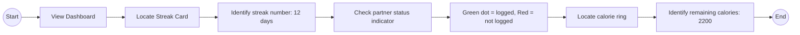
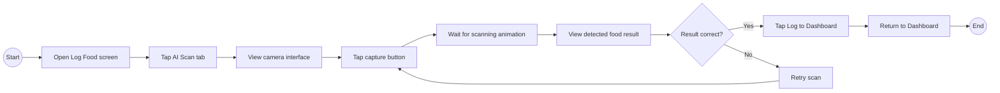
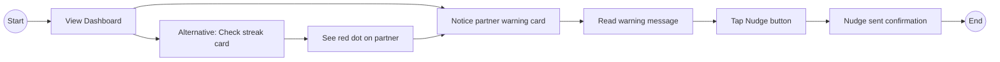
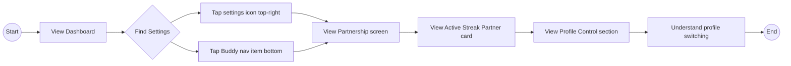

```mermaid
flowchart LR
    A((Start)) --> B[Tap + button in nav bar]
    B --> C[View Log Food screen]
    C --> D[Ensure Manual tab is selected]
    D --> E[Browse/search food categories]
    E --> F[Select Phở Bò from grid]
    F --> G[Portion picker appears]
    G --> H[Select portion: S/M/L]
    H --> I[Food logged, return to Dashboard]
    I --> J[Verify meal in Personal Log]
    J --> K((End))
```

# FuelUp Usability Test Plan
## Unmoderated Remote Testing

**Prototype URL:** `http://192.168.1.23:8000/index.html`
**Test Duration:** 15-20 minutes
**Test Type:** Unmoderated, task-based

---

## Test Goals

1. **Identify usability issues** in the FuelUp prototype
2. **Measure usability** - can users complete core tasks?
3. **Measure efficiency** - how quickly can tasks be completed?
4. **Measure satisfaction** - do users find the app pleasant to use?

---

## Metrics

| Metric | Measurement |
|--------|-------------|
| **Task Success Rate** | % of users completing each task |
| **Time on Task** | Seconds to complete each task |
| **Error Rate** | Wrong paths taken before success |
| **SUS Score** | System Usability Scale (post-test) |
| **Satisfaction** | Post-task ease rating (1-5) |

---

## Personas Under Test

| ID | Name | Type | Key Behaviors |
|----|------|------|---------------|
| PER-01 | Linh Nguyen | Primary | Young professional, wants <30s logging |
| PER-02 | Minh Tran | Secondary | Student, first-time tracker |
| PER-03 | Khoa Pham | Tertiary | Fitness enthusiast, wants precision |

---

## 4.1 Tasks to Perform

---

### TASK 1 - View Dashboard and Understand Streak Status

**The task**
- Start from the Dashboard view (default screen)
- Users will be required to **identify the current streak count** and **determine if their partner has logged food today**
- Users will be asked what "Shared Streak" means to them
- Finally, users will identify their **remaining calorie goal** for the day

**Expected flow of actions**

**Objectives**
- Users understand the "Shared Streak" concept without explanation
- Users correctly interpret partner status indicators (green = logged, red = not logged)
- Users locate their calorie goal quickly
- The dashboard provides clear "at a glance" information

**Success criteria**
- User identifies streak count within 10 seconds
- User correctly interprets partner status
- User locates remaining calories within 15 seconds

---

### TASK 2 - Log a Meal Manually

**The task**
- Start from the Dashboard view
- Users will be required to **log a Phở Bò (beef noodle soup)** for lunch
- Users must **select a portion size** (Small, Medium, or Large)
- Finally, users will verify the meal appears in their **Personal Log**

**Expected flow of actions**

**Objectives**
- Users discover the "+" button to add food
- The Manual vs AI Scan toggle is clear
- Food categories are easy to browse
- Portion picker (S/M/L) is intuitive
- Logging completes in under 30 seconds

**Success criteria**
- Task completed in < 30 seconds
- User selects correct food item
- User successfully chooses a portion size
- Meal appears in Personal Log

---

### TASK 3 - Use AI Scan to Log Food

**The task**
- Start from the Log Food screen
- Users will be required to **switch to AI Scan mode**
- Users will **capture/scan a food item** using the camera interface
- Users will **confirm and log** the detected food item

**Expected flow of actions**

**Objectives**
- Users discover the AI Scan feature
- The Manual/Scan toggle is noticeable
- Camera interface is intuitive
- Scan result display is clear and trustworthy
- Confidence percentage (98%) builds trust

**Success criteria**
- User finds AI Scan tab within 5 seconds
- User understands how to trigger scan
- User successfully logs scanned food
- User expresses confidence in the detection

---

### TASK 4 - Send a Nudge to Partner

**The task**
- Start from the Dashboard view
- Scenario: Your partner **has not logged food today** and the streak is at risk
- Users will be required to **find the partner warning** and **send a nudge** to remind their partner

**Expected flow of actions**

**Objectives**
- Partner warning is visible and attention-grabbing
- Users understand what "nudge" means
- The nudge action feels supportive, not punitive
- Users value the accountability feature

**Success criteria**
- User notices partner warning within 10 seconds
- User successfully triggers nudge action
- User understands the purpose of the feature

---

### TASK 5 - Access Partnership Settings

**The task**
- Start from the Dashboard view
- Users will be required to **navigate to Partnership/Settings**
- Users will **view their current streak partner** information
- Users will **explore profile switching** options

**Expected flow of actions**

**Objectives**
- Settings/Partnership is discoverable via multiple paths
- Partner information display is clear
- Profile switching concept is understood
- Users can find the "Change" partner option

**Success criteria**
- User finds settings within 10 seconds
- User locates partner information
- User understands profile switching purpose

---

## Pre-Test Screening Questionnaire

*To match participants to personas*

### Q1. What is your age range?
- [ ] 18-24 → Lean toward Minh
- [ ] 25-32 → Lean toward Linh
- [ ] 33+ → Lean toward Khoa

### Q2. Have you used a calorie tracking app before?
- [ ] Never → Minh
- [ ] Tried but stopped → Linh
- [ ] Use regularly → Khoa

### Q3. How much time are you willing to spend logging a meal?
- [ ] Under 15 seconds → Linh
- [ ] 15-30 seconds → Minh
- [ ] As long as needed for accuracy → Khoa

---

## Post-Task Questions

*Ask after each task*

| Question | Scale |
|----------|-------|
| How easy was this task? | 1 (Very Hard) - 5 (Very Easy) |
| How confident are you that you completed it correctly? | 1 (Not Confident) - 5 (Very Confident) |

**Open prompt:** "What was confusing or difficult about this task?"

---

## Post-Test Questionnaire

### System Usability Scale (SUS)

*Rate 1 (Strongly Disagree) to 5 (Strongly Agree)*

1. I think I would like to use this app frequently.
2. I found the app unnecessarily complex.
3. I thought the app was easy to use.
4. I think I would need tech support to use this app.
5. I found the various functions well integrated.
6. I thought there was too much inconsistency in this app.
7. I imagine most people would learn to use this app quickly.
8. I found the app very awkward to use.
9. I felt very confident using the app.
10. I needed to learn a lot before I could use this app.

### Open-Ended Questions

1. What did you like most about this app?
2. What was the most frustrating part?
3. Would the "Streak Partner" feature motivate you to log daily? Why?
4. What's one thing you would change?
5. How likely are you to recommend this app? (1-10)

---

## Facilitator Observation Checklist

### Per Task - Record:
- [ ] Time to complete (seconds)
- [ ] Success (Yes / Partial / No)
- [ ] Errors or wrong paths taken
- [ ] Verbal expressions (confusion, delight, frustration)
- [ ] Questions asked

### Red Flags to Watch:
- [ ] Can't find "+" button
- [ ] Doesn't understand "Shared Streak"
- [ ] Confused by partner status indicators
- [ ] Portion picker unclear
- [ ] AI Scan result unexpected
- [ ] Settings hard to find

---

## Session Logistics

**Before:**
1. Prototype running at `http://192.168.1.23:8000/index.html`
2. Participant on same WiFi network
3. Screening questionnaire completed
4. Persona assigned

**During:**
1. Participant opens URL on mobile device
2. Complete tasks 1-5 in order
3. Think aloud while navigating
4. Rate each task after completion

**After:**
1. Complete SUS questionnaire
2. Answer open-ended questions
3. Thank participant

---

*Test plan for FuelUp — Streak Partners Edition*
*Created: 2026-01-09*
