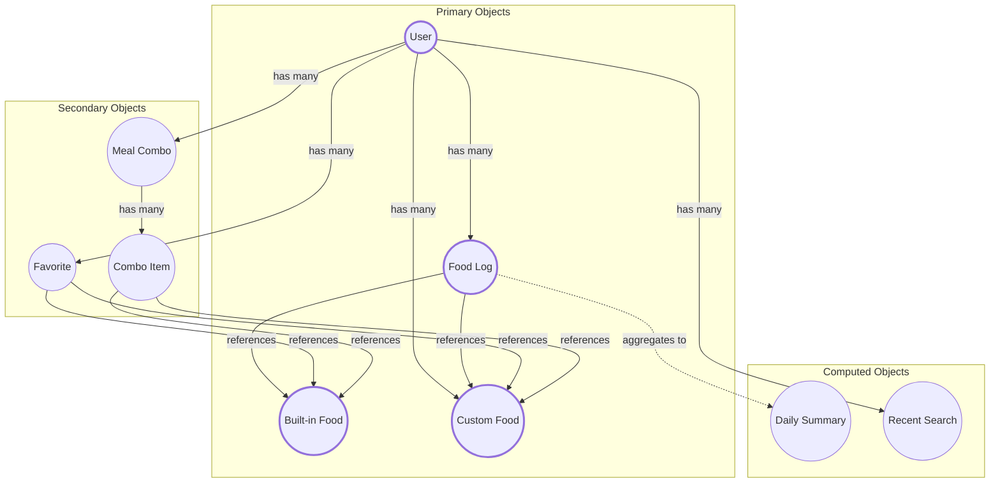

# OOUX Dot Map - Base (Calo Tracker)

## Objects & Actions Summary

| Type | Object | Description | Key Actions |
|------|--------|-------------|-------------|
| **Primary** | User | App user with account & goals | create account, sign in, sign out, update |
| **Primary** | Food Log | Individual meal entry | log, delete, undo |
| **Primary** | Food (Built-in) | Curated Vietnamese food database | view, search, browse |
| **Primary** | Custom Food | User-created food | create, view |
| **Secondary** | Favorite | Saved favorite foods | add, remove, reorder, quick-log |
| **Secondary** | Meal Combo | Reusable multi-item meals | create, edit, delete, use |
| **Secondary** | Combo Item | Item within meal combo | add, remove, edit |
| **Derived** | Daily Summary | Daily nutrition totals | computed from Food Logs |
| **Derived** | Recent Search | Search history | auto-saved on search |

---

## Object Attributes

### User

| Attribute | Type | Status |
|-----------|------|--------|
| id | text | Required |
| email | text | Required |
| password | text | Required |
| display name | text | Optional |
| daily calorie goal | number | Required |
| daily protein goal | number | Required |
| daily carbs goal | number | Required |
| daily fat goal | number | Required |
| created at | timestamp | Auto |
| updated at | timestamp | Auto |

### Food (Built-in)

| Attribute | Type | Status |
|-----------|------|--------|
| id | text | Required |
| Vietnamese name | text | Required |
| English name | text | Required |
| category | food category | Required |
| serving description | text | Optional |
| confidence | number (0-1) | Required |
| calories (S/M/L) | number | Required |
| protein (S/M/L) | number | Required |
| fat (S/M/L) | number | Required |
| carbs (S/M/L) | number | Required |
| is active | yes/no | Required |

### Food Log

| Attribute | Type | Status |
|-----------|------|--------|
| id | text | Required |
| user id | text | Required |
| food type | 'built-in' or 'custom' | Required |
| food id | text | Required |
| portion | Small / Medium / Large / Single | Required |
| food name | text | Required |
| calories | number | Required |
| protein | number | Required |
| fat | number | Required |
| carbs | number | Required |
| logged date | date | Required |
| logged at | timestamp | Required |
| deleted at | timestamp | Optional (for undo) |

### Custom Food

| Attribute | Type | Status |
|-----------|------|--------|
| id | text | Required |
| user id | text | Required |
| name | text | Required |
| calories | number | Required |
| protein | number | Optional |
| fat | number | Optional |
| carbs | number | Optional |
| created at | timestamp | Auto |

### Favorite

| Attribute | Type | Status |
|-----------|------|--------|
| id | text | Required |
| user id | text | Required |
| food type | 'built-in' or 'custom' | Required |
| food id | text | Required |
| sort order | number | Required |
| default portion | S/M/L | Required |
| times used | number | Auto |
| last used at | timestamp | Auto |

### Meal Combo

| Attribute | Type | Status |
|-----------|------|--------|
| id | text | Required |
| user id | text | Required |
| name | text | Required |
| description | text | Optional |
| total calories | number | Computed |
| total protein | number | Computed |
| total fat | number | Computed |
| total carbs | number | Computed |
| times used | number | Auto |
| last used at | timestamp | Auto |

### Combo Item

| Attribute | Type | Status |
|-----------|------|--------|
| id | text | Required |
| combo id | text | Required |
| food type | 'built-in' or 'custom' | Required |
| food id | text | Required |
| portion | S/M/L | Required |
| food name | text | Required |
| is required | yes/no | Required |
| sort order | number | Required |

### Daily Summary (Computed)

| Attribute | Type | Status |
|-----------|------|--------|
| user id | text | Required |
| date | date | Required |
| total calories | number | Computed |
| total protein | number | Computed |
| total fat | number | Computed |
| total carbs | number | Computed |
| number of logs | number | Computed |

---

## Relationships Diagram

---

## Actions per Object

| Object | User Actions |
|--------|--------------|
| **User** | create account, sign in, sign out, update profile, update goals, change password, reset password |
| **Food Log** | log (via tap, scan, manual entry), delete, undo |
| **Built-in Food** | search, browse, view portion sizes, add to favorites |
| **Custom Food** | create (via manual entry) |
| **Favorite** | add, remove, quick-log, reorder |
| **Meal Combo** | create, edit, delete, use (log all items) |
| **Combo Item** | add, remove, change portion |
| **Daily Summary** | view (computed automatically) |
| **Recent Search** | view (auto-saved) |

---

## Categories & Portion Sizes

### Food Categories
| Category | Examples |
|----------|----------|
| Noodles | Phở, bún, mì |
| Rice | Cơm, xôi |
| Bánh Mì | Bánh mì |
| Snacks | Đồ ăn vặt |
| Drinks | Đồ uống |
| Desserts | Tráng miệng |
| Clean Eating | Eat clean |

### Portion Sizes
| Size | Description |
|------|-------------|
| S | Small portion |
| M | Medium portion |
| L | Large portion |
| Single | For custom foods (no size variation) |

### Limits
- Max users: 10
- Max custom foods per user: 30
- Max favorites per user: 20
- Max meal combos per user: 10
- Max items per combo: 8
- Max logs per day: 30
- Log history: 30 days
- Built-in foods: ~500
