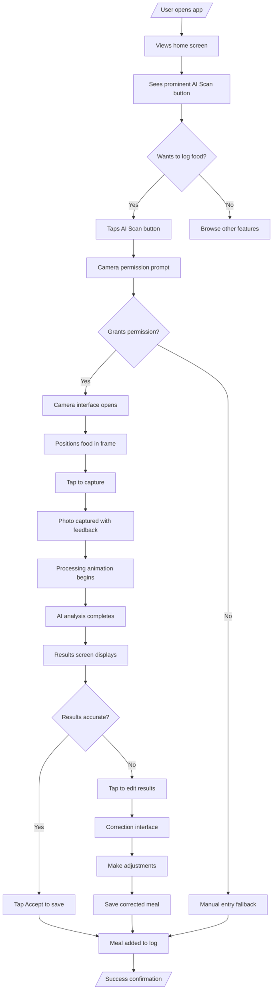
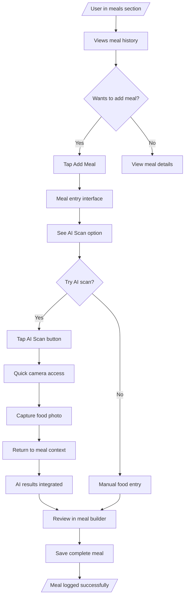
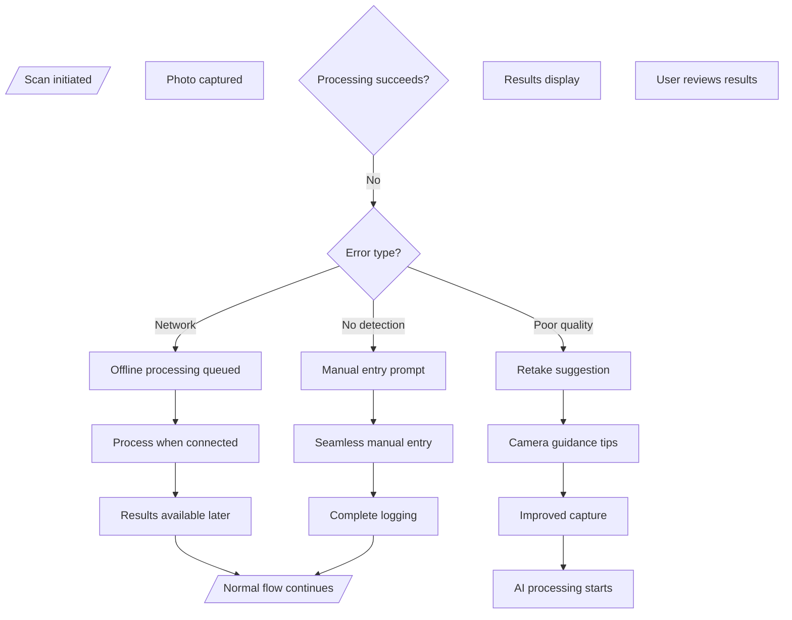

# Design-Lite Workflow: AI-Powered Food Scan

## Step 5: USER-FLOWS
*Combined: IA map + Mermaid flows + Screen list*

### Information Architecture (IA) Map

```
┌─────────────────────────────────────────────────────────────────┐
│                    CALOR TRACKER - AI SCAN MVP                   │
│                                                                 │
│  ┌─────────────────┐    ┌─────────────────┐    ┌─────────────────┐ │
│  │   HOME          │    │   MEALS         │    │   SCAN          │ │
│  │  ├─ Dashboard  │    │  ├─ History     │    │  ├─ Camera      │ │
│  │  ├─ Quick Log  │    │  ├─ Today       │    │  ├─ Processing  │ │
│  │  │  (Manual)    │    │  ├─ Add Meal    │    │  ├─ Results     │ │
│  │  └─ AI Scan ⭐   │    │  └─ Edit        │    │  └─ Corrections │ │
│  └─────────────────┘    └─────────────────┘    └─────────────────┘ │
│                                                                 │
│  ┌─────────────────┐    ┌─────────────────┐    ┌─────────────────┐ │
│  │   SEARCH        │    │   PROFILE      │    │   SETTINGS      │ │
│  │  ├─ Food DB     │    │  ├─ Stats       │    │  ├─ Preferences │ │
│  │  ├─ Favorites   │    │  ├─ Goals       │    │  ├─ AI Settings │ │
│  │  ├─ Recent      │    │  ├─ Achievements│    │  └─ Privacy     │ │
│  │  └─ Categories  │    │  └─ Account     │    │                  │ │
│  │                  │    │                  │    │                  │
│  └─────────────────┘    └─────────────────┘    └─────────────────┘ │
└─────────────────────────────────────────────────────────────────┘

Navigation Changes:
• AI Scan promoted as primary action on home screen
• New dedicated SCAN section for camera workflow
• Quick access from meals section for adding to existing logs
• Settings integration for AI preferences and accuracy controls
```

### Key User Flows (Mermaid Diagrams)

#### Flow 1: Primary Scan Journey


#### Flow 2: Contextual Scan from Meals


#### Flow 3: Error Recovery Flow


### Comprehensive Screen List

#### Core Scan Screens (New)
1. **Scan Camera** - Full-screen camera interface with food positioning guidance
2. **Scan Processing** - Loading state with progress animation and estimated time
3. **Scan Results** - AI detection results with nutritional breakdown and confidence
4. **Scan Corrections** - Manual editing interface for inaccurate detections

#### Enhanced Existing Screens (Modified)
5. **Home Dashboard** - Added prominent AI scan button and quick access
6. **Meal Builder** - Integrated scan results into meal creation workflow
7. **Settings > AI** - New section for scan preferences and accuracy controls
8. **Food Search** - Enhanced with scan fallback and comparison features

#### Edge Case & Empty State Screens
9. **Camera Permission** - Permission request with clear value proposition
10. **Scan Failed** - Error recovery with retake options and manual fallback
11. **Offline Processing** - Queue status when network unavailable
12. **Scan History** - Previous scans with reprocessing options

**Total Screens:** 12 (4 new core, 4 enhanced, 4 edge cases)

**Navigation Patterns:**
- Direct camera launch from home screen
- Contextual scan access from meal logging
- Seamless fallback to manual entry on failures
- Settings integration for preferences

**Responsive Considerations:**
- Mobile-first camera optimization
- Tablet support with adjusted layouts
- Progressive enhancement for camera capabilities
- Touch-friendly controls for all interactions</content>
<parameter name="filePath">prototypes/02a-ai-delegation/outputs/CR03-ai-food-scan/5-user-flows.md