# IA Map: AI-Powered Food Scan

## 2.1 Identify Where Objects Live

Map each object to its location in app hierarchy:

| Object | Primary Location | Secondary Location(s) | Access From |
|--------|------------------|----------------------|-------------|
| Food Photo | /scan/capture | /scan/history, /meal/add | Home, Meal logging |
| AI Detection | /scan/processing | /scan/results, /settings/ai | Scan flow, Results |
| Scan Result | /scan/results | /meal/add, /history | Scan flow, Meal logging |
| Manual Entry | /meal/add/manual | /scan/results/edit, /search | Meal logging, Corrections |
| Meal Log | /meal/add | /history, /dashboard | Meal logging, History |

## 2.2 Show Current IA (Base App Structure)

```mermaid
flowchart TB
    subgraph ROOT["🏠 Calor Tracker"]
        direction TB
        HOME["Home/Dashboard"]

        subgraph NAV["Bottom Navigation"]
            HOME_TAB["Home"]
            MEALS["Meals"]
            SEARCH["Search"]
            PROFILE["Profile"]
            SETTINGS["Settings"]
        end
    end

    HOME --> NAV
```

## 2.3 Show IA Changes for AI Food Scan Feature

Highlight what's new/modified:

## 2.4 IA Decision Table

| Location | Change Type | Rationale |
|----------|-------------|-----------|
| /scan | NEW | Dedicated section for camera-based food logging |
| /scan/capture | NEW | Full-screen camera interface for food photography |
| /scan/processing | NEW | Loading states and AI analysis feedback |
| /scan/results | NEW | AI detection results with correction capabilities |
| /meal/add | MODIFIED | Enhanced with scan integration and manual fallback |

## 2.5 Navigation Paths to Objects

| Object | Primary Path | Alternative Path(s) |
|--------|--------------|---------------------|
| Food Photo | Home → AI Scan → Camera | Meals → Add Meal → Scan |
| AI Detection | Scan → Capture → Auto-process | - |
| Scan Result | Scan → Results | Meals → Add from Scan |
| Manual Entry | Meals → Add Meal → Manual | Scan → Results → Edit |
| Meal Log | Meals → Add Meal → Complete | Scan → Results → Add to Meal |</content>
<parameter name="filePath">prototypes/02a-ai-delegation/outputs/CR03-ai-food-scan/7-ia-map.md