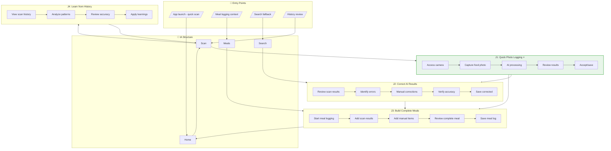
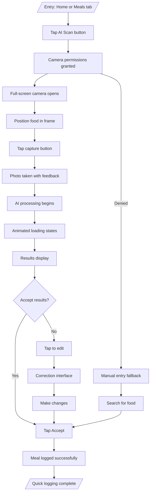
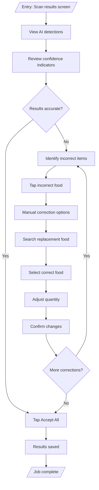
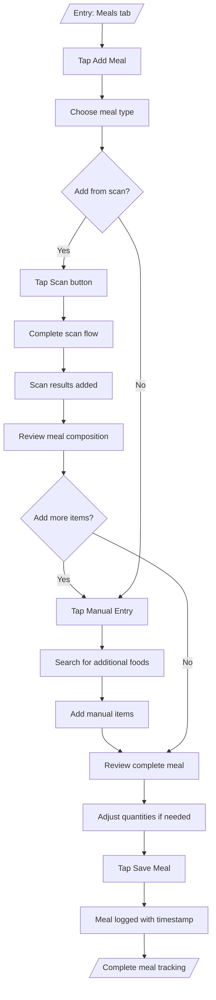
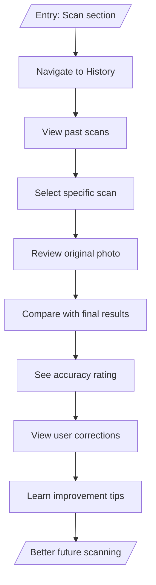

# User Flows: AI-Powered Food Scan

## 3.1 Derive Jobs-to-be-Done

From objects, actions, and IA, derive jobs:

| Job ID | Job Statement | Primary Objects | IA Location | Key Actions |
|--------|---------------|-----------------|-------------|-------------|
| J1 | When I want to log food quickly without typing, I want to take a photo and get instant calorie estimates, So that I can maintain consistent tracking with minimal effort | Food Photo, AI Detection, Scan Result | /scan | capture, process, review, accept |
| J2 | When AI detection is wrong, I want to easily correct the results manually, So that I can ensure nutritional accuracy while benefiting from AI speed | Scan Result, Manual Entry | /scan/results | review, edit, correct, save |
| J3 | When I want to track complete meals, I want to combine multiple scans or manual entries, So that I can log comprehensive nutritional information | Scan Result, Meal Log | /meal/add | combine, organize, complete |
| J4 | When I want to improve future scans, I want to see my scanning history and patterns, So that I can learn to take better photos for more accurate results | Scan History, Food Photo | /scan/history | review, analyze, learn |

## 3.2 Create Complete Flow Diagram

Show all jobs navigating through IA:

## 3.3 Create Individual Job Flows

### J1: Quick Photo Logging (Primary Job)

### J2: Correct AI Results

### J3: Build Complete Meals

### J4: Learn from History

## 3.4 Job Summary

| Job | IA Entry Point | Steps | Decision Points | Exit Point |
|-----|----------------|-------|-----------------|------------|
| J1: Quick Photo Logging | Home/Meals | 8 | 2 | Meal logged |
| J2: Correct AI Results | Scan results | 6 | 2 | Corrections saved |
| J3: Build Complete Meals | Meals | 7 | 1 | Meal completed |
| J4: Learn from History | Scan | 4 | 0 | History reviewed |</content>
<parameter name="filePath">prototypes/02a-ai-delegation/outputs/CR03-ai-food-scan/7-user-flows.md