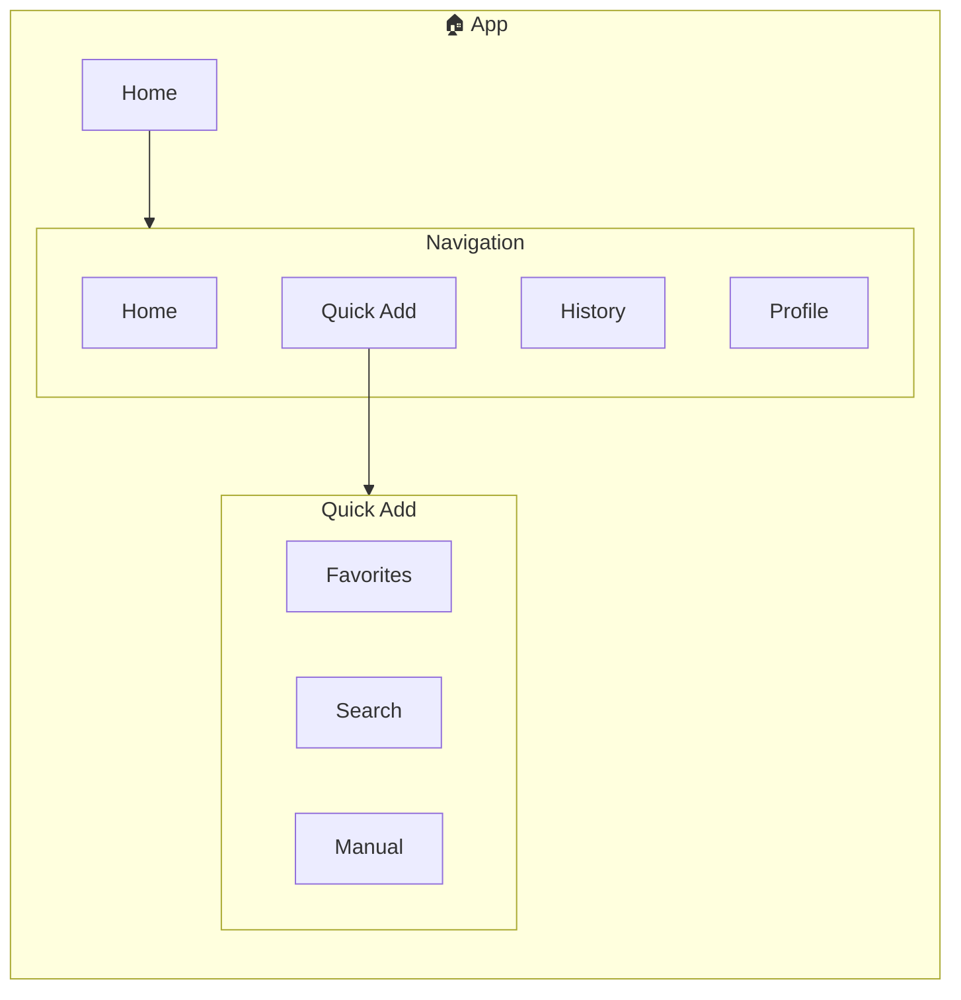
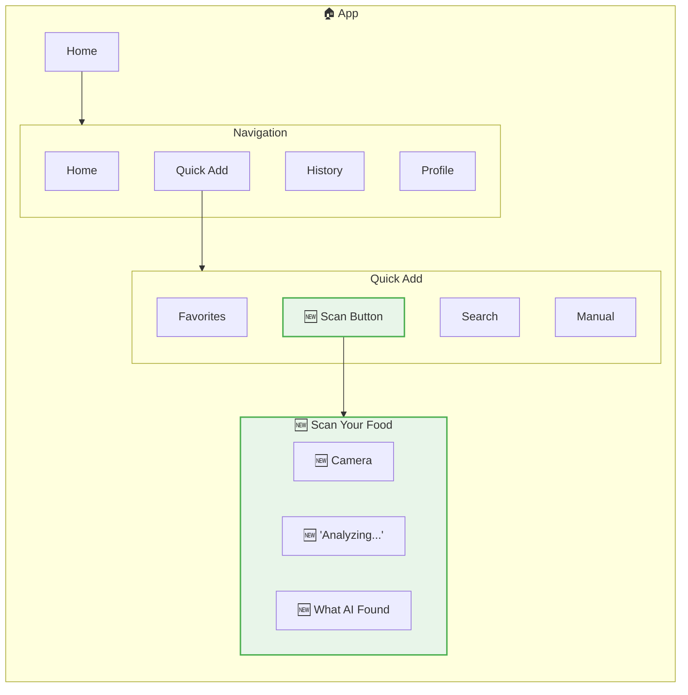
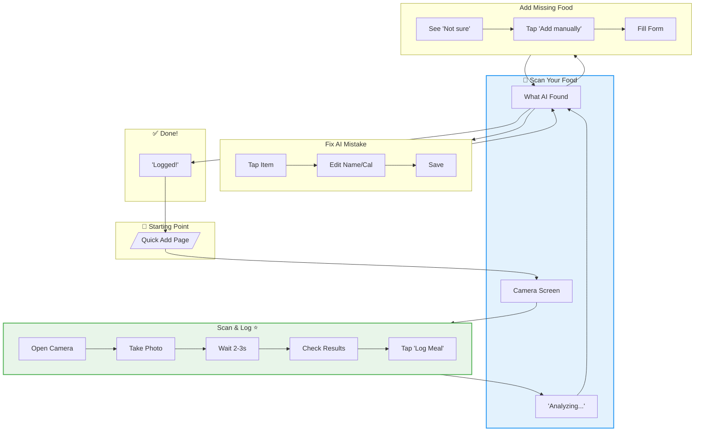
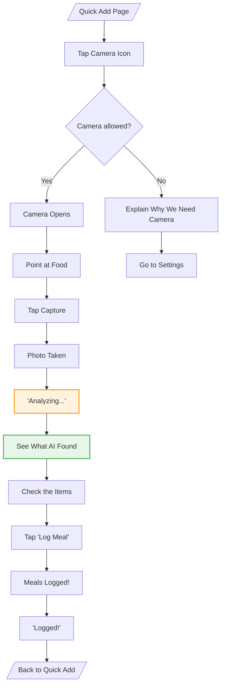
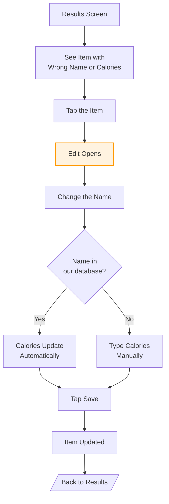
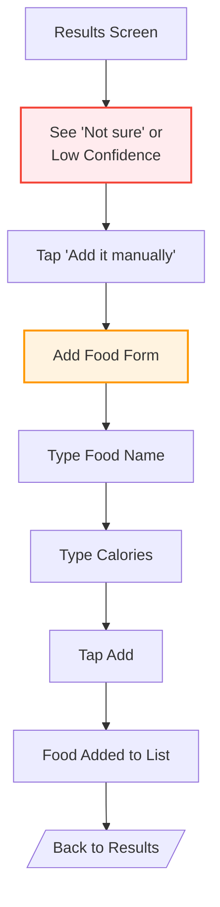
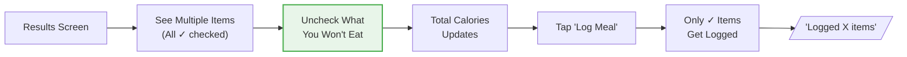
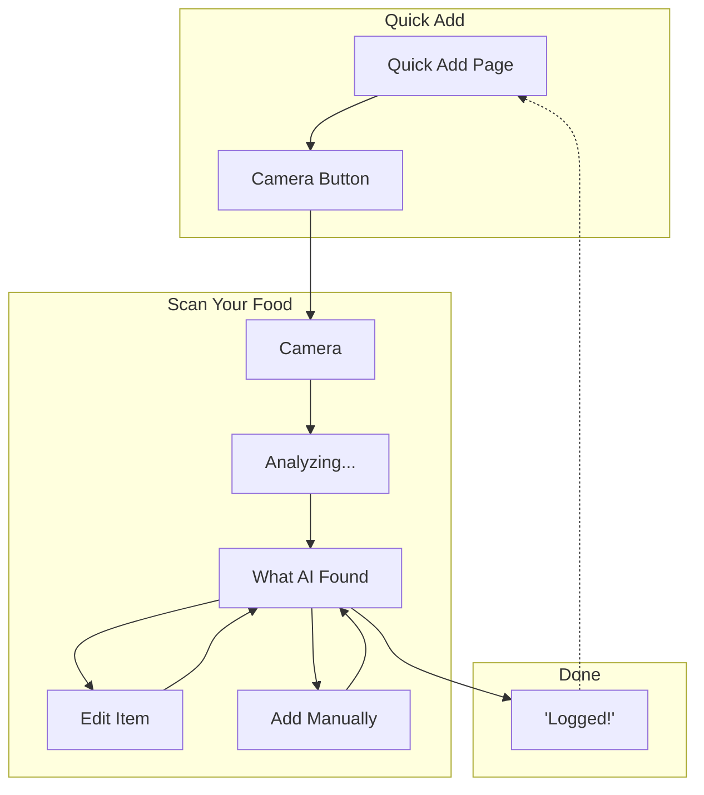

# User Flows: CR03 AI-Powered Food Scan

## App Structure

### Where Things Live

| Thing | Main Location | Also Found | How to Get There |
|-------|---------------|------------|------------------|
| Photo | Camera screen | (temporary) | Take a picture |
| What AI Found | Results screen | - | After scanning |
| Recognized Food | Results screen | - | AI shows it |
| Logged Meal | Today's timeline | Results (confirm) | After you log it |

### Current App Structure

### What's New in This Feature

### What's Changing

| Screen | Change | Why |
|--------|--------|-----|
| Quick Add | UPDATED | Add camera button |
| Camera | NEW | Take photo of your food |
| Analyzing | NEW | 2-3 second wait while AI thinks |
| Results | NEW | See what AI found + edit + confirm |
| Home | UNCHANGED | Shows logged meals |

---

## What Users Want to Do

| Goal | What They're Thinking | Where | Steps |
|------|----------------------|-------|-------|
| Scan & Log ⭐ | "I have food in front of me, let me take a picture instead of typing" | Camera → Results | snap, check, log |
| Fix AI Mistake | "It got it wrong, let me fix the name or calories" | Results screen | tap, edit, save |
| Add Missing Food | "AI couldn't figure this out, I'll add it myself" | Results → manual | tap, type, save |
| Pick What to Log | "It found multiple things but I'm only eating some of them" | Results screen | uncheck items, log |

---

## Complete Flow Overview

---

## Step-by-Step Flows

### Scan & Log (The Easy Way) ⭐

**How often:** Every day - alternative to typing
**Starting from:** Camera icon on Quick Add
**Ending at:** Success message, back to Quick Add

**What happens:**
- Camera button → Opens camera (asks permission first)
- Capture button → Takes photo, starts AI
- Analyzing → 2-3 second wait with animation
- Results → List of foods AI found with calories
- Log Meal → Logs everything that's checked

**What if:**
- Camera not allowed → Shows why we need it + link to Settings
- Too dark → "Photo too dark" message
- Taking too long (>5s) → "Taking longer than usual..."

---

### Fix AI Mistake (When It Gets It Wrong)

**How often:** Sometimes - when AI is wrong
**Starting from:** Results screen, tap on an item
**Ending at:** Stay on results

**What happens:**
- Tap item → Opens edit right there
- Change name → If we know that food, calories auto-update
- Change calories → You can override manually
- Save → Updates item in the list

**What if:**
- Multiple wrong items → Edit each one
- Food not in database → Enter calories manually

---

### Add Missing Food (When AI Can't Figure It Out)

**How often:** Sometimes - when AI fails
**Starting from:** Results screen shows low confidence
**Ending at:** Item added to results

**What happens:**
- Low confidence → Shows "Not sure" badge
- Very low (<40%) → Suggests "Add it manually"
- Add manually → Opens simple form
- Add → Adds to the results list (you can still log all together)

**What if:**
- Nothing detected at all → "No food found. Try again or add manually?"
- Only some foods found → Shows what it found, asks about the rest

---

### Pick What to Log (Multiple Items)

**How often:** Sometimes - when scanning a plate with multiple foods
**Starting from:** Results screen with multiple items
**Ending at:** Only checked items logged

**What happens:**
- All items checked by default
- Tap checkbox to uncheck
- Total calories updates live
- Log Meal → Only logs what's checked

---

## All Screens

### Scan Screens

| Screen | Used For | What It Does |
|--------|----------|--------------|
| Camera | Taking photos | Point at food and capture |
| Analyzing | Waiting | Shows animation while AI thinks |
| Results | Reviewing | Shows what AI found, lets you edit and confirm |

### Popups & Forms

| Popup/Form | Used For | What It Does |
|------------|----------|--------------|
| Edit Item | Fixing mistakes | Change name or calories right there |
| Add Food Form | Missing items | Add what AI couldn't find |
| Confidence Badge | Transparency | Shows how sure AI is |
| Item Checkbox | Selection | Toggle items on/off |

### Shared Parts

| Part | Used For | What It Does |
|------|----------|--------------|
| Success Message | Feedback | Shows "Logged!" after confirming |

---

## Screen Connections

---

## Summary

| Goal | Where | Steps | Decisions | How Often |
|------|-------|-------|-----------|-----------|
| Scan & Log ⭐ | Camera → Results | 6 | 1 | Every day |
| Fix Mistake | Results screen | 4 | 1 | Sometimes |
| Add Missing | Results → manual | 4 | 0 | Sometimes |
| Pick Items | Results screen | 3 | 0 | Sometimes |

---

## Key Patterns

1. **Snap then review** - Take photo → wait → see results (not live scanning)
2. **Show confidence** - Green = sure, yellow = maybe, suggests next step
3. **Review before logging** - You check/edit before it's logged
4. **Graceful fallback** - Low confidence → "Add it manually" option
5. **Multiple items** - Toggle what to log when scanning a plate

---

## How to Get Around

| What | Main Way | Other Way |
|------|----------|-----------|
| Start Scan | Quick Add → Camera button | - |
| See Results | Camera → Take photo → Wait | - |
| Edit Item | Results → Tap item | - |
| Add Missing | Results → "Add manually" | AI shows "Not sure" → prompt |
| Log Everything | Results → "Log Meal" | - |
