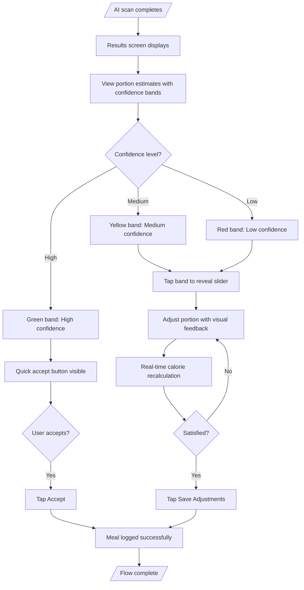
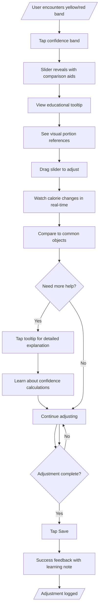
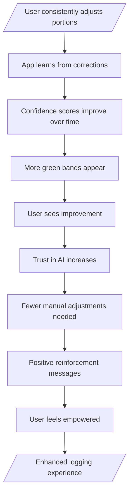
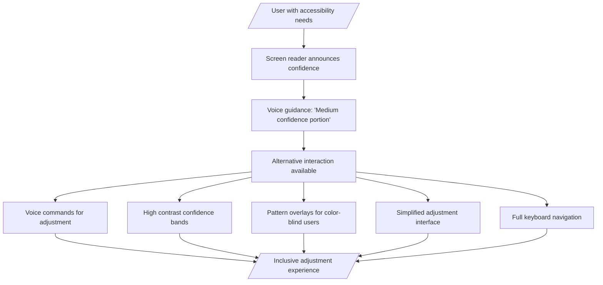

# Design-Lite Workflow: Portion Estimation UX Enhancement

## Step 5: USER-FLOWS
*Combined: IA map + Mermaid flows + Screen list*

### Information Architecture (IA) Map

```
┌─────────────────────────────────────────────────────────────────┐
│                    CALOR TRACKER - PORTION ENHANCED             │
│                                                                 │
│  ┌─────────────────┐    ┌─────────────────┐    ┌─────────────────┐ │
│  │   HOME          │    │   MEALS         │    │   SCAN          │ │
│  │  ├─ Dashboard  │    │  ├─ History     │    │  ├─ Camera      │ │
│  │  ├─ Quick Log  │    │  ├─ Today       │    │  ├─ Processing  │ │
│  │  │  (Manual)    │    │  ├─ Add Meal    │    │  ├─ Results ⭐   │ │
│  │  └─ AI Scan     │    │  └─ Edit        │    │  └─ Corrections │ │
│  └─────────────────┘    └─────────────────┘    └─────────────────┘ │
│                                                                 │
│  ┌─────────────────┐    ┌─────────────────┐    ┌─────────────────┐ │
│  │   SEARCH        │    │   PROFILE      │    │   SETTINGS      │ │
│  │  ├─ Food DB     │    │  ├─ Stats       │    │  ├─ Preferences │ │
│  │  ├─ Favorites   │    │  ├─ Goals       │    │  ├─ AI Settings  │ │
│  │  ├─ Recent      │    │  ├─ Achievements│    │  ├─ Portion UX   │ │
│  │  └─ Categories  │    │  └─ Account     │    │  └─ Help         │ │
│  │                  │    │                  │    │                  │
│ └─────────────────┘    └─────────────────┘    └─────────────────┘ │
└─────────────────────────────────────────────────────────────────┘

Navigation Changes:
• Scan Results enhanced with confidence bands and adjustment controls
• Settings expanded with Portion UX preferences
• All portion displays now include confidence indicators
• Adjustment flows integrated seamlessly into existing logging
```

### Key User Flows (Mermaid Diagrams)

#### Flow 1: Confidence-Based Portion Review


#### Flow 2: Educational Adjustment Experience


#### Flow 3: Progressive Trust Building


#### Flow 4: Accessibility-First Design


### Comprehensive Screen List

#### Enhanced Existing Screens (Modified)
1. **Scan Results** - Enhanced with confidence bands and adjustment controls
2. **Manual Entry** - Added confidence indicators for AI suggestions
3. **Meal Builder** - Portion adjustments integrated into meal creation
4. **Food Search** - Confidence indicators on AI-suggested portions

#### New Components (Added)
5. **Confidence Band** - Color-coded indicator with tap-to-adjust functionality
6. **Portion Slider** - Smooth adjustment control with real-time feedback
7. **Comparison Overlay** - Visual aids showing portion equivalencies
8. **Educational Tooltip** - Explanations of confidence levels and adjustments

#### Settings & Preferences (Enhanced)
9. **Portion UX Settings** - User preferences for confidence display and adjustment behavior
10. **Accessibility Options** - Controls for confidence band appearance and interaction methods

#### Edge Case & Empty State Screens
11. **Adjustment Tutorial** - First-time user guidance for portion adjustments
12. **Confidence Calibration** - User feedback on confidence accuracy
13. **Adjustment History** - Review of past corrections and learning progress

**Total Screens:** 13 (4 enhanced, 6 new components, 3 edge cases)

**Navigation Patterns:**
- Confidence bands appear on all portion estimates
- Tap interactions reveal adjustment controls inline
- Seamless integration with existing logging flows
- Progressive disclosure prevents UI clutter

**Responsive Considerations:**
- Mobile-first: Touch-optimized sliders and bands
- Tablet: Enhanced comparison visuals and side-by-side views
- Accessibility: Full keyboard and screen reader support
- Performance: Efficient animations and real-time calculations</content>
<parameter name="filePath">prototypes/02a-ai-delegation/outputs/CR04-portion-estimation/5-user-flows.md