# IA Map: Portion Estimation UX Enhancement

## 2.1 Identify Where Objects Live

Map each object to its location in app hierarchy:

| Object | Primary Location | Secondary Location(s) | Access From |
|--------|------------------|----------------------|-------------|
| Portion Estimate | /scan/results, /meal/add | /history/[meal], /search/[food] | Scan results, Meal logging |
| Confidence Indicator | /scan/results, /meal/add | All portion displays | Inline with estimates |
| Adjustment Control | /scan/results/edit, /meal/add/edit | /settings/demo | Portion editing interfaces |
| Portion Reference | /scan/results/help, /meal/add/help | /settings/tutorial | Help overlays, tutorials |
| Correction History | /settings/data/corrections | /profile/learning | Settings, profile analytics |

## 2.2 Show Current IA (Base App Structure)

```mermaid
flowchart TB
    subgraph ROOT["🏠 Calor Tracker"]
        direction TB
        HOME["Home/Dashboard"]

        subgraph NAV["Bottom Navigation"]
            HOME_TAB["Home"]
            MEALS["Meals"]
            SEARCH["Search"]
            PROFILE["Profile"]
            SETTINGS["Settings"]
        end
    end

    HOME --> NAV
```

## 2.3 Show IA Changes for Portion Estimation Enhancement

Highlight what's new/modified:

```mermaid
flowchart TB
    subgraph ROOT["🏠 Calor Tracker"]
        direction TB
        HOME["Home/Dashboard"]

        subgraph NAV["Bottom Navigation"]
            HOME_TAB["Home"]
            MEALS["Meals"]
            SEARCH["Search"]
            PROFILE["Profile"]
            SETTINGS["Settings"]
        end

        subgraph SCAN_SEC["Scan Section (Enhanced)"]
            SCAN_RESULTS["Scan Results ⭐"]
            SCAN_EDIT["Portion Corrections"]
            SCAN_HELP["Reference Guides"]
        end

        subgraph MEALS_SEC["Meals Section (Enhanced)"]
            MEALS_ADD["Add Meal ⭐"]
            MEALS_EDIT["Edit Portions"]
        end

        subgraph SETTINGS_SEC["Settings (Enhanced)"]
            SETTINGS_DATA["Data & Learning ⭐"]
            SETTINGS_CORRECTIONS["Correction History"]
        end
    end

    HOME --> NAV
    HOME --> SCAN_SEC
    MEALS --> MEALS_SEC
    SETTINGS --> SETTINGS_SEC

    style SCAN_RESULTS fill:#e8f5e9,stroke:#4CAF50,stroke-width:2px
    style MEALS_ADD fill:#e8f5e9,stroke:#4CAF50,stroke-width:2px
    style SETTINGS_DATA fill:#e8f5e9,stroke:#4CAF50,stroke-width:2px
    style SCAN_EDIT fill:#e8f5e9,stroke:#4CAF50,stroke-width:2px
    style MEALS_EDIT fill:#e8f5e9,stroke:#4CAF50,stroke-width:2px
    style SETTINGS_CORRECTIONS fill:#e8f5e9,stroke:#4CAF50,stroke-width:2px
```

## 2.4 IA Decision Table

| Location | Change Type | Rationale |
|----------|-------------|-----------|
| /scan/results | MODIFIED | Enhanced with confidence indicators and adjustment controls |
| /meal/add | MODIFIED | Portion editing capabilities added to meal logging |
| /settings/data | NEW | Data quality and learning analytics section |
| /settings/data/corrections | NEW | User correction history and patterns |
| All portion displays | MODIFIED | Consistent confidence indicator styling |

## 2.5 Navigation Paths to Objects

| Object | Primary Path | Alternative Path(s) |
|--------|--------------|---------------------|
| Portion Estimate | Scan → Results | Meals → Add → AI suggestions |
| Confidence Indicator | Inline with estimates | Settings → Data → Show examples |
| Adjustment Control | Tap confidence band → Slider | Meals → Edit → Portion controls |
| Portion Reference | Help icon → References | Settings → Tutorial → Examples |
| Correction History | Settings → Data → Corrections | Profile → Learning → History |</content>
<parameter name="filePath">prototypes/02a-ai-delegation/outputs/CR04-portion-estimation/7-ia-map.md