# User Flows: Portion Estimation UX Enhancement

## 3.1 Derive Jobs-to-be-Done

From objects, actions, and IA, derive jobs:

| Job ID | Job Statement | Primary Objects | IA Location | Key Actions |
|--------|---------------|-----------------|-------------|-------------|
| J1 | When I see an AI portion estimate I don't trust, I want to see clear indicators of uncertainty, So that I understand when to trust or adjust the AI | Confidence Indicator, Portion Estimate | /scan/results, /meal/add | view indicators, understand meaning, decide trust |
| J2 | When I need to correct a portion estimate, I want easy, intuitive adjustment controls, So that I can quickly make accurate changes without frustration | Adjustment Control, Portion Reference | /scan/results/edit, /meal/add/edit | access controls, make adjustments, use references |
| J3 | When I want to learn about portion sizes, I want helpful visual references and comparisons, So that I can make better estimates in the future | Portion Reference, Correction History | /scan/results/help, /settings/tutorial | view examples, compare sizes, learn patterns |
| J4 | When I want to see my correction patterns, I want to review my adjustment history, So that I can understand my habits and improve accuracy over time | Correction History, Portion Accuracy | /settings/data/corrections | review history, analyze patterns, apply learnings |

## 3.2 Create Complete Flow Diagram

Show all jobs navigating through IA:

```mermaid
flowchart TB
    subgraph ENTRY["🚀 Entry Points"]
        E1[/"AI scan results"/]
        E2[/"Meal logging"/]
        E3[/"Settings exploration"/]
        E4[/"Learning curiosity"/]
    end

    subgraph IA["📱 IA Structure"]
        SCAN["Scan"]
        MEALS["Meals"]
        SETTINGS["Settings"]
    end

    subgraph J1["J1: Understand AI Trust ⭐"]
        direction LR
        J1A["View portion estimate"]
        J1B["See confidence indicator"]
        J1C["Read tooltip explanation"]
        J1D["Assess trustworthiness"]
        J1E["Decide to accept/adjust"]

        J1A --> J1B --> J1C --> J1D --> J1E
    end

    subgraph J2["J2: Adjust Portions Easily"]
        direction LR
        J2A["Identify untrusted estimate"]
        J2B["Access adjustment controls"]
        J2C["Use visual references"]
        J2D["Make corrections"]
        J2E["Confirm changes"]
        J2F["Save adjusted portion"]

        J2A --> J2B --> J2C --> J2D --> J2E --> J2F
    end

    subgraph J3["J3: Learn Portion References"]
        direction LR
        J3A["Access reference guides"]
        J3B["View comparison examples"]
        J3C["Study visual aids"]
        J3D["Apply learnings"]
        J3E["Improve future estimates"]

        J3A --> J3B --> J3C --> J3D --> J3E
    end

    subgraph J4["J4: Review Correction History"]
        direction LR
        J4A["Access correction history"]
        J4B["Review adjustment patterns"]
        J4C["Analyze accuracy trends"]
        J4D["Apply insights"]

        J4A --> J4B --> J4C --> J4D
    end

    E1 --> SCAN
    E2 --> MEALS
    E3 --> SETTINGS
    E4 --> SETTINGS

    SCAN --> J1
    SCAN --> J2
    SCAN --> J3
    MEALS --> J2
    SETTINGS --> J3
    SETTINGS --> J4

    J1 --> J2
    J2 --> J3
    J3 --> J4

    style J1 fill:#e8f5e9,stroke:#4CAF50,stroke-width:2px
```

## 3.3 Create Individual Job Flows

### J1: Understand AI Trust (Primary Job)

### J2: Adjust Portions Easily

### J3: Learn Portion References

### J4: Review Correction History

## 3.4 Job Summary

| Job | IA Entry Point | Steps | Decision Points | Exit Point |
|-----|----------------|-------|-----------------|------------|
| J1: Understand AI Trust | Portion estimate | 5 | 2 | Trust decision made |
| J2: Adjust Portions Easily | Confidence tap | 6 | 1 | Portion corrected |
| J3: Learn Portion References | Help access | 5 | 0 | Knowledge gained |
| J4: Review Correction History | Settings | 4 | 0 | Insights applied |</content>
<parameter name="filePath">prototypes/02a-ai-delegation/outputs/CR04-portion-estimation/7-user-flows.md