# User Flows: CR04 Improve Portion Estimation UX

## App Structure

### Where Things Live

| Thing | Main Location | Also Found | How to Get There |
|-------|---------------|------------|------------------|
| AI's Guess | Results screen | - | After scanning |
| How Sure AI Is | Results screen | - | Color badge |
| Portion Size | Results, Quick Add | - | Size picker |
| Custom Amount | Results (edit) | - | "Custom" option |

### Current App Structure

```mermaid
flowchart TB
    subgraph App["🏠 App"]
        direction TB

        subgraph Scan["Scan Flow"]
            Camera["Camera"]
            Thinking["Analyzing"]
            Results["Results"]
        end

        subgraph QuickAdd["Quick Add"]
            Favorites["Favorites"]
            SizePicker["Size Picker"]
        end
    end

    Camera --> Thinking --> Results
    Favorites --> SizePicker
```

### What's New in This Feature

```mermaid
flowchart TB
    subgraph App["🏠 App"]
        direction TB

        subgraph Scan["Scan Flow"]
            Camera["Camera"]
            Thinking["Analyzing"]
            Results["🔄 Better Results"]
        end

        subgraph BetterResults["🆕 Smarter Results"]
            ConfBadge["🆕 'How Sure' Badge"]
            LooksGood["🆕 'Looks good!' Button"]
            AdjustBtn["🆕 'Adjust' Button"]
            BetterPicker["🆕 Better Size Picker"]
            CustomAmount["🆕 Custom Amount"]
        end
    end

    Camera --> Thinking --> Results
    Results --> BetterResults

    style Results fill:#fff3e0,stroke:#FF9800,stroke-width:2px
    style BetterResults fill:#e8f5e9,stroke:#4CAF50,stroke-width:2px
```

### What's Changing

| Screen | Change | Why |
|--------|--------|-----|
| Results | UPDATED | Add confidence badge, accept/adjust buttons |
| Size Picker | NEW | Better picker with S/M/L + Custom option |
| Custom Entry | NEW | Enter exact grams or calories |
| Quick Add Picker | UNCHANGED | Existing S/M/L (no confidence needed) |

---

## What Users Want to Do

| Goal | What They're Thinking | Where | Steps |
|------|----------------------|-------|-------|
| See How Sure AI Is | "Is this guess reliable? Should I trust it?" | Results | look at badge color |
| Quick Accept ⭐ | "That looks right, let me just log it" | Results | tap 'Looks good!' |
| Adjust Size | "Close but wrong size, let me fix it" | Size picker | tap, pick S/M/L, log |
| Enter Exact Amount | "I need to be precise, let me type it" | Custom entry | tap, type, save |

---

## Complete Flow Overview

---

## Step-by-Step Flows

### See How Sure AI Is (Results Screen)

**How often:** Every scan
**Starting from:** After AI finishes analyzing
**Ending at:** Decide to accept or adjust

```mermaid
flowchart TB
    Start[/"Scan Complete"/]
    ResultsScreen["Results Screen"]
    SeeGuess["See AI's Guess:\n'Phở bò - Medium'"]
    SeeBadge["See Confidence Badge"]
    HowSure{"How sure\nis AI?"}
    VeryConfident["🟢 Very Sure (>80%)"]
    SomewhatSure["🟡 Somewhat Sure (60-80%)"]
    NotSure["No badge (<60%)"]
    ShowAccept["'Looks good!' is BIG"]
    ShowBoth["Both buttons equal"]
    ShowAdjust["Shows adjust options"]

    Start --> ResultsScreen --> SeeGuess --> SeeBadge --> HowSure
    HowSure -->|Very| VeryConfident --> ShowAccept
    HowSure -->|Somewhat| SomewhatSure --> ShowBoth
    HowSure -->|Not| NotSure --> ShowAdjust

    style VeryConfident fill:#e8f5e9,stroke:#4CAF50,stroke-width:2px
    style SomewhatSure fill:#fff3e0,stroke:#FF9800,stroke-width:2px
    style NotSure fill:#ffebee,stroke:#f44336,stroke-width:2px
```

**What happens:**
- Very sure (green) → "Looks good!" is the main button
- Somewhat sure (yellow) → Both buttons are equal size
- Not sure (no badge) → Shows adjust options right away

**What if:**
- Very low (<40%) → Skips confidence display, goes straight to adjust

---

### Quick Accept (When AI Is Right) ⭐

**How often:** Most of the time - when AI nails it
**Starting from:** Results screen with good confidence
**Ending at:** Meal logged

**What happens:**
- One tap to accept and log
- No extra confirmation needed
- Success message shows what was logged

**What if:**
- Tapped by mistake → Use undo in message (5 seconds)

---

### Adjust Size (When AI Is Close But Wrong)

**How often:** Sometimes - when AI gets the food right but size wrong
**Starting from:** Tap "Adjust size" on results
**Ending at:** Meal logged with fixed size

**What happens:**
- Picker shows what AI guessed (highlighted)
- Tap different size → Calories update right away
- Also shows "Custom..." at the bottom

**What if:**
- AI said Medium, you want Small → One tap change
- Need more precision → Tap "Custom..."

---

### Enter Exact Amount (For Precision Users)

**How often:** Rarely - for people who want exact numbers
**Starting from:** Tap "Custom" in size picker
**Ending at:** Meal logged with custom values

**What happens:**
- Type grams → Calories auto-calculate (if we have that data)
- OR type calories directly → Override mode
- Both fields available

**What if:**
- No gram data → Manual calorie entry only
- Very high value (>2000) → Maybe a warning in v2

---

## All Screens

### Results Screens

| Screen | Used For | What It Does |
|--------|----------|--------------|
| Results (Better) | Reviewing AI guess | Shows guess + confidence + accept/adjust |

### Popups & Forms

| Popup/Form | Used For | What It Does |
|------------|----------|--------------|
| Size Picker (Better) | Adjusting size | S/M/L with AI's pick highlighted + Custom |
| Custom Entry | Exact amounts | Grams/Calories input |

### Parts & Badges

| Part | Used For | What It Does |
|------|----------|--------------|
| Confidence Badge | Showing AI certainty | 🟢 Green = sure, 🟡 Yellow = maybe |
| "Looks good!" Button | Quick accept | Main action when AI is right |
| "Adjust size" Button | Fixing size | Opens picker |
| S/M/L Options | Size selection | Standard sizes |

---

## Screen Connections

---

## Summary

| Goal | Where | Steps | Decisions | How Often |
|------|-------|-------|-----------|-----------|
| See Confidence | Results | 3 | 1 | Every scan |
| Quick Accept ⭐ | Results | 2 | 0 | Most times |
| Adjust Size | Picker | 4 | 0 | Sometimes |
| Enter Exact | Custom | 4 | 1 | Rarely |

---

## Key Patterns

1. **Show confidence** - Badge color tells you how much to trust AI
2. **Easy path first** - Accept is easy, adjust is available, custom is deeper
3. **Live updates** - Calories change as you pick different sizes
4. **Smart defaults** - High confidence → "Looks good!" is the main action
5. **Graceful precision** - S/M/L not enough → Custom entry available

---

## How to Get Around

| What | Main Way | Other Way |
|------|----------|-----------|
| AI's Guess | Scan → Results | - |
| Accept It | Results → "Looks good!" | - |
| Change Size | Results → "Adjust" → Picker | - |
| Exact Amount | Results → "Adjust" → Picker → "Custom" | - |

---

## What The Badge Colors Mean

| Confidence | Badge | Main Button | Other Button |
|------------|-------|-------------|--------------|
| >80% (Very sure) | 🟢 Green | "Looks good!" (BIG) | "Adjust" (small) |
| 60-80% (Somewhat sure) | 🟡 Yellow | "Looks good!" | "Adjust" (same size) |
| <60% (Not sure) | None | "Adjust" | - (goes straight to picker) |
