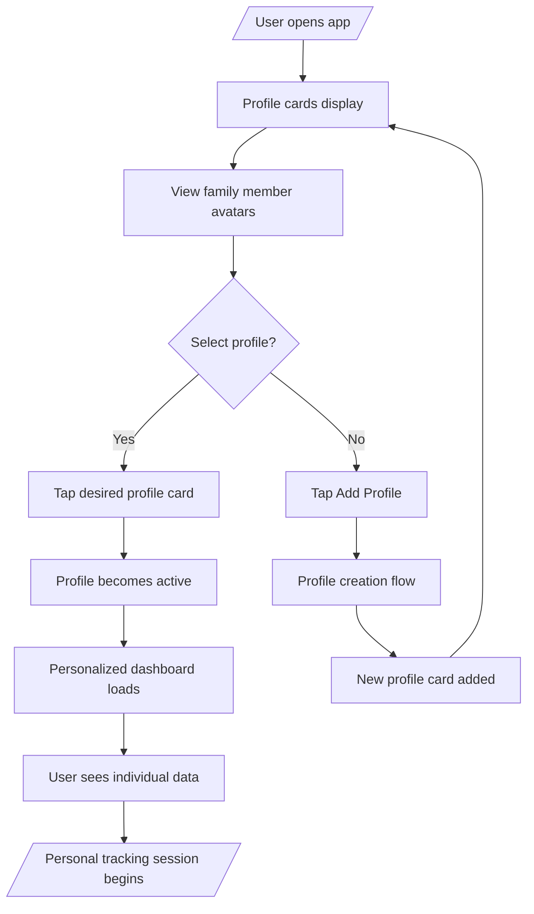
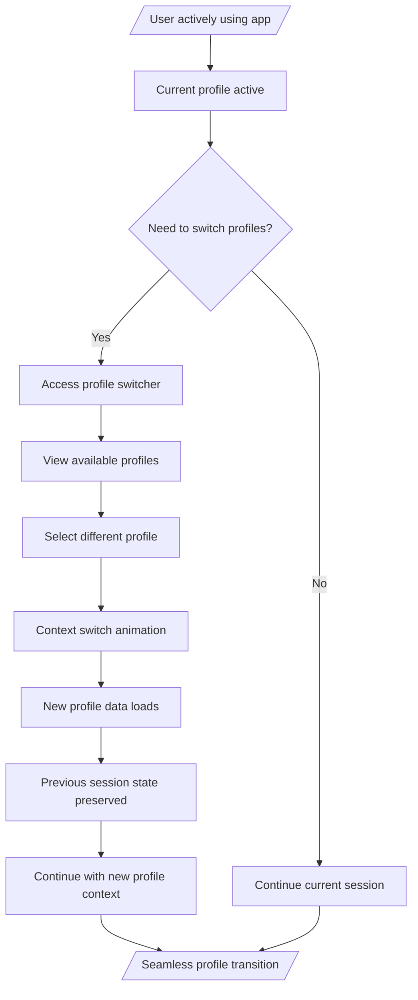
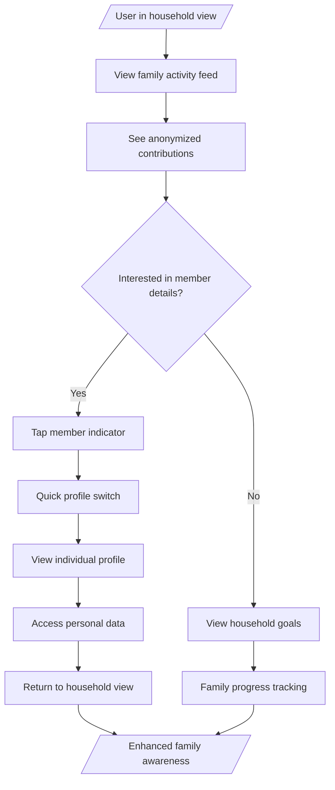
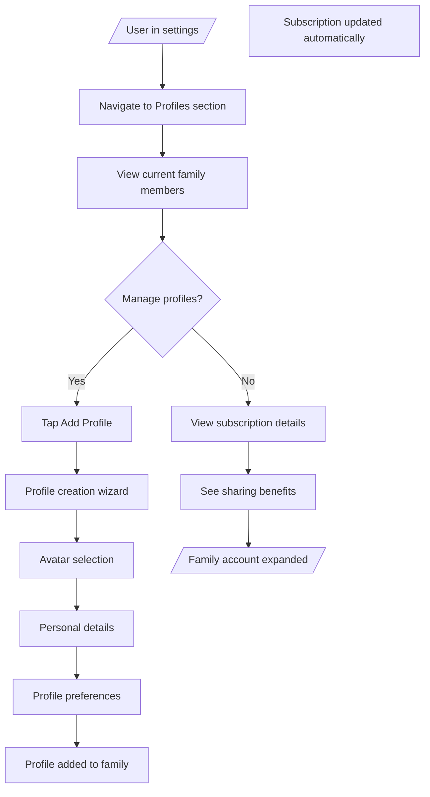

# Design-Lite Workflow: Multi-User Support Mode

## Step 5: USER-FLOWS
*Combined: IA map + Mermaid flows + Screen list*

### Information Architecture (IA) Map

```
┌─────────────────────────────────────────────────────────────────┐
│                    CALOR TRACKER - MULTI-USER MVP                │
│                                                                 │
│  ┌─────────────────┐    ┌─────────────────┐    ┌─────────────────┐ │
│  │   PROFILES ⭐   │    │   HOUSEHOLD     │    │   INDIVIDUAL    │ │
│  │  ├─ Profile     │    │  ├─ Dashboard   │    │  ├─ Dashboard   │ │
│  │  │  Cards       │    │  ├─ Activity    │    │  ├─ Meals       │ │
│  │  ├─ Switcher    │    │  ├─ Goals       │    │  ├─ Progress    │ │
│  │  ├─ Management  │    │  └─ Members     │    │  ├─ Settings    │ │
│  │  └─ Settings    │    │                  │    │  └─ Profile     │ │
│  └─────────────────┘    └─────────────────┘    └─────────────────┘ │
│                                                                 │
│  ┌─────────────────┐    ┌─────────────────┐    ┌─────────────────┐ │
│  │   MEALS         │    │   CHALLENGES    │    │   SETTINGS      │ │
│  │  ├─ History     │    │  ├─ Active      │    │  ├─ Subscription │ │
│  │  ├─ Planning    │    │  ├─ Social      │    │  ├─ Profiles     │ │
│  │  ├─ Analytics   │    │  ├─ Leaderboards│    │  ├─ Privacy      │ │
│  │  └─ Favorites   │    │  └─ Achievements│    │  └─ Help         │ │
│  │                  │    │                  │    │                  │
│ └─────────────────┘    └─────────────────┘    └─────────────────┘ │
└─────────────────────────────────────────────────────────────────┘

Navigation Changes:
• Profile Cards become app entry point (replaces single home screen)
• Household tab provides family overview and coordination
• Individual tabs remain personalized per active profile
• Profile switcher available throughout app for context changes
• Settings expanded with profile and subscription management
```

### Key User Flows (Mermaid Diagrams)

#### Flow 1: App Launch & Profile Selection


#### Flow 2: Profile Switching During Use


#### Flow 3: Household Coordination


#### Flow 4: Subscription & Profile Management


### Comprehensive Screen List

#### Core Profile Screens (New)
1. **Profile Cards** - Netflix-style grid of family member profiles on app launch
2. **Profile Switcher** - Dropdown/modal for switching between profiles during use
3. **Profile Creation** - Wizard for adding new family members to the account
4. **Household Dashboard** - Shared family activity view with anonymized data

#### Enhanced Existing Screens (Modified)
5. **Individual Dashboard** - Personalized home screen per active profile
6. **Meals History** - Profile-specific meal logging and history
7. **Progress Tracking** - Individual goal progress and analytics
8. **Settings > Profiles** - Family account and profile management
9. **Settings > Subscription** - Multi-user billing and sharing details

#### Profile Management Screens (New)
10. **Profile Editor** - Edit individual profile details and preferences
11. **Profile Removal** - Safe profile deletion with data export options
12. **Subscription Sharing** - Visual breakdown of shared costs and benefits

#### Edge Case & Empty State Screens
13. **Single User Onboarding** - Transition from single to multi-user account
14. **Profile Limit Reached** - Upgrade prompts for larger families
15. **Offline Profile Sync** - Handling profile changes without network
16. **Profile Recovery** - Restore accidentally deleted profiles

**Total Screens:** 16 (4 new core, 5 enhanced, 4 new management, 3 edge cases)

**Navigation Patterns:**
- Profile cards as mandatory app entry point
- Profile switcher accessible from all screens
- Household view as optional shared context
- Individual views remain the primary interaction mode
- Settings provide profile and subscription management

**Responsive Considerations:**
- Mobile-first: Touch-optimized profile cards and switching
- Tablet: Enhanced grid layouts for profile selection
- Shared devices: Quick switching and automatic timeouts
- Accessibility: Voice navigation and screen reader support for profiles</content>
<parameter name="filePath">prototypes/02a-ai-delegation/outputs/CR05-multi-user-support/5-user-flows.md