# IA Map: Multi-User Support Mode

## 2.1 Identify Where Objects Live

Map each object to its location in app hierarchy:

| Object | Primary Location | Secondary Location(s) | Access From |
|--------|------------------|----------------------|-------------|
| Family Account | /profiles/setup | /settings/account | Initial setup, account management |
| Individual Profile | /profiles | /home (active), /settings/profile | Profile selection, personal settings |
| Household Dashboard | /household | /home (summary), /profiles | Family overview, navigation hub |
| Profile Switcher | /profiles/switcher | All screens (overlay) | Global navigation, context switching |
| Shared Subscription | /settings/subscription | /profiles/setup, /household | Billing, account management |

## 2.2 Show Current IA (Base App Structure)

```mermaid
flowchart TB
    subgraph ROOT["🏠 Calor Tracker"]
        direction TB
        HOME["Home/Dashboard"]

        subgraph NAV["Bottom Navigation"]
            HOME_TAB["Home"]
            MEALS["Meals"]
            SEARCH["Search"]
            PROFILE["Profile"]
            SETTINGS["Settings"]
        end
    end

    HOME --> NAV
```

## 2.3 Show IA Changes for Multi-User Support

Highlight what's new/modified:

```mermaid
flowchart TB
    subgraph ROOT["🏠 Calor Tracker"]
        direction TB
        PROFILES["🆕 Profile Cards ⭐"]

        subgraph NAV["Bottom Navigation"]
            HOME_TAB["Home"]
            MEALS["Meals"]
            SEARCH["Search"]
            HOUSEHOLD["🆕 Household"]
            SETTINGS["Settings"]
        end

        subgraph HOME_SEC["Home Section (Profile-Specific)"]
            HOME_PERSONAL["Personal Dashboard"]
            PROFILE_SWITCHER["Profile Switcher"]
        end

        subgraph HOUSEHOLD_SEC["🆕 Household Section"]
            HOUSEHOLD_DASHBOARD["Family Dashboard"]
            HOUSEHOLD_ACTIVITY["Shared Activity"]
            HOUSEHOLD_GOALS["Family Goals"]
        end

        subgraph PROFILES_SEC["🆕 Profiles Section"]
            PROFILES_LIST["Profile Management"]
            PROFILES_ADD["Add Family Member"]
            PROFILES_EDIT["Edit Profile"]
        end

        subgraph SETTINGS_SEC["Settings (Enhanced)"]
            SETTINGS_SUBSCRIPTION["Family Subscription ⭐"]
            SETTINGS_PRIVACY["Profile Privacy"]
        end
    end

    PROFILES --> NAV
    NAV --> HOME_SEC
    NAV --> HOUSEHOLD_SEC
    NAV --> PROFILES_SEC
    NAV --> SETTINGS_SEC

    style PROFILES fill:#e8f5e9,stroke:#4CAF50,stroke-width:2px
    style HOUSEHOLD fill:#e8f5e9,stroke:#4CAF50,stroke-width:2px
    style HOUSEHOLD_SEC fill:#e8f5e9,stroke:#4CAF50,stroke-width:2px
    style PROFILES_SEC fill:#e8f5e9,stroke:#4CAF50,stroke-width:2px
    style SETTINGS_SUBSCRIPTION fill:#e8f5e9,stroke:#4CAF50,stroke-width:2px
    style PROFILE_SWITCHER fill:#e8f5e9,stroke:#4CAF50,stroke-width:2px
```

## 2.4 IA Decision Table

| Location | Change Type | Rationale |
|----------|-------------|-----------|
| /profiles | NEW | Netflix-style profile selection as app entry point |
| /household | NEW | Family overview and coordination hub |
| /home | MODIFIED | Becomes profile-specific personal dashboard |
| /settings/subscription | MODIFIED | Enhanced with family billing and member management |
| Global navigation | MODIFIED | Profile switcher available throughout app |

## 2.5 Navigation Paths to Objects

| Object | Primary Path | Alternative Path(s) |
|--------|--------------|---------------------|
| Family Account | Settings → Account → Family | Initial setup flow |
| Individual Profile | Profiles → Select | Home → Profile Switcher |
| Household Dashboard | Navigation → Household | Home → Family Summary |
| Profile Switcher | Global overlay | Profiles → Quick Switch |
| Shared Subscription | Settings → Subscription | Household → Billing |</content>
<parameter name="filePath">prototypes/02a-ai-delegation/outputs/CR05-multi-user-support/7-ia-map.md