# User Flows: Multi-User Support Mode

## 3.1 Derive Jobs-to-be-Done

From objects, actions, and IA, derive jobs:

| Job ID | Job Statement | Primary Objects | IA Location | Key Actions |
|--------|---------------|-----------------|-------------|-------------|
| J1 | When I want to share subscription costs with my family, I want to set up a family account, So that we can all access premium features affordably | Family Account, Shared Subscription | /profiles/setup | create account, add members, select plan |
| J2 | When I want to switch between family members, I want easy profile switching, So that I can log food for the right person quickly | Individual Profile, Profile Switcher | /profiles, global overlay | select profile, switch context, maintain state |
| J3 | When I want to see family nutrition patterns, I want a household dashboard, So that I can coordinate meals and track family health | Household Dashboard, Family Activity Feed | /household | view summary, see highlights, navigate to individuals |
| J4 | When I want to maintain personal privacy, I want individual data separation, So that my nutrition tracking remains private within the family | Individual Profile, Privacy Settings | /settings/profile, /profiles/edit | set privacy, control sharing, manage data |

## 3.2 Create Complete Flow Diagram

Show all jobs navigating through IA:

```mermaid
flowchart TB
    subgraph ENTRY["🚀 Entry Points"]
        E1[/"New user signup"/]
        E2[/"Existing user upgrade"/]
        E3[/"Profile switching need"/]
        E4[/"Family coordination"/]
    end

    subgraph IA["📱 IA Structure"]
        PROFILES["Profiles"]
        HOME["Home"]
        HOUSEHOLD["Household"]
        SETTINGS["Settings"]
    end

    subgraph J1["J1: Setup Family Account ⭐"]
        direction LR
        J1A["Choose family plan"]
        J1B["Create family account"]
        J1C["Add first member"]
        J1D["Invite additional members"]
        J1E["Complete setup"]

        J1A --> J1B --> J1C --> J1D --> J1E
    end

    subgraph J2["J2: Switch Profiles Easily"]
        direction LR
        J2A["Access profile switcher"]
        J2B["View available profiles"]
        J2C["Select target profile"]
        J2D["Context switch animation"]
        J2E["Load personal dashboard"]
        J2F["Continue with new profile"]

        J2A --> J2B --> J2C --> J2D --> J2E --> J2F
    end

    subgraph J3["J3: Coordinate Household"]
        direction LR
        J3A["Access household view"]
        J3B["View family summary"]
        J3C["See member highlights"]
        J3D["Navigate to individual"]
        J3E["Coordinate activities"]

        J3A --> J3B --> J3C --> J3D --> J3E
    end

    subgraph J4["J4: Maintain Privacy"]
        direction LR
        J4A["Access profile settings"]
        J4B["Configure privacy controls"]
        J4C["Set data sharing preferences"]
        J4D["Review privacy status"]

        J4A --> J4B --> J4C --> J4D
    end

    E1 --> PROFILES
    E2 --> SETTINGS
    E3 --> HOME
    E4 --> HOUSEHOLD

    PROFILES --> J1
    HOME --> J2
    HOUSEHOLD --> J3
    SETTINGS --> J4

    J1 --> HOME
    J2 --> HOME
    J3 --> HOME
    J4 --> SETTINGS

    style J1 fill:#e8f5e9,stroke:#4CAF50,stroke-width:2px
```

## 3.3 Create Individual Job Flows

### J1: Setup Family Account (Primary Job)

### J2: Switch Profiles Easily

### J3: Coordinate Household

### J4: Maintain Privacy

## 3.4 Job Summary

| Job | IA Entry Point | Steps | Decision Points | Exit Point |
|-----|----------------|-------|-----------------|------------|
| J1: Setup Family Account | Signup/upgrade | 6 | 1 | Profile selection |
| J2: Switch Profiles Easily | Profile switcher | 5 | 0 | Personal dashboard |
| J3: Coordinate Household | Household tab | 4 | 0 | Individual profile |
| J4: Maintain Privacy | Settings | 4 | 0 | Settings updated |</content>
<parameter name="filePath">prototypes/02a-ai-delegation/outputs/CR05-multi-user-support/7-user-flows.md