# User Flows: CR05 Multi-User Support (Family/Couple Mode)

## App Structure

### Where Things Live

| Thing | Main Location | Also Found | How to Get There |
|-------|---------------|------------|------------------|
| Your Profile | Settings → Profiles | Header (your picture) | Settings, tap avatar |
| Your Partner | Settings → Add Partner | - | Settings |
| Both of You | Settings → Profiles | - | Settings |
| Shared Meal | Quick Add (toggle) | Home timeline | Size picker, timeline |

### Current App Structure

```mermaid
flowchart TB
    subgraph App["🏠 App"]
        direction TB
        Home["Home"]

        subgraph Tabs["Navigation"]
            Tab1["Home"]
            Tab2["Quick Add"]
            Tab3["History"]
            Tab4["Profile"]
        end

        subgraph Settings["Settings"]
            Account["Account"]
            Goals["Goals"]
            Logout["Logout"]
        end
    end

    Home --> Tabs
    Tab4 --> Settings
```

### What's New in This Feature

```mermaid
flowchart TB
    subgraph App["🏠 App"]
        direction TB
        Header["🆕 Your Picture (Tap to Switch)"]
        Home["Home"]

        subgraph Tabs["Navigation"]
            Tab1["Home"]
            Tab2["Quick Add"]
            Tab3["History"]
            Tab4["Profile"]
        end

        subgraph Settings["Settings"]
            Account["Account"]
            Profiles["🆕 Profiles"]
            AddPartner["🆕 Add Partner"]
            Goals["Goals"]
            Logout["Logout"]
        end

        subgraph QuickAddBetter["Quick Add (Better)"]
            SizePicker["🔄 Size Picker"]
            LogForPartner["🆕 'Log for partner too' Toggle"]
        end
    end

    Header --> Home
    Home --> Tabs
    Tab4 --> Settings
    Tab2 --> QuickAddBetter

    style Header fill:#e8f5e9,stroke:#4CAF50,stroke-width:2px
    style Profiles fill:#e8f5e9,stroke:#4CAF50,stroke-width:2px
    style AddPartner fill:#e8f5e9,stroke:#4CAF50,stroke-width:2px
    style LogForPartner fill:#e8f5e9,stroke:#4CAF50,stroke-width:2px
```

### What's Changing

| Screen | Change | Why |
|--------|--------|-----|
| Header | UPDATED | Add profile picture you can tap to switch |
| Settings → Profiles | NEW | Manage who uses the app |
| Settings → Add Partner | NEW | Add your partner's profile |
| Size Picker | UPDATED | Add "Log for partner too" toggle |
| Home | UPDATED | Shows meals for whoever is active |

---

## What Users Want to Do

| Goal | What They're Thinking | Where | Steps |
|------|----------------------|-------|-------|
| Add Partner | "Let me add my partner so we can both track on this phone" | Settings → Add Partner | type name, set goal, save |
| Log for Both ⭐ | "We're sharing this meal, let me log it for both of us" | Size picker (toggle) | toggle on, pick partner's size, log |
| Log Just for Me | "I'm eating alone, just log for myself" | Size picker | keep toggle off, log |
| Switch to Partner | "My partner needs to log something, let me switch to their view" | Tap your picture | tap avatar, select partner |
| See Partner's Day | "How's my partner doing today? Let me check their dashboard" | Switch profile | switch, look at their Home |

---

## Complete Flow Overview

---

## Step-by-Step Flows

### Add Partner (One-Time Setup)

**How often:** Once - when you first want to share
**Starting from:** Settings → "Add Partner"
**Ending at:** Partner created, back to settings

**What happens:**
- Name: Required, can't be empty
- Goal: Slider with 2000 as default
- Add: Creates their profile, shows in switcher

**What if:**
- Same name as you → Allowed (you can tell by the picture)
- Already have a partner → v1 only supports 2 people

---

### Log for Both (Shared Meals) ⭐

**How often:** Every day - when you eat together
**Starting from:** Quick Add → pick food → size picker
**Ending at:** Both meals logged, success message

**What happens:**
- Toggle appears below your size selection
- Partner's size starts same as yours
- You can change partner to different S/M/L
- One "Log Meal" button logs for both

**What if:**
- No partner added yet → Toggle doesn't show
- Partner eats different amount → Shows both calorie counts

---

### Log Just for Me (Solo Meals)

**How often:** Every day - when you eat alone
**Starting from:** Quick Add → pick food
**Ending at:** Your meal logged

**What happens:**
- Toggle is OFF by default
- Normal logging flow unchanged
- Only logs to whoever is active

---

### Switch to Partner (Hand Over the Phone)

**How often:** A few times a day
**Starting from:** Tap your picture in the header
**Ending at:** Now viewing as partner

```mermaid
flowchart LR
    Start[/"Any Screen"/]
    Avatar["Your Picture\n(Shows Who's Active)"]
    TapAvatar["Tap Your Picture"]
    Dropdown["Dropdown Shows:\n• You (current)\n• Partner"]
    SelectPartner["Tap Partner"]
    ViewSwitches["Now Viewing\nas Partner"]
    HomeRefreshes["Home Shows\nPartner's Data"]
    AvatarUpdates["Picture Changes\nto Partner's"]
    Done[/"Continue as Partner"/]

    Start --> Avatar --> TapAvatar --> Dropdown --> SelectPartner --> ViewSwitches --> HomeRefreshes --> AvatarUpdates --> Done

    style Dropdown fill:#fff3e0,stroke:#FF9800,stroke-width:2px
    style ViewSwitches fill:#e8f5e9,stroke:#4CAF50,stroke-width:2px
```

**What happens:**
- Your picture always visible in header
- Tap → Dropdown with both people
- Select → Instant switch
- Everything now shows their data

**What if:**
- No partner → Dropdown doesn't show, just your picture
- Switch while logging → Keeps what you were doing

---

### See Partner's Day (Check on Them)

**How often:** Sometimes - to see how they're doing
**Starting from:** Switch to partner
**Ending at:** Look at their Home

```mermaid
flowchart LR
    Start[/"Your Home"/]
    TapAvatar["Tap Your Picture"]
    SelectPartner["Select Partner"]
    TheirHome["Home Shows\nPartner's Data"]
    SeeTheirDay["See Their:\n• Today's Calories\n• History\n• Goals"]
    CanLogForThem["Can Log for Them\n(Their Favorites)"]
    Done[/"Switch Back\nWhen Done"/]

    Start --> TapAvatar --> SelectPartner --> TheirHome --> SeeTheirDay --> CanLogForThem --> Done

    style TheirHome fill:#e3f2fd,stroke:#2196F3,stroke-width:2px
```

**What happens:**
- Full access to partner's view
- Can log meals for them
- Uses their favorites list
- Switch back via same dropdown

---

## All Screens

### Settings Screens

| Screen | Used For | What It Does |
|--------|----------|--------------|
| Settings (Better) | Managing profiles | Shows "Add Partner" option |
| Add Partner | Creating partner | Name + calorie goal form |
| Profiles | Viewing everyone | List of people using the app |

### Quick Add (Better)

| Screen | Used For | What It Does |
|--------|----------|--------------|
| Size Picker (Better) | Logging meals | Now has "Log for partner too" toggle |

### Header Parts

| Part | Used For | What It Does |
|------|----------|--------------|
| Your Picture | Showing who's active | Shows current person's avatar |
| Profile Dropdown | Switching people | Tap to select you or partner |

### Home (Better)

| Screen | Used For | What It Does |
|--------|----------|--------------|
| Home | Daily overview | Shows whoever is active's data |

---

## Screen Connections

---

## Summary

| Goal | Where | Steps | Decisions | How Often |
|------|-------|-------|-----------|-----------|
| Add Partner | Settings → Add Partner | 5 | 1 | Once |
| Log for Both ⭐ | Size picker (toggle) | 6 | 2 | Every day |
| Log Just for Me | Size picker | 4 | 0 | Every day |
| Switch Profile | Header tap | 4 | 0 | A few times daily |
| See Partner's Day | Header → switch | 4 | 0 | Sometimes |

---

## Key Patterns

1. **Same phone, both people** - Both profiles on one phone, switch via header
2. **Choose to share** - Toggle is OFF by default, you turn it on when sharing a meal
3. **Always know who** - Your picture in header prevents logging as wrong person
4. **Separate favorites** - Each person has their own favorites list
5. **Different portions** - Can set different size for partner (they eat more/less)

---

## How to Get Around

| What | Main Way | Other Way |
|------|----------|-----------|
| Add Partner | Settings → Add Partner | - |
| Log for Both | Quick Add → Food → Picker → Toggle ON | - |
| Switch to Partner | Tap your picture → Dropdown → Select | - |
| Partner's Home | Switch profile → Home | - |
| Partner's Favorites | Switch profile → Quick Add | - |
