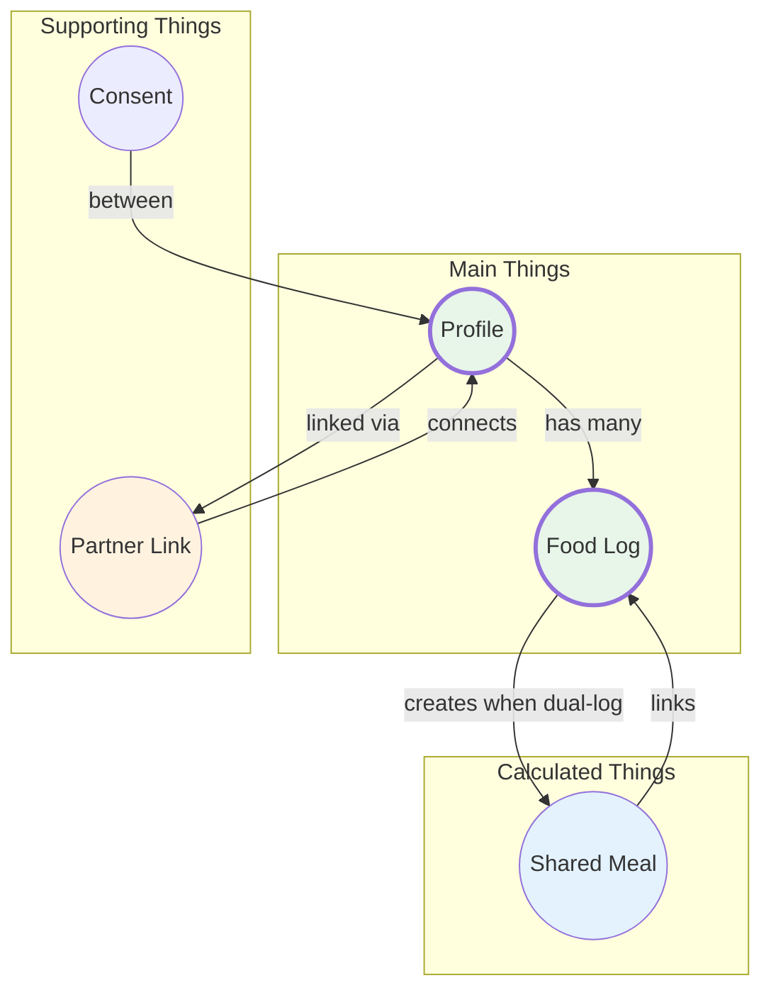

# Dot Map - CR05 Multi-User Support

## What This Feature Does

**Feature:** Multi-User Support (Couple Mode)
**Problem:** When couples eat the same meal, each person logs separately - double the work
**Solution:** "Log for Both" feature + Profile switching on the same device

---

## Things & Actions Summary

| Type | Thing | Description | User Actions |
|------|-------|-------------|--------------|
| **Main** | Profile | Individual person (self or partner) | create, switch, view, edit |
| **Main** | Food Log | A meal entry (now supports dual logging) | log, log for both, delete, undo |
| **Supporting** | Partner Link | Connection between you and your partner | create, remove |
| **Supporting** | Consent | Permission to log meals for partner | grant, take back |
| **Calculated** | Shared Meal | Link between two related food logs | auto-created |

---

## Details for Each Thing

### Profile

| Detail | Type | Required? | Notes |
|--------|------|-----------|-------|
| id | text | Yes | Unique identifier |
| display name | text | Yes | Shown in Profile Switcher |
| avatar emoji | emoji | Yes | Visual identifier |
| daily calorie goal | number | Yes | Personal target |
| daily protein goal | number | Yes | Personal target |
| daily carbs goal | number | Yes | Personal target |
| daily fat goal | number | Yes | Personal target |
| is primary | yes/no | Yes | True for main user |
| created at | timestamp | Auto | When profile was created |

### Partner Link

| Detail | Type | Required? | Notes |
|--------|------|-----------|-------|
| primary user id | text | Yes | Main account holder |
| partner profile id | text | Yes | Partner's profile |
| partner display name | text | Yes | Shown in app |
| consent enabled | yes/no | Yes | Can log for partner? |
| created at | timestamp | Auto | When partner was added |

### Food Log (Enhanced for CR05)

| Detail | Type | Required? | Notes |
|--------|------|-----------|-------|
| id | text | Yes | Unique identifier |
| profile id | text | Yes | **NEW:** Which profile this belongs to |
| food id | text | Yes | Reference to food item |
| portion | S/M/L | Yes | Portion size |
| calories | number | Yes | Calculated value |
| logged at | timestamp | Yes | When logged |
| shared meal id | text | No | **NEW:** Links to partner's log |
| logged by | text | No | **NEW:** Who logged this |

### Shared Meal (Calculated)

| Detail | Type | Required? | Notes |
|--------|------|-----------|-------|
| id | text | Yes | Unique identifier |
| user log id | text | Yes | Your food log |
| partner log id | text | Yes | Partner's food log |
| created at | timestamp | Auto | When "Log for Both" was used |

### Consent

| Detail | Type | Required? | Notes |
|--------|------|-----------|-------|
| grantor id | text | Yes | Partner who gave permission |
| grantee id | text | Yes | User who received permission |
| granted at | timestamp | Auto | When consent was given |
| revoked at | timestamp | No | When consent was taken back |

---

## What Users Can Do

| Thing | User Actions |
|-------|--------------|
| **Profile** | create (via Add Partner), switch (via dropdown), view, edit goals |
| **Partner Link** | create (add partner), remove (remove partner) |
| **Consent** | grant (enable "Log for Both"), take back (disable) |
| **Food Log** | log for self, log for both, delete, undo |
| **Shared Meal** | auto-created (no direct action) |

---

## How Things Connect

```
You (Profile)
    |
    +--< has >-- Partner Link --< connects to >-- Partner (Profile)
    |                                                 |
    +--< has many >-- Food Logs <--------------- Food Logs --< has many >--+
    |                     |                           |
    |                     +--< linked via >-- Shared Meal --< linked via >--+
    |
    +--< grants >-- Consent --< receives >-- Partner (Profile)
```

### Connection Diagram



---

## Key Design Decisions

| Decision | Why |
|----------|-----|
| Profile-based, not separate logins | Partner doesn't need their own account |
| Consent OFF by default | Privacy - must explicitly opt in |
| Shared Meal is calculated | Auto-created, no extra user action needed |
| Partner portion can be different | Different appetites, same meal |
| Data stays separate | Each profile has own favorites, history |

---

## Limits

| Limit | Value | Why |
|-------|-------|-----|
| Partners per user | 1 | MVP - couple mode only |
| Profiles per device | 2 | Primary + 1 partner |
| Consent revocation | Anytime | Privacy requirement |
