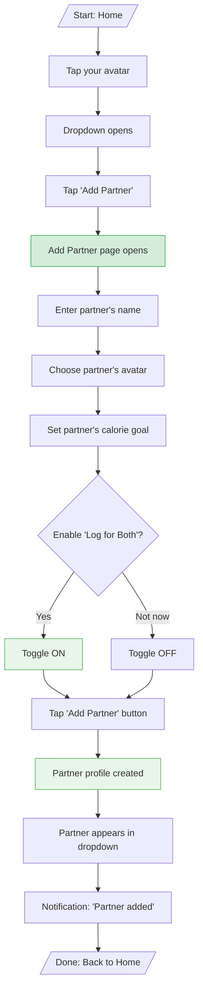
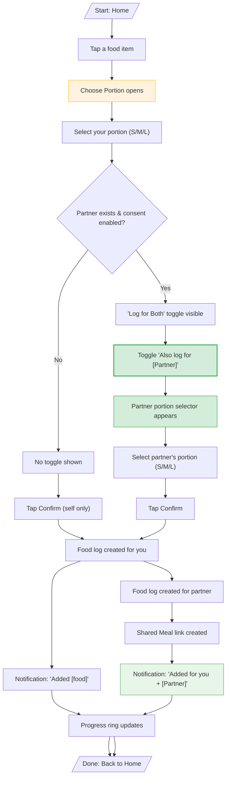
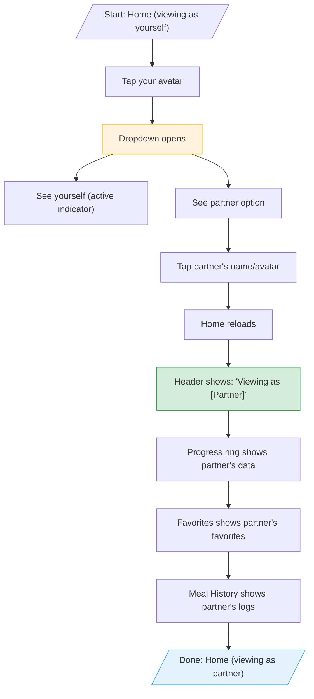
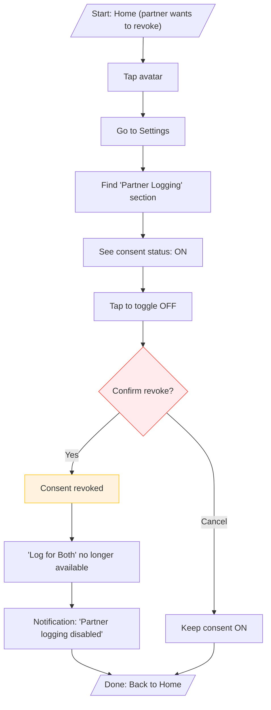
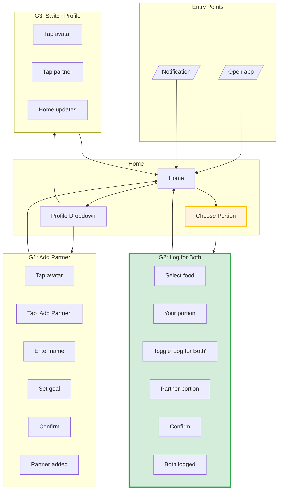
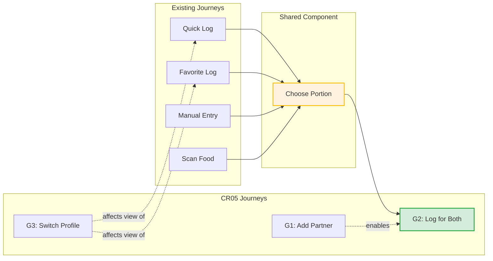

# User Journeys - CR05 Multi-User Support

## User Goals Summary

| Goal ID | Goal Statement | Things Involved | Key Actions |
|---------|----------------|-----------------|-------------|
| **G1** | When I want to track meals for both of us, I want to add my partner, so that we can share meal logging | Profile, Partner Link, Consent | create, grant |
| **G2** | When we eat together, I want to log for both of us at once, so that we save time | Food Log, Shared Meal | log for both, confirm |
| **G3** | When I want to see my partner's progress, I want to switch profiles, so that I can help them stay on track | Profile | switch, view |
| **G4** | When my partner logs something wrong for me, I want to take back my consent, so that I control my own data | Consent | take back |

---

## Individual Journey Diagrams

### G1: Add Partner (First-Time Setup)

**Goal:** When I want to track meals for both of us, I want to add my partner, so that we can share meal logging.

**How often:** Once per household

**Steps:** 9 | **Decisions:** 1 (consent) | **Time:** ~30 seconds

**Success looks like:**
- Partner appears in profile dropdown
- "Log for Both" toggle is available (if consent enabled)

---

### G2: Log for Both (Primary CR05 Journey)

**Goal:** When we eat together, I want to log for both of us at once, so that we save time.

**How often:** Very High (60-70% of meals are shared)

**Steps:** 7 (with partner) / 5 (without) | **Decisions:** 2 (your portion, partner portion) | **Time:** <30 seconds

**Success looks like:**
- Both food logs created
- Shared Meal record links them
- Notification shows both names
- Both progress rings update

---

### G3: Switch Profile (View Partner's Progress)

**Goal:** When I want to see my partner's progress, I want to switch profiles, so that I can help them stay on track.

**How often:** Medium (a few times per day)

**Steps:** 4 | **Decisions:** 0 | **Time:** ~2 seconds

**Success looks like:**
- Header clearly shows active profile
- All data shows partner's info
- Can log for partner while in their view

---

### G4: Take Back Consent (Revoke Permission)

**Goal:** When my partner logs something wrong for me, I want to take back my consent, so that I control my own data.

**How often:** Rare (edge case)

**Steps:** 6 | **Decisions:** 1 (confirm revoke) | **Time:** ~10 seconds

**Note:** This journey is for future implementation. MVP assumes consent stays enabled once granted.

---

## Complete Journey Map

Shows all goals and how they connect:

---

## Journey Summary

| Goal | Entry Point | Steps | Decisions | Exit Point | How Often |
|------|-------------|-------|-----------|------------|-----------|
| G1: Add Partner | Profile Dropdown | 9 | 1 | Home | Once |
| G2: Log for Both | Choose Portion | 7 | 2 | Home | Very High |
| G3: Switch Profile | Profile Dropdown | 4 | 0 | Home | Medium |
| G4: Take Back Consent | Settings | 6 | 1 | Home | Rare |

---

## How CR05 Journeys Connect to Existing Journeys

---

## Edge Cases & Error Handling

| Scenario | How to Handle |
|----------|---------------|
| Partner not added yet | "Log for Both" toggle not shown |
| Consent not enabled | "Log for Both" toggle not shown |
| Partner profile still loading | Toggle disabled until loaded |
| Partner log fails | Show "Added for you (partner failed)" |
| User deletes shared meal | Only deletes their log, partner's stays |
| Undo after "Log for Both" | Only undoes user's log |

---

## Success Metrics

| Metric | Target | How to Measure |
|--------|--------|----------------|
| Shared meal logging time | ≤30 seconds | Timer from tap to confirm |
| Meal logging increase | +40% | Compare pre/post CR05 logs |
| Active profile clarity | 9/10 users correct | User testing |
