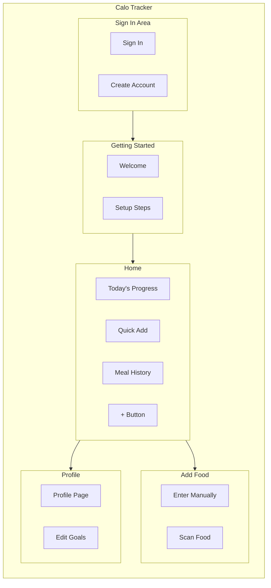
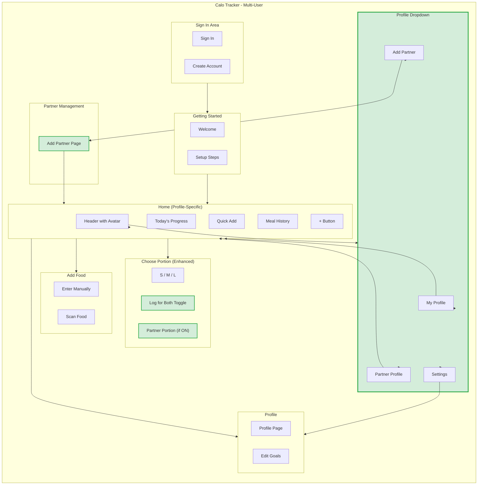

# App Map - CR05 Multi-User Support

## How Journeys Shape Structure

Structure emerges from understanding user journeys. This section analyzes what areas the app needs to support each goal.

---

## Journey-to-Structure Analysis

### What Areas Do Journeys Need?

| Journey | Areas Needed | Why |
|---------|--------------|-----|
| G1: Add Partner | Home (avatar), Profile Dropdown, Add Partner page | Setup flow starts from avatar, needs dedicated page for form |
| G2: Log for Both | Home, Choose Portion (enhanced) | Quick access from home, portion picker is the key moment |
| G3: Switch Profile | Home (avatar), Profile Dropdown | Fast switching via dropdown in header |
| G4: Take Back Consent | Profile, Settings | Privacy controls live in settings area |

### What Areas Already Exist?

| Area | Already Supports |
|------|------------------|
| Home | View progress, quick add food, meal history |
| Choose Portion | Select S/M/L, confirm logging |
| Profile | User info, goals, settings |

### What's New for CR05?

| New/Enhanced | Journeys Supported | Why New |
|--------------|-------------------|---------|
| **Profile Dropdown** (new) | G1, G3 | Need way to switch profiles + add partner |
| **Add Partner page** (new) | G1 | Form needs dedicated space (name, avatar, goal, consent) |
| **Choose Portion** (enhanced) | G2 | Add "Log for Both" toggle + partner portion |
| **Notification** (enhanced) | G2 | Show "for you + [Partner]" message |

---

## Group Related Actions

| Area | Journeys Supported | Things Shown |
|------|-------------------|--------------|
| **Home** | G1, G2, G3 | Progress ring, meal history, quick add, avatar (dropdown trigger) |
| **Profile Dropdown** | G1, G3 | Your profile, partner profile, add partner option, settings link |
| **Add Partner** | G1 | Name input, avatar picker, calorie goal, consent toggle |
| **Choose Portion** | G2 | Food name, S/M/L buttons, "Log for Both" toggle, partner portion |
| **Profile/Settings** | G4 | User info, goals, partner logging consent |

---

## App Structure (Before CR05)



---

## App Structure (With CR05)



---

## Where Things Live

| Thing | Main Location | Also Appears In | How to Access |
|-------|---------------|-----------------|---------------|
| **Profile** | Profile page | Home header (avatar) | Tap avatar → Profile Dropdown |
| **Partner Link** | Add Partner page | Profile Dropdown | Tap avatar → "Add Partner" |
| **Consent** | Add Partner page | (Settings - future) | During partner setup |
| **Food Log** | Home (Meal History) | - | Scroll to Meal History |
| **Shared Meal** | Home (Meal History) | - | Auto-linked, visual indicator |

---

## Navigation Paths

### New Navigation (CR05)

| From | To | How | Journey |
|------|-----|-----|---------|
| Home | Profile Dropdown | Tap avatar in header | G1, G3 |
| Profile Dropdown | Partner View | Tap partner avatar | G3 |
| Profile Dropdown | Add Partner | Tap "Add Partner" | G1 |
| Add Partner | Home | Complete setup | G1 |
| Choose Portion | Dual Log | Toggle "Log for Both" | G2 |

### Updated Navigation

| Navigation | Before | After |
|------------|--------|-------|
| Tap avatar | → Profile page | → Profile Dropdown |
| Choose Portion confirm | → Home (1 log) | → Home (1 or 2 logs) |
| Notification | "Added [food]" | "Added for you" or "Added for you + [Partner]" |

---

## Route Structure

| Route | Screen | Who Can Access | Status | Purpose |
|-------|--------|----------------|--------|---------|
| `/` | Redirect | - | Unchanged | Redirects to Sign In |
| `/login` | Sign In | Public | Unchanged | User authentication |
| `/register` | Create Account | Public | Unchanged | New user registration |
| `/dashboard` | Home | Logged in | Modified | Profile-specific dashboard |
| `/add-partner` | Add Partner | Logged in | **NEW** | Create partner profile |
| `/profile` | Profile | Logged in | Modified | Shows active profile |
| `/profile/edit-goals` | Edit Goals | Logged in | Unchanged | Edit nutrition goals |

---

## Screen Sections Detail

### Home (Profile-Specific)

```
┌─────────────────────────────────────────────┐
│ Header                                       │
│ ┌─────────────────────────────────────────┐ │
│ │ [Avatar ▼] Profile Dropdown trigger     │ │  ← NEW
│ │ "Viewing as: [Name]"                    │ │  ← NEW
│ └─────────────────────────────────────────┘ │
├─────────────────────────────────────────────┤
│ Today's Progress                             │  ← Profile-specific
│ [Calorie Ring] [Macro Bars]                 │
├─────────────────────────────────────────────┤
│ Quick Add                                    │
│ [Search Bar]                                │
│ My Favorites (profile-specific)              │  ← Profile-specific
│ Meal Combos (profile-specific)               │  ← Profile-specific
├─────────────────────────────────────────────┤
│ Meal History                                 │  ← Profile-specific
│ [Today's logs for active profile]           │
├─────────────────────────────────────────────┤
│ [+ Add Food Button]                         │
└─────────────────────────────────────────────┘
```

### Profile Dropdown

```
┌─────────────────────────────────────────────┐
│ Switch Profile                               │
├─────────────────────────────────────────────┤
│ ●  My Profile                                │  ← Active indicator
│    1,800 kcal goal                          │
├─────────────────────────────────────────────┤
│    [Partner Name]                            │  ← NEW
│    1,500 kcal goal                          │
├─────────────────────────────────────────────┤
│ + Add Partner                                │  ← NEW
├─────────────────────────────────────────────┤
│ Settings                                     │
└─────────────────────────────────────────────┘
```

### Choose Portion (Enhanced)

```
┌─────────────────────────────────────────────┐
│ Choose Portion Size                          │
├─────────────────────────────────────────────┤
│ [Food Name]                                 │
│                                             │
│ Your portion:                               │
│ [ S ] [ M ] [ L ]                           │
├─────────────────────────────────────────────┤
│ ☐ Also log for [Partner Name]               │  ← NEW Toggle
├─────────────────────────────────────────────┤
│ (If toggle ON)                              │
│ [Partner]'s portion:                        │  ← NEW
│ [ S ] [ M ] [ L ]                           │  ← NEW
├─────────────────────────────────────────────┤
│ [ Cancel ]              [ Confirm ]          │
└─────────────────────────────────────────────┘
```

---

## What Changed Summary

### New Elements

| Element | Location | Purpose |
|---------|----------|---------|
| **Profile Dropdown** | Home header | Switch between self and partner views |
| **Add Partner** | New page `/add-partner` | Create partner profile |
| **"Log for Both" Toggle** | Choose Portion pop-up | Enable dual logging |
| **Partner Portion Selector** | Choose Portion pop-up | Pick different size for partner |

### Modified Elements

| Element | Change | Impact |
|---------|--------|--------|
| **Home** | Now profile-specific | Shows active profile's data |
| **Today's Progress** | Profile-specific | Ring/macros for active profile |
| **My Favorites** | Profile-specific | Separate favorites per profile |
| **Meal History** | Profile-specific | Shows active profile's logs |
| **Choose Portion** | Enhanced | Added toggle + partner portion |
| **Notification** | Enhanced | Shows "Added for you + [Partner]" |

### Unchanged Elements

| Element | Why Unchanged |
|---------|---------------|
| Sign In / Create Account | No change to auth flow |
| Getting Started | Same onboarding for primary user |
| Enter Manually | Works same, respects active profile |
| Scan Food | Works same, respects active profile |
| Edit Goals | Works same, per-profile goals |

---

## Design Decisions

| Decision | Why |
|----------|-----|
| Profile Dropdown in header | Most accessible location, always visible |
| Add Partner as separate page | Needs name + goals input (not inline) |
| Toggle in Choose Portion | Natural moment to decide dual-log |
| Partner portion separate | Different appetites common |
| Profile-specific data | Clear separation, no confusion |
