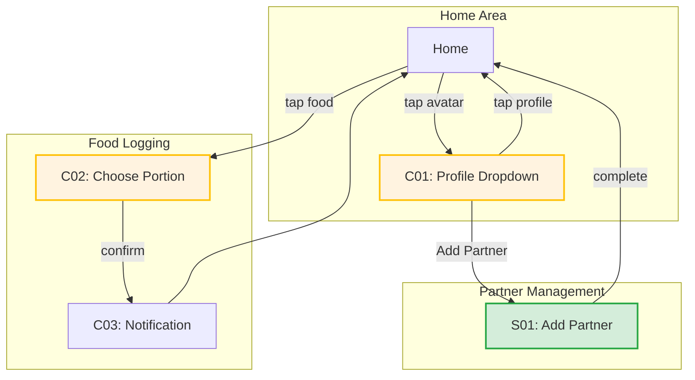

# Screen List - CR05 Multi-User Support

## Screens from Journey Steps

Look at each step in journeys and decide if it needs a screen:

| Journey Step | Goal | Type | Needs Screen? | Why |
|--------------|------|------|---------------|-----|
| Tap avatar | G1, G3 | Action | No | Opens dropdown |
| Profile Dropdown | G1, G3 | Choose | Yes (Component) | Select profile or add partner |
| Add Partner page | G1 | Input | Yes | Name + goals form |
| Enter partner name | G1 | Input | Part of Add Partner | Single field |
| Set partner goal | G1 | Input | Part of Add Partner | Single field |
| Consent toggle | G1 | Decision | Part of Add Partner | Simple toggle |
| Partner added confirmation | G1 | Feedback | No | Notification |
| Choose Portion (enhanced) | G2 | Choose | Yes (Enhanced) | S/M/L + Log for Both toggle |
| "Log for Both" toggle | G2 | Decision | Part of Choose Portion | Simple toggle |
| Partner portion selector | G2 | Choose | Part of Choose Portion | S/M/L for partner |
| Dual log confirmation | G2 | Feedback | No | Notification |
| Switch to partner view | G3 | Action | No | Home reloads |
| Home (partner view) | G3 | View | Yes (Modified) | Same screen, different data |
| Manage consent | G4 | Input | Future | Settings section |

**Screen Types:**
- **View** - Display information
- **Choose** - Select from options
- **Input** - Enter information
- **Confirm** - Verify action
- **Feedback** - Show result (often just a notification)

---

## Consolidated Screen List

### New Screens (CR05)

| ID | Screen | Type | Purpose | Goals Supported |
|----|--------|------|---------|-----------------|
| **S01** | Add Partner | Full page | Create partner profile with name, avatar, calorie goal, consent | G1 |

### New Components (CR05)

| ID | Component | Type | Purpose | Goals Supported |
|----|-----------|------|---------|-----------------|
| **C01** | Profile Dropdown | Dropdown | Profile selection, add partner option | G1, G3 |

### Enhanced Components (CR05)

| ID | Component | Type | Enhancement | Goals Supported |
|----|-----------|------|-------------|-----------------|
| **C02** | Choose Portion | Pop-up | Added "Log for Both" toggle + partner portion | G2 |
| **C03** | Notification | Toast | Shows "for you + [Partner]" message | G2 |

### Modified Screens (CR05)

| ID | Screen | Modification | Impact |
|----|--------|--------------|--------|
| **M01** | Home | Header shows Profile Dropdown instead of simple avatar | All flows affected |
| **M02** | Home | All data sections now profile-specific | G3 affects what's shown |
| **M03** | Profile Page | Shows active profile info | G3 affects what's shown |

---

## Full Screen vs Pop-up

| Screen | Type | Why |
|--------|------|-----|
| S01 Add Partner | Full screen | Form with multiple fields needs space |
| C01 Profile Dropdown | Pop-up (dropdown) | Quick choice, stays on current page |
| C02 Choose Portion | Pop-up (bottom sheet) | Quick choice over current content |
| C03 Notification | Pop-up (toast) | Temporary feedback message |

---

## Screen Details

### S01: Add Partner Page

**Route:** `/add-partner`
**Type:** Full page
**Goals:** G1 (Add Partner)

```
┌─────────────────────────────────────────────┐
│ ← Back                      Add Partner      │
├─────────────────────────────────────────────┤
│                                             │
│         [Large Avatar Emoji Picker]          │
│                                             │
├─────────────────────────────────────────────┤
│ Partner's Name                               │
│ ┌─────────────────────────────────────────┐ │
│ │ [                                      ]│ │
│ └─────────────────────────────────────────┘ │
│                                             │
│ Daily Calorie Goal                          │
│ ┌─────────────────────────────────────────┐ │
│ │ [          1,500          ] kcal       │ │
│ └─────────────────────────────────────────┘ │
│                                             │
├─────────────────────────────────────────────┤
│ Partner Logging                              │
│                                             │
│ ☑ Allow me to log meals for [Partner]       │
│   Partner can change this anytime           │
│                                             │
├─────────────────────────────────────────────┤
│                                             │
│        [ Add Partner Button ]                │
│                                             │
└─────────────────────────────────────────────┘
```

**Fields:**
- Avatar emoji picker (required)
- Partner name (required, text)
- Daily calorie goal (required, number, default 1,500)
- Consent toggle (default ON, can be changed)

**Actions:**
- Back: Return to Home
- Add Partner: Create profile, return to Home

---

### C01: Profile Dropdown (New Component)

**Type:** Dropdown
**Trigger:** Tap avatar in header
**Goals:** G1, G3

```
┌─────────────────────────────────────────────┐
│ Switch Profile                               │
├─────────────────────────────────────────────┤
│ ●  My Profile                                │
│    1,800 kcal goal                          │
├─────────────────────────────────────────────┤
│    [Partner Name]                            │
│    1,500 kcal goal                          │
├─────────────────────────────────────────────┤
│ + Add Partner                                │
├─────────────────────────────────────────────┤
│ Settings                                     │
└─────────────────────────────────────────────┘
```

**States:**
- No partner: Only shows "My Profile" + "Add Partner"
- Has partner: Shows both profiles + indicator for active
- Active profile: Marked with ● indicator

**Actions:**
- Tap profile: Switch to that profile's view
- Tap Add Partner: Navigate to Add Partner page
- Tap Settings: Navigate to Profile/Settings

---

### C02: Choose Portion (Enhanced)

**Type:** Pop-up / Bottom sheet
**Trigger:** Tap any food item
**Goals:** G2

```
┌─────────────────────────────────────────────┐
│ Choose Portion Size                          │
│                                   [ × ]      │
├─────────────────────────────────────────────┤
│ Phở bò                                       │
│ Vietnamese beef noodle soup                 │
├─────────────────────────────────────────────┤
│ Your portion:                               │
│                                             │
│   ┌─────┐   ┌─────┐   ┌─────┐              │
│   │  S  │   │  M  │   │  L  │              │
│   │320  │   │480  │   │640  │              │
│   │kcal │   │kcal │   │kcal │              │
│   └─────┘   └─────┘   └─────┘              │
│                                             │
├─────────────────────────────────────────────┤
│ ☐ Also log for [Partner Name]               │  ← NEW
│                                             │
│ ─ ─ ─ ─ ─ ─ ─ ─ ─ ─ ─ ─ ─ ─ ─ ─ ─ ─ ─ ─ ─ │
│ (Shown when toggle ON)                      │
│                                             │
│ [Partner]'s portion:                        │  ← NEW
│                                             │
│   ┌─────┐   ┌─────┐   ┌─────┐              │
│   │  S  │   │  M  │   │  L  │              │
│   │320  │   │480  │   │640  │              │
│   │kcal │   │kcal │   │kcal │              │
│   └─────┘   └─────┘   └─────┘              │
│                                             │
├─────────────────────────────────────────────┤
│         [ Confirm (960 kcal total) ]         │  ← Shows combined
└─────────────────────────────────────────────┘
```

**When toggle shows:**
- Partner exists AND consent enabled

**When partner portion shows:**
- Toggle is ON

**Confirm button:**
- Shows combined kcal when logging for both

**Actions:**
- Select portion (self): Required
- Toggle "Log for Both": Optional
- Select portion (partner): Required if toggle ON
- Confirm: Create 1 or 2 food logs
- Close: Cancel without logging

---

### C03: Notification (Enhanced)

**Type:** Toast
**Trigger:** After food logged
**Goals:** G2

**Variants:**

1. **Self only:**
```
┌─────────────────────────────────────────────┐
│ ✓ Added Phở bò (M)               [Undo]     │
└─────────────────────────────────────────────┘
```

2. **Log for Both:**
```
┌─────────────────────────────────────────────┐
│ ✓ Added for you + [Partner]      [Undo]     │
│   Phở bò (M) + (S)                          │
└─────────────────────────────────────────────┘
```

3. **Partial failure:**
```
┌─────────────────────────────────────────────┐
│ ⚠ Added for you (partner failed) [Undo]     │
│   Phở bò (M)                                │
└─────────────────────────────────────────────┘
```

---

## Screen Flow Diagram



---

## Build Priority

| Priority | Item | Type | Why |
|----------|------|------|-----|
| 1 | S01: Add Partner | New page | Required to enable all CR05 features |
| 2 | C01: Profile Dropdown | New component | Core navigation for multi-user |
| 3 | C02: Choose Portion | Enhancement | Primary feature - "Log for Both" |
| 4 | M01-M03: Home modifications | Modification | Profile-specific data display |
| 5 | C03: Notification | Enhancement | User feedback for dual logging |

---

## Screen-to-Thing Mapping

| Screen/Component | Things Used |
|------------------|-------------|
| S01: Add Partner | Profile, Partner Link, Consent |
| C01: Profile Dropdown | Profile, Partner Link |
| C02: Choose Portion | Food Log, Shared Meal |
| C03: Notification | Food Log |
| M01: Home (header) | Profile |
| M02: Home (data) | Food Log, Daily Summary |

---

## Accessibility Notes

| Screen | Consideration |
|--------|---------------|
| Profile Dropdown | Clear active profile indicator (not color-only) |
| Choose Portion | Toggle clearly labeled with partner name |
| Notification | Message readable without relying on color |
| Add Partner | Form fields properly labeled |

---

## Summary

| Category | Count | Items |
|----------|-------|-------|
| New Screens | 1 | Add Partner |
| New Components | 1 | Profile Dropdown |
| Enhanced Components | 2 | Choose Portion, Notification |
| Modified Screens | 3 | Home (×3 aspects) |
| **Total Changes** | **7** | |

---

## Quality Checklist

- [x] Every thing from Dot Map appears in at least one journey
- [x] Every journey has clear start and end points
- [x] App structure supports all journeys efficiently
- [x] Every screen traces back to a journey step
- [x] Pop-ups vs full screens are justified
- [x] Navigation between screens is documented
- [x] Diagrams use user-friendly names (no tech jargon)
