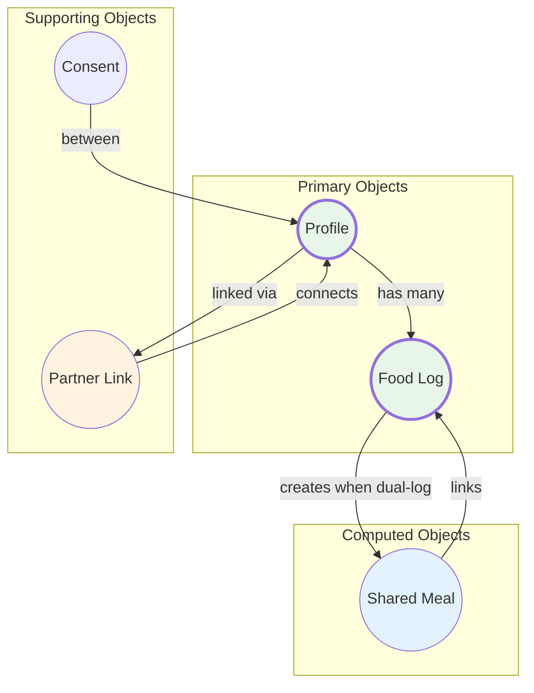

# OOUX Dot Map - CR05 Multi-User Support

## CR05 Summary

**Feature:** Multi-User Support (Family/Couple Mode)
**Problem:** When couples eat the same meal, each logs separately → double friction
**Solution:** "Log for Both" feature + Profile switching on same device

---

## Objects & Actions Summary

| Type | Object | Description | Key Actions |
|------|--------|-------------|-------------|
| **Primary** | Profile | Individual user within household (self or partner) | create, switch, view, edit |
| **Primary** | Food Log | Meal entry (now supports dual logging) | log, log for both, delete, undo |
| **Secondary** | Partner Link | Connection between primary user and partner | create, remove |
| **Secondary** | Consent | Permission to log on behalf of partner | grant, revoke |
| **Derived** | Shared Meal | Link between two related food logs | auto-created when "Log for Both" used |

---

## Object Attributes

### Profile

| Attribute | Type | Status | Notes |
|-----------|------|--------|-------|
| id | text | Required | Unique identifier |
| display name | text | Required | Shown in Profile Switcher |
| avatar emoji | text | Required | Visual identifier |
| daily calorie goal | number | Required | Personal goal |
| daily protein goal | number | Required | Personal goal |
| daily carbs goal | number | Required | Personal goal |
| daily fat goal | number | Required | Personal goal |
| is primary | yes/no | Required | True for main user |
| created at | timestamp | Auto | When profile was created |

### Partner Link

| Attribute | Type | Status | Notes |
|-----------|------|--------|-------|
| primary user id | text | Required | Main account holder |
| partner profile id | text | Required | Partner's profile |
| partner display name | text | Required | Shown in UI |
| consent enabled | yes/no | Required | Can log for partner? |
| created at | timestamp | Auto | When partner was added |

### Food Log (Enhanced)

| Attribute | Type | Status | Notes |
|-----------|------|--------|-------|
| id | text | Required | Unique identifier |
| profile id | text | Required | **NEW:** Which profile this belongs to |
| food id | text | Required | Reference to food item |
| portion | S/M/L | Required | Portion size |
| calories | number | Required | Calculated value |
| logged at | timestamp | Required | When logged |
| shared meal id | text | Optional | **NEW:** Links to partner's log |
| logged by | text | Optional | **NEW:** Who logged this (self or partner) |

### Shared Meal (Derived)

| Attribute | Type | Status | Notes |
|-----------|------|--------|-------|
| id | text | Required | Unique identifier |
| user log id | text | Required | Primary user's food log |
| partner log id | text | Required | Partner's food log |
| created at | timestamp | Auto | When "Log for Both" was used |

### Consent

| Attribute | Type | Status | Notes |
|-----------|------|--------|-------|
| grantor id | text | Required | Partner who gave permission |
| grantee id | text | Required | User who received permission |
| granted at | timestamp | Auto | When consent was given |
| revoked at | timestamp | Optional | When consent was revoked |

---

## Actions per Object

| Object | User Actions |
|--------|--------------|
| **Profile** | create (via Add Partner), switch (via Profile Switcher), view, edit goals |
| **Partner Link** | create (add partner), remove (remove partner) |
| **Consent** | grant (enable "Log for Both"), revoke (disable) |
| **Food Log** | log for self, log for both, delete, undo |
| **Shared Meal** | auto-created (no direct action) |

---

## Relationships Diagram



---

## CR05-Specific Relationships

```
Primary User Profile
    │
    ├──< has >── Partner Link ──< connects to >── Partner Profile
    │                                                │
    ├──< has many >── Food Logs ←──────────────── Food Logs ──< has many >──┤
    │                     │                           │
    │                     └──< linked via >── Shared Meal ──< linked via >──┘
    │
    └──< grants >── Consent ──< receives >── Partner Profile
```

---

## Key Design Decisions

| Decision | Rationale |
|----------|-----------|
| Profile-based, not User-based | Partner doesn't need separate login |
| Consent OFF by default | Ethics requirement - explicit opt-in |
| Shared Meal is derived | Auto-created, no user action needed |
| Partner portion can differ | Different appetites, same meal |
| Data isolation | Each profile has independent favorites, history |

---

## Limits

| Limit | Value | Reason |
|-------|-------|--------|
| Partners per user | 1 | MVP scope - couple mode only |
| Profiles per device | 2 | Primary + 1 partner |
| Consent revocation | Anytime | Ethics requirement |
