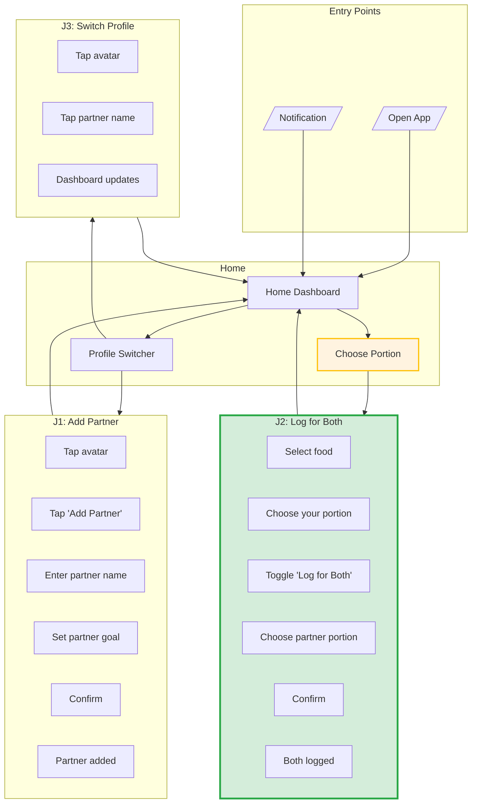
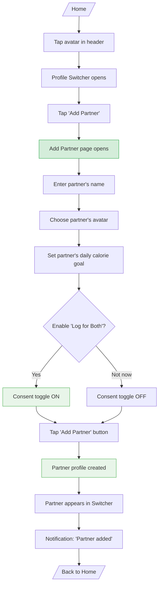
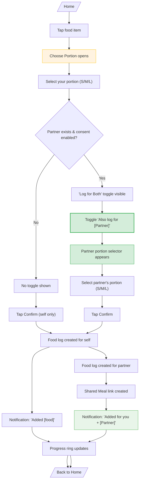
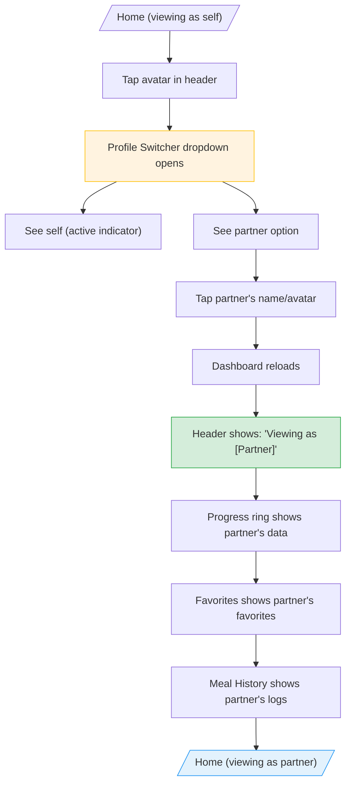
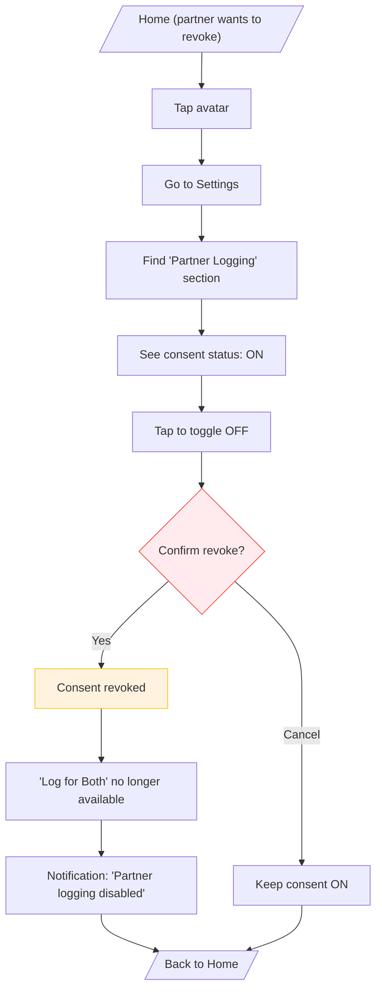
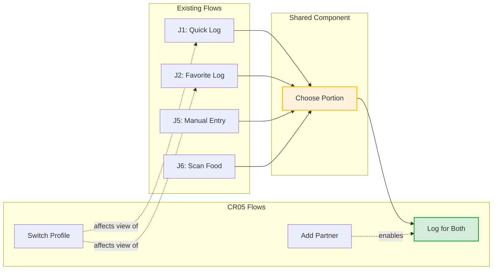

# User Flows - CR05 Multi-User Support

## Jobs-to-be-Done Summary

| Job ID | Job Statement | Objects | Location | Key Actions |
|--------|---------------|---------|----------|-------------|
| **J1** | When I want to track meals for both of us, I want to add my partner, So that we can share meal logging | Profile, Partner Link, Consent | Add Partner | create profile, grant consent |
| **J2** | When we eat together, I want to log for both of us at once, So that we save time | Food Log, Shared Meal | Home → Choose Portion | toggle "Log for Both", confirm |
| **J3** | When I want to see my partner's progress, I want to switch profiles, So that I can help them stay on track | Profile | Profile Switcher | tap partner, view dashboard |
| **J4** | When my partner logs something wrong for me, I want to manage my consent, So that I control my own data | Consent | Settings (future) | revoke consent |

---

## Complete Flow Diagram

---

## Individual Job Flows

### J1: Add Partner (First-Time Setup)

**Job Statement:** When I want to track meals for both of us, I want to add my partner, So that we can share meal logging.

**Frequency:** Once per household

**Steps:** 9 | **Decisions:** 1 (consent) | **Time:** ~30 seconds

**Success Criteria:**
- Partner appears in Profile Switcher
- "Log for Both" toggle available in Choose Portion (if consent enabled)

---

### J2: Log for Both (Primary CR05 Flow)

**Job Statement:** When we eat together, I want to log for both of us at once, So that we save time.

**Frequency:** Very High (60-70% of meals are shared)

**Steps:** 7 (with partner) / 5 (without) | **Decisions:** 2 (your portion, partner portion) | **Time:** <30 seconds

**Success Criteria:**
- Both food logs created
- Shared Meal record links them
- Toast shows both names
- Both progress rings update

---

### J3: Switch Profile (View Partner's Dashboard)

**Job Statement:** When I want to see my partner's progress, I want to switch profiles, So that I can help them stay on track.

**Frequency:** Medium (a few times per day)

**Steps:** 4 | **Decisions:** 0 | **Time:** ~2 seconds

**Success Criteria:**
- Header clearly shows active profile
- All data reflects partner's profile
- Can log for partner while in their view

---

### J4: Manage Consent (Revoke Permission)

**Job Statement:** When my partner logs something wrong for me, I want to manage my consent, So that I control my own data.

**Frequency:** Rare (edge case)

**Steps:** 6 | **Decisions:** 1 (confirm revoke) | **Time:** ~10 seconds

**Note:** This flow is for future implementation. MVP assumes consent stays enabled once granted.

---

## Flow Interactions

### How CR05 Flows Connect to Existing Flows

---

## Job Summary

| Job | Entry Point | Steps | Decisions | Exit Point | Frequency |
|-----|-------------|-------|-----------|------------|-----------|
| J1: Add Partner | Profile Switcher | 9 | 1 | Home | Once |
| J2: Log for Both | Choose Portion | 7 | 2 | Home | Very High |
| J3: Switch Profile | Profile Switcher | 4 | 0 | Home | Medium |
| J4: Manage Consent | Settings | 6 | 1 | Home | Rare |

---

## Edge Cases & Error Handling

| Scenario | Handling |
|----------|----------|
| Partner not added yet | "Log for Both" toggle not shown |
| Consent not enabled | "Log for Both" toggle not shown |
| Partner profile still loading | Toggle disabled until loaded |
| Partner log fails | Show "Added for you (partner failed)" |
| User tries to delete shared meal | Only deletes their log, partner's remains |
| Undo after "Log for Both" | Only undoes user's log |

---

## Success Metrics (From Hypothesis)

| Metric | Target | How Measured |
|--------|--------|--------------|
| Shared meal logging time | ≤30 seconds | Timer from tap to confirm |
| Meal logging increase | +40% | Compare pre/post CR05 logs |
| Active profile clarity | 9/10 users correct | User testing |
