# IA Map: Social Challenges & Leaderboards

## 2.1 Identify Where Objects Live

Map each object to its location in app hierarchy:

| Object | Primary Location | Secondary Location(s) | Access From |
|--------|------------------|----------------------|-------------|
| Challenge | /challenges | /home (featured), /social | Navigation, Search |
| Leaderboard | /leaderboards | /challenges/[id], /social | Navigation, Challenge detail |
| Social Profile | /social/profile | /leaderboards/[user], /challenges/[user] | Social tab, Friend lists |
| Achievement | /social/profile/achievements | /home (recent), /challenges/[id] | Profile, Home feed |
| Social Group | /social/groups | /challenges/[id]/participants | Social tab, Challenge detail |

## 2.2 Show Current IA (Base App Structure)

```mermaid
flowchart TB
    subgraph ROOT["🏠 Calor Tracker"]
        direction TB
        HOME["Home/Dashboard"]

        subgraph NAV["Bottom Navigation"]
            CHALLENGES["Challenges"]
            LOGGING["Logging"]
            LEADERBOARDS["Leaderboards"]
            SOCIAL["Social"]
            PROFILE["Profile"]
        end
    end

    HOME --> NAV
```

## 2.3 Show IA Changes for Social Challenges Feature

Highlight what's new/modified:

## 2.4 IA Decision Table

| Location | Change Type | Rationale |
|----------|-------------|-----------|
| /leaderboards | NEW | Dedicated section for social competition and rankings |
| /social | NEW | Hub for social features, friends, and community |
| /challenges | MODIFIED | Enhanced with social participant views and sharing |
| /home | MODIFIED | Added social feed integration and friend highlights |
| /profile | MODIFIED | Extended with social stats and achievements |

## 2.5 Navigation Paths to Objects

| Object | Primary Path | Alternative Path(s) |
|--------|--------------|---------------------|
| Challenge | Home → Challenges → Browse → Select | Social → Groups → Active Challenges |
| Leaderboard | Home → Leaderboards → Global/Friends | Challenges → [Challenge] → Leaderboard |
| Social Profile | Home → Social → Profile | Leaderboards → [User] → Profile |
| Achievement | Social → Profile → Achievements | Home → Social Feed → Achievement |
| Social Group | Social → Groups → Browse | Challenges → [Challenge] → Participants |</content>
<parameter name="filePath">prototypes/02a-ai-delegation/outputs/CR06-social-challenges/7-ia-map.md