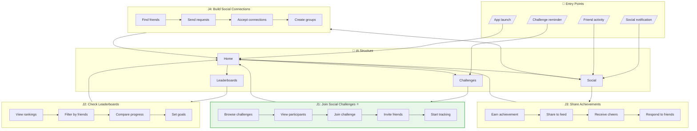
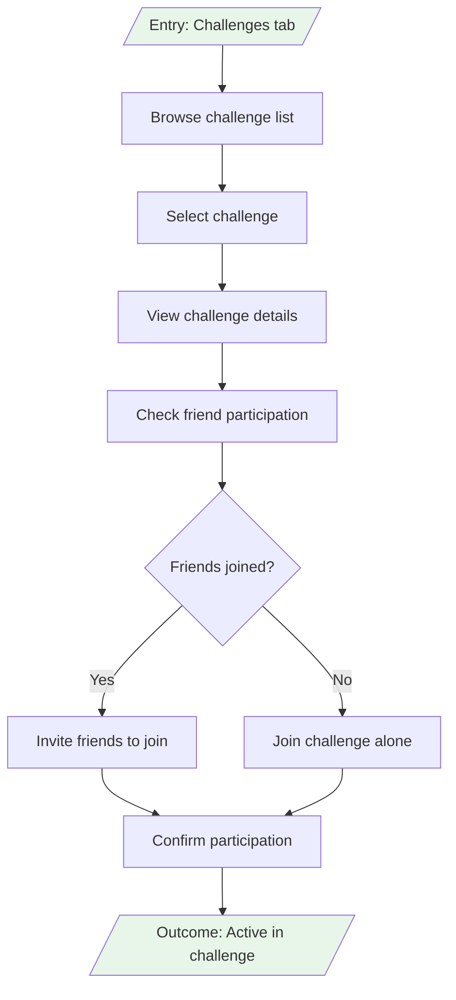
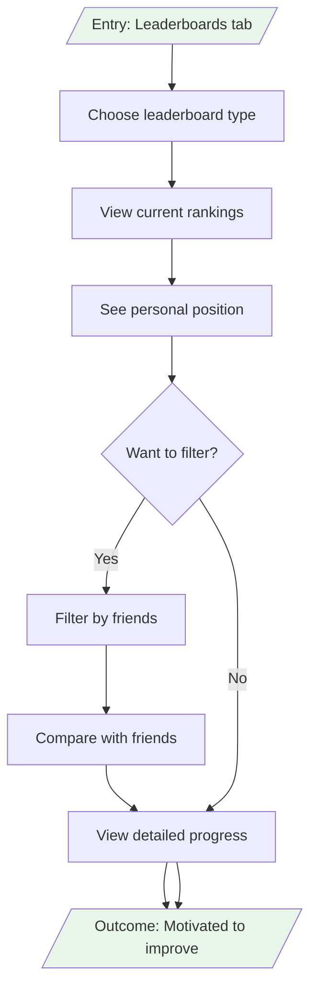
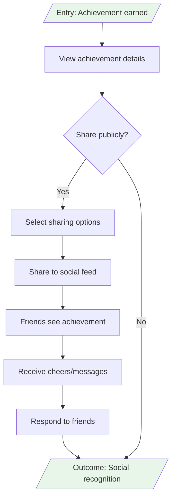
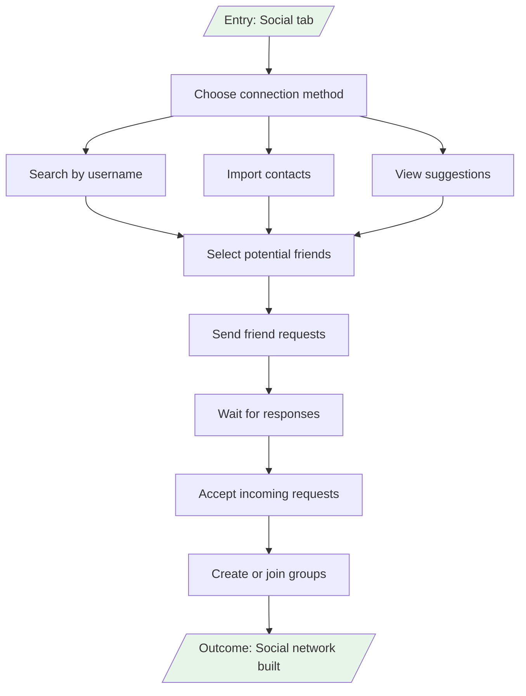

# User Flows: Social Challenges & Leaderboards

## 3.1 Derive Jobs-to-be-Done

From objects, actions, and IA, derive jobs:

| Job ID | Job Statement | Primary Objects | IA Location | Key Actions |
|--------|---------------|-----------------|-------------|-------------|
| J1 | When I feel unmotivated alone, I want to join social challenges with friends, So that I stay accountable and engaged | Challenge, Social Group | /challenges, /social | browse, join, invite friends |
| J2 | When I want to see how I'm doing, I want to check leaderboards and compare progress, So that I feel competitive motivation | Leaderboard, Social Profile | /leaderboards | view rankings, filter, compare |
| J3 | When I accomplish something, I want to share achievements and get recognition, So that I feel valued by my social circle | Achievement, Social Profile | /social | earn, share, receive cheers |
| J4 | When I want to build fitness community, I want to connect with friends and form groups, So that I have ongoing social support | Social Profile, Social Group | /social | find friends, connect, create groups |

## 3.2 Create Complete Flow Diagram

Show all jobs navigating through IA:

## 3.3 Create Individual Job Flows

### J1: Join Social Challenges (Primary Job)

### J2: Check Leaderboards

### J3: Share Achievements

### J4: Build Social Connections

## 3.4 Job Summary

| Job | IA Entry Point | Steps | Decision Points | Exit Point |
|-----|----------------|-------|-----------------|------------|
| J1: Join Social Challenges | Challenges tab | 5 | 1 | Home |
| J2: Check Leaderboards | Leaderboards tab | 4 | 1 | Home |
| J3: Share Achievements | Achievement notification | 4 | 1 | Home |
| J4: Build Social Connections | Social tab | 6 | 0 | Home |</content>
<parameter name="filePath">prototypes/02a-ai-delegation/outputs/CR06-social-challenges/7-user-flows.md