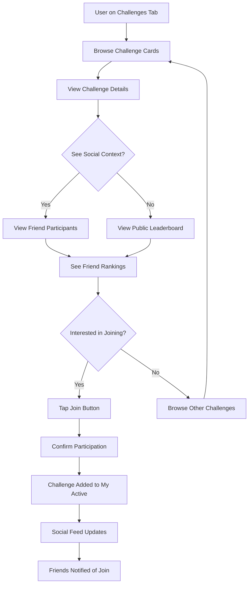
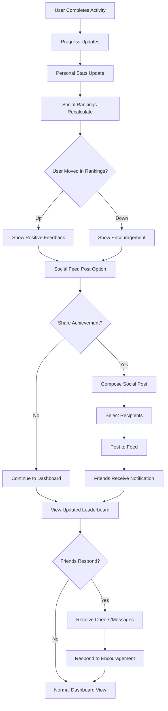
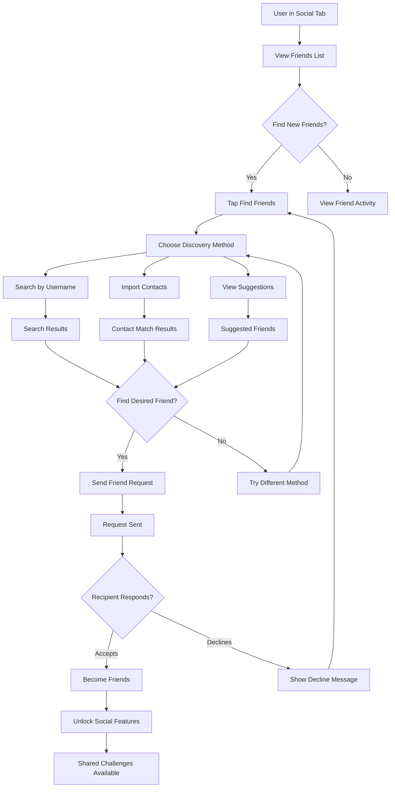
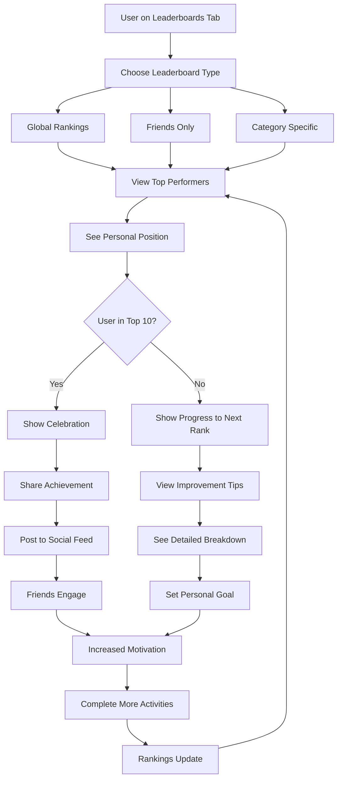

# Design-Lite Workflow: Social Challenges & Leaderboards

## Step 5: USER-FLOWS
*Combined: IA map + Mermaid flows + Screen list*

### Information Architecture (IA) Map

```
┌─────────────────────────────────────────────────────────────────┐
│                    CALOR TRACKER - SOCIAL MVP                    │
│                                                                 │
│  ┌─────────────────┐    ┌─────────────────┐    ┌─────────────────┐ │
│  │   HOME          │    │   CHALLENGES    │    │  LEADERBOARDS   │ │
│  │  ├─ Dashboard  │    │  ├─ Browse      │    │  ├─ Global       │ │
│  │  ├─ Activity   │    │  ├─ My Active   │    │  ├─ Friends      │ │
│  │  │  Feed        │    │  ├─ Social      │    │  ├─ Categories   │ │
│  │  └─ Social      │    │  ├─ Completed   │    │  └─ History      │ │
│  │     Feed        │    │  └─ Create New  │    │                  │ │
│  └─────────────────┘    └─────────────────┘    └─────────────────┘ │
│                                                                 │
│  ┌─────────────────┐    ┌─────────────────┐    ┌─────────────────┐ │
│  │   SOCIAL        │    │   PROFILE       │    │   SETTINGS      │ │
│  │  ├─ Friends     │    │  ├─ Stats       │    │  ├─ Privacy      │ │
│  │  ├─ Find        │    │  ├─ Achievements│    │  ├─ Notifications │ │
│  │  ├─ Requests    │    │  ├─ Social      │    │  ├─ Social       │ │
│  │  └─ Activity    │    │  └─ Settings    │    │  └─ Preferences  │ │
│  │                  │    │                  │    │                  │ │
│  └─────────────────┘    └─────────────────┘    └─────────────────┘ │
└─────────────────────────────────────────────────────────────────┘

Navigation Patterns:
• Bottom Tab Bar: Home | Challenges | Leaderboards | Social | Profile
• Social overlays on existing screens (friend indicators, social context)
• Deep linking support for challenge invites and social shares
```

### Key User Flows (Mermaid Diagrams)

#### Flow 1: Discover & Join Social Challenge


#### Flow 2: Social Progress Tracking & Encouragement


#### Flow 3: Friend Discovery & Connection


#### Flow 4: Leaderboard Competition & Motivation


### Comprehensive Screen List

#### Core Social Screens (New)
1. **Social Hub** - Main social dashboard with friend activity feed
2. **Find Friends** - Friend discovery and connection interface
3. **Friend Requests** - Incoming/outgoing friend request management
4. **Friend Profile** - Individual friend profile with shared challenges
5. **Social Settings** - Privacy controls and social preferences

#### Enhanced Challenge Screens (Modified)
6. **Challenge Browser** - Updated with social context and friend participation
7. **Challenge Details** - Enhanced with social leaderboard and friend list
8. **Active Challenges** - Personal challenge dashboard with social progress
9. **Challenge Creation** - Social challenge creation with friend invitation
10. **Challenge Completion** - Celebration screen with social sharing options

#### Leaderboard Screens (New)
11. **Leaderboard Hub** - Main leaderboard navigation and filtering
12. **Global Leaderboard** - Public rankings across all challenges
13. **Friends Leaderboard** - Private rankings among connected friends
14. **Category Leaderboards** - Challenge-specific rankings (Steps, Cardio, etc.)
15. **Personal Ranking** - Detailed view of user's position and progress

#### Social Overlay Components (Reusable)
16. **Social Context Card** - Shows friend participation in challenges
17. **Friend Activity Feed** - Scrollable list of friend achievements
18. **Quick Encouragement** - Modal for sending cheers and messages
19. **Social Share Sheet** - Native sharing for achievements and challenges
20. **Friend Selector** - Multi-select interface for sharing and invitations

#### Enhanced Existing Screens
21. **Home Dashboard** - Added social feed integration and friend highlights
22. **Profile Screen** - Social stats, friend count, and social achievements
23. **Settings > Social** - Granular privacy controls for social features
24. **Notifications** - Social notification preferences and history

#### Edge Case & Empty State Screens
25. **No Friends Connected** - Onboarding screen for social features
26. **Empty Leaderboard** - State when insufficient participants
27. **Social Feature Disabled** - Privacy-focused user experience
28. **Challenge Invite** - Deep-linked invitation acceptance flow

**Total Screens:** 28 (8 new core, 8 enhanced, 12 components/edge cases)

**Navigation Patterns:**
- Tab-based main navigation (5 tabs)
- Stack navigation within tabs
- Modal overlays for social interactions
- Deep linking for external invitations
- Bottom sheet for quick actions

**Responsive Considerations:**
- Mobile-first design with tablet optimizations
- Progressive enhancement for larger screens
- Touch-friendly social interactions
- Swipe gestures for leaderboard browsing</content>
<parameter name="filePath">.claude/outputs/design-lite-workflow/social-challenges-user-flows.md