# IA Map: Manual Entry Primary, AI Scan Secondary

## 2.1 Identify Where Objects Live

Map each object to its location in app hierarchy:

| Object | Primary Location | Secondary Location(s) | Access From |
|--------|------------------|----------------------|-------------|
| Manual Entry | /home | /meals/add, /search | Home screen, Quick actions |
| AI Scan | /home/scan | /meals/add (secondary) | Home screen, Meal logging |
| Food Item | /search | /home/recent, /favorites | Search, Quick access |
| Meal Log | /meals | /home/today, /history | Meals tab, Dashboard |
| Accuracy Assurance | /settings/data | /profile/stats | Settings, Profile |

## 2.2 Show Current IA (Base App Structure)

```mermaid
flowchart TB
    subgraph ROOT["🏠 Calor Tracker"]
        direction TB
        HOME["Home/Dashboard"]

        subgraph NAV["Bottom Navigation"]
            HOME_TAB["Home"]
            MEALS["Meals"]
            SEARCH["Search"]
            PROFILE["Profile"]
            SETTINGS["Settings"]
        end
    end

    HOME --> NAV
```

## 2.3 Show IA Changes for Manual Entry Primary Feature

Highlight what's new/modified:

```mermaid
flowchart TB
    subgraph ROOT["🏠 Calor Tracker"]
        direction TB
        HOME["Home/Dashboard"]

        subgraph NAV["Bottom Navigation"]
            HOME_TAB["Home"]
            MEALS["Meals"]
            SEARCH["Search"]
            PROFILE["Profile"]
            SETTINGS["Settings"]
        end

        subgraph HOME_SEC["Home Section (Modified)"]
            HOME_LOG["🆕 Manual Entry (Primary)"]
            HOME_SCAN["AI Scan (Secondary)"]
            HOME_RECENT["Recent Foods"]
            HOME_MEALS["Today's Meals"]
        end

        subgraph MEALS_SEC["Meals Section (Enhanced)"]
            MEALS_LIST["Meal History"]
            MEALS_ADD["Add Meal"]
            MEALS_EDIT["Edit Meal"]
        end

        subgraph SEARCH_SEC["Search Section (Enhanced)"]
            SEARCH_FOODS["Food Database"]
            SEARCH_RECENT["Recent Searches"]
            SEARCH_FAVORITES["Favorite Foods"]
        end

        subgraph SETTINGS_SEC["Settings (Modified)"]
            SETTINGS_DATA["🆕 Data & Accuracy"]
            SETTINGS_AI["AI Preferences"]
        end
    end

    HOME --> NAV
    HOME --> HOME_SEC
    MEALS --> MEALS_SEC
    SEARCH --> SEARCH_SEC
    SETTINGS --> SETTINGS_SEC

    style HOME_LOG fill:#e8f5e9,stroke:#4CAF50,stroke-width:2px
    style HOME_SCAN fill:#fff3e0,stroke:#ff9800,stroke-width:2px
    style SETTINGS_DATA fill:#e8f5e9,stroke:#4CAF50,stroke-width:2px
```

## 2.4 IA Decision Table

| Location | Change Type | Rationale |
|----------|-------------|-----------|
| /home | MODIFIED | Prominent manual entry button, secondary AI scan |
| /settings/data | NEW | Data accuracy controls and AI preferences |
| /meals/add | MODIFIED | Enhanced manual entry with AI fallback option |
| /search | MODIFIED | Improved food selection for manual entry |
| /profile | MODIFIED | Added data quality metrics |

## 2.5 Navigation Paths to Objects

| Object | Primary Path | Alternative Path(s) |
|--------|--------------|---------------------|
| Manual Entry | Home → Manual Entry Button | Meals → Add Meal → Manual |
| AI Scan | Home → AI Scan Button | Meals → Add Meal → Scan |
| Food Item | Search → Browse Database | Home → Recent Foods |
| Meal Log | Meals → Today's Meals | Home → Meal Summary |
| Accuracy Assurance | Settings → Data & Accuracy | Profile → Data Quality |</content>
<parameter name="filePath">prototypes/02a-ai-delegation/outputs/CR08-manual-entry-primary/7-ia-map.md