# User Flows: Manual Entry Primary, AI Scan Secondary

## 3.1 Derive Jobs-to-be-Done

From objects, actions, and IA, derive jobs:

| Job ID | Job Statement | Primary Objects | IA Location | Key Actions |
|--------|---------------|-----------------|-------------|-------------|
| J1 | When I want accurate calorie tracking, I want to manually enter food details, So that I have complete control over my data quality | Manual Entry, Food Item | /home, /search | search, select, customize, save |
| J2 | When I want convenience but need accuracy, I want to use AI scan with manual verification, So that I benefit from automation while ensuring correctness | AI Scan, Manual Entry | /home/scan | capture, review, correct, accept |
| J3 | When I want to track my eating patterns, I want to view and manage meal logs, So that I can monitor my nutrition over time | Meal Log, Food Item | /meals | create, review, edit, analyze |
| J4 | When I want to ensure data reliability, I want to monitor and control accuracy settings, So that I can trust my nutritional information | Accuracy Assurance | /settings/data | view metrics, adjust preferences, provide feedback |

## 3.2 Create Complete Flow Diagram

Show all jobs navigating through IA:

```mermaid
flowchart TB
    subgraph ENTRY["🚀 Entry Points"]
        E1[/"App launch"/]
        E2[/"Meal time reminder"/]
        E3[/"Food logging habit"/]
        E4[/"Accuracy concern"/]
    end

    subgraph IA["📱 IA Structure"]
        HOME["Home"]
        MEALS["Meals"]
        SEARCH["Search"]
        SETTINGS["Settings"]
    end

    subgraph J1["J1: Manual Food Entry ⭐"]
        direction LR
        J1A["Access manual entry"]
        J1B["Search for food"]
        J1C["Select food item"]
        J1D["Enter quantity"]
        J1E["Save to meal"]

        J1A --> J1B --> J1C --> J1D --> J1E
    end

    subgraph J2["J2: AI Scan with Verification"]
        direction LR
        J2A["Access AI scan"]
        J2B["Capture food photo"]
        J2C["Review AI results"]
        J2D{"Results accurate?"}
        J2E["Accept results"]
        J2F["Manual correction"]
        J2G["Save corrected meal"]

        J2A --> J2B --> J2C --> J2D
        J2D -->|Yes| J2E --> J2G
        J2D -->|No| J2F --> J2G
    end

    subgraph J3["J3: Manage Meal Logs"]
        direction LR
        J3A["View meal history"]
        J3B["Select meal to edit"]
        J3C["Modify food items"]
        J3D["Update quantities"]
        J3E["Save changes"]

        J3A --> J3B --> J3C --> J3D --> J3E
    end

    subgraph J4["J4: Monitor Data Accuracy"]
        direction LR
        J4A["Access data settings"]
        J4B["View accuracy metrics"]
        J4C["Adjust AI preferences"]
        J4D["Provide feedback"]

        J4A --> J4B --> J4C --> J4D
    end

    E1 --> HOME
    E2 --> HOME
    E3 --> HOME
    E4 --> SETTINGS

    HOME --> J1
    HOME --> J2
    MEALS --> J3
    SETTINGS --> J4

    SEARCH --> J1
    SEARCH --> J3

    J1 --> MEALS
    J2 --> MEALS
    J3 --> HOME
    J4 --> HOME

    style J1 fill:#e8f5e9,stroke:#4CAF50,stroke-width:2px
```

## 3.3 Create Individual Job Flows

### J1: Manual Food Entry (Primary Job)

### J2: AI Scan with Verification

### J3: Manage Meal Logs

### J4: Monitor Data Accuracy

## 3.4 Job Summary

| Job | IA Entry Point | Steps | Decision Points | Exit Point |
|-----|----------------|-------|-----------------|------------|
| J1: Manual Food Entry | Home screen | 7 | 1 | Meals summary |
| J2: AI Scan with Verification | Home screen | 8 | 1 | Meals summary |
| J3: Manage Meal Logs | Meals tab | 6 | 1 | Meal details |
| J4: Monitor Data Accuracy | Settings | 5 | 1 | Settings |</content>
<parameter name="filePath">prototypes/02a-ai-delegation/outputs/CR08-manual-entry-primary/7-user-flows.md