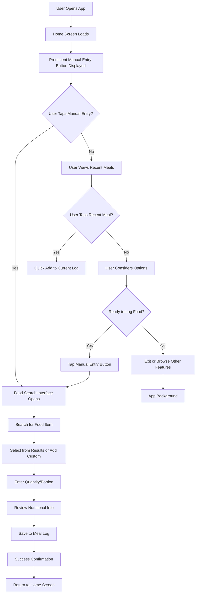
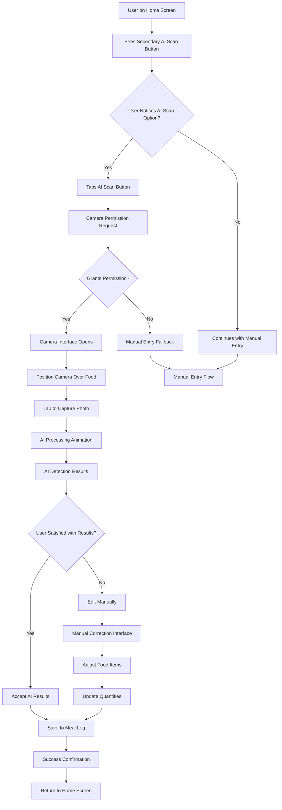
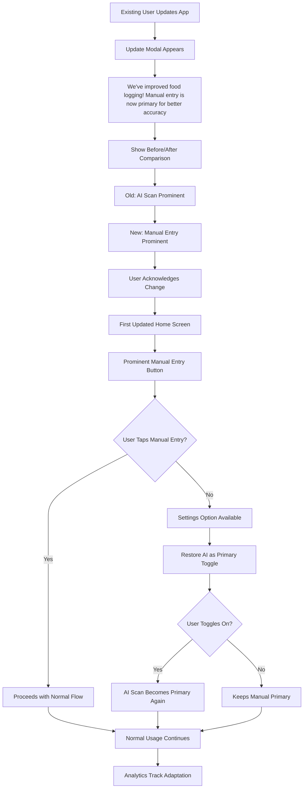

# Design-Lite Workflow: Manual Entry Primary, AI Scan Secondary

## Step 5: USER-FLOWS
*Combined: IA map + Mermaid flows + Screen list*

### Information Architecture (IA) Map

```
┌─────────────────────────────────────────────────────────────────┐
│                    CALOR TRACKER - MANUAL FIRST MVP             │
│                                                                 │
│  ┌─────────────────┐    ┌─────────────────┐    ┌─────────────────┐ │
│  │   HOME          │    │   LOGGING       │    │  HISTORY        │ │
│  │  ├─ Manual Entry│    │  ├─ Meal Logger │    │  ├─ Daily View  │ │
│  │  ├─ AI Scan     │    │  ├─ Food Search │    │  ├─ Weekly      │ │
│  │  │  (Secondary) │    │  ├─ Quick Add   │    │  ├─ Monthly     │ │
│  │  └─ Recent Meals│    │  └─ Favorites   │    │  └─ Trends      │ │
│  └─────────────────┘    └─────────────────┘    └─────────────────┘ │
│                                                                 │
│  ┌─────────────────┐    ┌─────────────────┐    ┌─────────────────┐ │
│  │   CHALLENGES    │    │   PROFILE       │    │   SETTINGS      │ │
│  │  ├─ Active      │    │  ├─ Stats       │    │  ├─ Preferences  │ │
│  │  ├─ Browse      │    │  ├─ Goals       │    │  ├─ Data Export  │ │
│  │  ├─ Social      │    │  ├─ Achievements│    │  ├─ AI Settings  │ │
│  │  └─ Leaderboards│    │  └─ Account     │    │  └─ Help         │ │
│  │                  │    │                  │    │                  │ │
│  └─────────────────┘    └─────────────────┘    └─────────────────┘ │
└─────────────────────────────────────────────────────────────────┘

Navigation Changes:
• Home screen now prioritizes Manual Entry as primary action
• AI Scan moved to secondary position with reduced prominence
• Clear visual hierarchy: Manual (70%) > Recent Meals (20%) > AI Scan (10%)
• Tab bar unchanged, but home screen content restructured
```

### Key User Flows (Mermaid Diagrams)

#### Flow 1: Primary Manual Entry Journey


#### Flow 2: Secondary AI Scan Journey


#### Flow 3: First-Time User Onboarding
```mermaid
flowchart TD
    A[New User Downloads App] --> B[Welcome Screen]
    B --> C[Basic Profile Setup]
    C --> D[First Home Screen Load]

    D --> E[Prominent Manual Entry Button]
    E --> F[Tooltip: "Start with accurate manual entry"]
    F --> G[Secondary AI Scan Button]
    G --> H[Tooltip: "Try AI scanning when you're ready"]

    H --> I[Educational Modal]
    I --> J["AI works great for simple meals, but manual entry gives you complete control over accuracy"]

    J --> K{Demo Manual Entry?}
    K -->|Yes| L[Guided Manual Entry Tutorial]
    K -->|No| M[Skip Tutorial]

    L --> N[Walkthrough: Search → Select → Quantity → Save]
    N --> O[Tutorial Completion]
    O --> P[First Manual Entry Attempt]

    M --> P
    P --> Q[Success Feedback]
    Q --> R[Suggest Trying AI Scan Next Time]

    R --> S[User Can Now Log Independently]
```

#### Flow 4: Existing User Adaptation


### Comprehensive Screen List

#### Core Updated Screens (Modified)
1. **Home Screen** - Complete redesign with manual entry prominence
2. **Manual Entry Interface** - Enhanced with primary positioning
3. **AI Scan Interface** - Moved to secondary flow, added validation step
4. **Onboarding Flow** - Updated to explain new hierarchy

#### New Screens/Components (Added)
5. **Hierarchy Explanation Modal** - Explains why manual is primary
6. **AI Results Review Screen** - New validation step for AI scans
7. **Accuracy Tooltip Component** - Contextual help about data quality
8. **Preference Toggle** - Settings option to customize hierarchy

#### Enhanced Existing Screens (Minor Updates)
9. **Settings > Logging** - Added AI/manual preference controls
10. **Help Center** - Updated FAQ about logging methods
11. **Analytics Dashboard** - New metrics for manual vs AI usage

#### Edge Case & Empty State Screens
12. **No Camera Permission** - Fallback when AI scan unavailable
13. **AI Processing Failed** - Error state with manual fallback
14. **First Manual Entry** - Encouraging empty state for new users
15. **AI Confidence Low** - Warning state when AI might be inaccurate

**Total Screens:** 15 (4 new, 8 modified, 3 edge cases)

**Navigation Patterns:**
- Primary action (manual entry) dominates home screen
- Secondary action (AI scan) accessible but not prominent
- Clear back navigation from all logging flows
- Contextual help available throughout
- Settings allow user customization

**Responsive Considerations:**
- Mobile-first: Large touch targets for primary action
- Tablet: Adjusted proportions but maintained hierarchy
- Accessibility: Screen reader support for action prominence
- Progressive enhancement for slower connections</content>
<parameter name="filePath">.claude/outputs/design-lite-workflow/manual-entry-primary-user-flows.md