# IA Map - 02-ai-lead with CR05 Multi-User Support

## Updated Information Architecture with Multi-User Support

```mermaid
flowchart TB
    subgraph ROOT["🏠 Calo Tracker - Multi-User Support"]
        direction TB

        subgraph AUTH["🔐 Authentication"]
            LOGIN["Sign In"]
            REGISTER["Create Account"]
            FORGOT["Forgot Password"]
            RESET["Reset Password"]
        end

        subgraph ONBOARDING["🎯 Getting Started"]
            WELCOME["Welcome"]
            NAME["Your Name"]
            GOAL["Choose Goal"]
            CALORIES["Set Daily Calories"]
        end

        subgraph MAIN["📱 Home (Profile-Specific)"]
            DASHBOARD["✏️ Home Dashboard"]

            subgraph HEADER["Header"]
                SWITCHER["🆕 Profile Switcher"]
                USER["User Avatar"]
                PARTNER["🆕 Partner Avatar"]
            end

            subgraph SECTIONS["Quick Add"]
                TODAY["Today Progress"]
                FAVORITES["My Favorites"]
                TEMPLATES["Meal Combos"]
                HISTORY["Meal History"]
                FOODS["Food List"]
                SEARCH["Search Results"]
            end

            subgraph MODALS["Pop-ups"]
                PORTION["✏️ Choose Portion Size"]
                ACTION["Add Food Options"]
                CONFIRM["Confirm Combo"]
            end
        end

        subgraph PARTNER["🆕 Partner Management"]
            ADD["🆕 Add Partner"]
            EDIT["Edit Partner"]
        end

        subgraph ADDFLOW["➕ Add Food"]
            MANUAL["Enter Manually"]
            SCAN["Scan Food"]
            RESULTS["Scan Results"]
        end

        subgraph PROFILE["👤 Profile"]
            PROFILE_PAGE["Profile Page"]
            EDIT_PROFILE["Edit Profile"]
            EDIT_GOALS["Edit Goals"]
            CHANGE_PWD["Change Password"]
        end
    end

    %% Auth Flow
    LOGIN --> REGISTER
    LOGIN --> FORGOT --> RESET
    LOGIN -->|success| WELCOME
    REGISTER -->|success| WELCOME

    %% Onboarding
    WELCOME --> NAME --> GOAL --> CALORIES -->|complete| DASHBOARD

    %% Profile Switcher (NEW - CR05)
    DASHBOARD --> HEADER
    SWITCHER --> USER --> DASHBOARD
    SWITCHER --> PARTNER --> DASHBOARD
    SWITCHER -->|Add Partner| ADD --> DASHBOARD

    %% Dashboard to Sections
    DASHBOARD --> SECTIONS

    %% Add Food Flow
    DASHBOARD -->|tap +| ACTION
    ACTION -->|Search| SEARCH
    ACTION -->|Manual| MANUAL
    ACTION -->|Scan| SCAN --> RESULTS -->|confirm| DASHBOARD

    %% Food Selection
    FOODS -->|tap| PORTION
    FAVORITES -->|tap| PORTION
    SEARCH -->|tap| PORTION
    RESULTS -->|change| PORTION

    %% Portion Options (ENHANCED - CR05)
    PORTION -->|Log Self| DASHBOARD
    PORTION -->|🆕 Log Both| DASHBOARD
    PORTION -->|🆕 Log Partner| DASHBOARD

    %% Combo
    TEMPLATES -->|tap| CONFIRM --> DASHBOARD

    %% Profile Flow
    DASHBOARD -->|avatar| PROFILE_PAGE --> EDIT_PROFILE
    PROFILE_PAGE --> EDIT_GOALS
    PROFILE_PAGE --> CHANGE_PWD
    PROFILE_PAGE -->|Manage| EDIT
    PROFILE_PAGE -->|logout| LOGIN

    %% Styling
    style DASHBOARD fill:#fff3cd,stroke:#ffc107,stroke-width:2px
    style SWITCHER fill:#d4edda,stroke:#28a745,stroke-width:3px
    style ADD fill:#d4edda,stroke:#28a745,stroke-width:3px
    style PORTION fill:#fff3cd,stroke:#ffc107,stroke-width:2px
    style PARTNER fill:#d4edda,stroke:#28a745,stroke-width:2px
    style PROFILE_PAGE fill:#d1ecf1,stroke:#17a2b8,stroke-width:2px
```



---

## Summary of Changes

### 🆕 NEW Elements

| Component | Location | Purpose |
|-----------|----------|---------|
| **Profile Switcher** | Header dropdown | Switch between User and Partner views |
| **Partner Avatar** | Header (Profile Switcher) | Visual indicator for partner profile |
| **Add Partner Page** | New route `/add-partner` | Create partner profile with name & calorie goal |
| **Edit Partner** | From Profile | Edit partner details (future enhancement) |
| **"Log for Both" Toggle** | Portion Picker modal | Log meal for both user and partner simultaneously |
| **Partner portion selection** | Portion Picker (when toggle ON) | Select different portion size for partner |

### ✏️ MODIFIED Elements

| Component | Change | Impact |
|-----------|--------|--------|
| **Home/Dashboard** | Now profile-specific | Shows data for active user (self or partner) |
| **Today's Progress** | Profile-specific | Displays current active user's calorie ring & macros |
| **My Favorites** | Profile-specific | Favorites separate per user |
| **Meal History** | Profile-specific | Timeline shows active user's logs only |
| **Meal Combos** | Profile-specific | Templates separate per user |
| **Choose Portion Size** | Enhanced modal | Added "Log for Both" toggle + partner portion selector |
| **Profile Screen** | Shows active user | Header displays "Viewing as [User/Partner]" |
| **Food Log Creation** | Supports dual logging | Can create 1 or 2 logs per action |

### Navigation Changes

| Navigation | Before | After |
|------------|--------|-------|
| App Entry | → Home | → Home (with default profile) |
| Header | Avatar → Profile | Profile Switcher dropdown → Select User/Partner |
| Food Logging | Tap food → Pick portion → Confirm | Tap food → Pick portion → [Optional: Toggle "Log for Both"] → Confirm |
| Profile Access | Tap avatar → Profile | Tap avatar (Profile Switcher) → View User/Partner → Manage Partner |

### Data Model Additions

```
Partner Link Object (NEW):
├── primary_user_id
├── partner_user_id
└── created_at

User Object (ENHANCED):
└── Can now reference Partner Link
```

---

## Route Structure Updates

| Route | Screen Name | Protection | Change | Purpose |
|-------|-------------|------------|--------|---------|
| `/` | Redirect | - | Unchanged | Redirects to Sign In |
| `/login` | Sign In | Public (logged out only) | Unchanged | User authentication |
| `/register` | Create Account | Public (logged out only) | Unchanged | New user registration |
| `/forgot-password` | Forgot Password | Public | Unchanged | Password recovery |
| `/reset-password` | Reset Password | Public | Unchanged | Set new password |
| `/onboarding/welcome` | Welcome | Logged in only | Unchanged | Onboarding start |
| `/onboarding/name` | Your Name | Logged in only | Unchanged | Set display name |
| `/onboarding/goal` | Choose Goal | Logged in only | Unchanged | Select health goal |
| `/onboarding/calories` | Set Daily Calories | Logged in only | Unchanged | Set daily calories |
| `/dashboard` | Home | Logged in only | ✏️ MODIFIED | Profile-specific main screen |
| `/add-partner` | Add Partner | Logged in only | 🆕 NEW | Create partner profile |
| `/profile` | Profile | Logged in only | ✏️ MODIFIED | Shows active user/partner |
| `/profile/edit` | Edit Profile | Logged in only | Unchanged | Edit name/avatar |
| `/profile/edit-goals` | Edit Goals | Logged in only | Unchanged | Edit nutrition goals |
| `/profile/change-password` | Change Password | Logged in only | Unchanged | Change password |

---

## Object Location Mapping Updates

| Object | Primary Location | Secondary Location(s) | Change | Access From |
|--------|------------------|----------------------|--------|-------------|
| **User** | Profile | Home (header) | ✏️ MODIFIED | Profile Switcher, Add Partner |
| **Partner** | 🆕 Add Partner Page | Home (Profile Switcher) | 🆕 NEW | Profile Switcher dropdown |
| **Partner Link** | 🆕 Database (localStorage) | - | 🆕 NEW | Add Partner, Profile Switcher |
| **Food Log** | Home (Meal History) | - | ✏️ MODIFIED | Profile-specific timeline |
| **System Food** | Home (Food List, Search) | Scanned Food Details | Unchanged | Tiles, Search, Scan |
| **Custom Food** | Home (Search) | - | Unchanged | Search results |
| **Favorite** | Home (My Favorites) | - | ✏️ MODIFIED | Profile-specific favorites |
| **Meal Combo** | Home (Meal Combos) | - | ✏️ MODIFIED | Profile-specific templates |
| **Daily Summary** | Home (Today's Progress) | - | ✏️ MODIFIED | Profile-specific progress |

---

## Screen Sections Updates

### Home Screen Sections (Profile-Specific)

```
┌─────────────────────────────────────────────┐
│ Header: Profile Switcher Dropdown           │  ← 🆕 NEW
├─────────────────────────────────────────────┤
│ Today's Progress: Ring + Macro Bars       │  ← ✏️ Shows active user
├─────────────────────────────────────────────┤
│ Quick Add Title + Search Bar              │
├─────────────────────────────────────────────┤
│ My Favorites (horizontal scroll)            │  ← ✏️ Profile-specific
├─────────────────────────────────────────────┤
│ Meal Combos                                │  ← ✏️ Profile-specific
├─────────────────────────────────────────────┤
│ Meal History (tabs: Today / Week)          │  ← ✏️ Profile-specific
├─────────────────────────────────────────────┤
│ Food List (recent items)                   │
├─────────────────────────────────────────────┤
│ [+ Add Food button]                        │
└─────────────────────────────────────────────┘
```

### Pop-ups & Sheets (Enhanced)

| Name | Type | Trigger | Change | Purpose |
|------|------|---------|--------|---------|
| Add Food Options | Bottom sheet | Tap + button | Unchanged | Manual/Scan choice |
| Choose Portion Size | Bottom sheet | Tap any food | ✏️ ENHANCED | S/M/L selection + 🆕 "Log for Both" toggle + 🆕 Partner portion |
| Confirm Meal Combo | Bottom sheet | Tap meal combo | Unchanged | Log combo items |
| Edit Meal Combo | Bottom sheet | Edit meal combo | Unchanged | Modify combo |
| Add Custom Food | Pop-up | From Add Options | Unchanged | Custom food add |
| Confirm Sign Out | Pop-up | Tap Sign Out button | Unchanged | Sign out confirmation |
| Notification | Toast | After logging food | ✏️ ENHANCED | Shows "Added for you + [Partner]" when toggle ON |
| Profile Switcher | 🆕 Dropdown | Tap avatar in header | 🆕 NEW | Switch between User/Partner, Add Partner |

---

## Key Features Delivered

1. **Partner Profile Creation** - Add partner with name & calorie goal
2. **Profile Switching** - Switch between "My View" and "Partner View"
3. **"Log for Both"** - Log single meal for both users simultaneously
4. **Independent Data** - Each user has separate favorites, history, combos
5. **Profile-Specific Dashboard** - Progress ring shows active user's data

---

## CR05 Implementation Notes

- **Storage:** Partner link stored in localStorage (same-device assumption)
- **Loading:** Partner data loads asynchronously with `isLoadingPartner` guard
- **Toggle Visibility:** "Log for Both" toggle only shows when partner exists and is loaded
- **Notification:** Toast displays "Added for you + [Partner name]" when logging for both
- **Undo Behavior:** Undo only applies to self-log when logging for both fails
- **Edit Behavior:** Edit only allows editing self-log when logging for both fails
