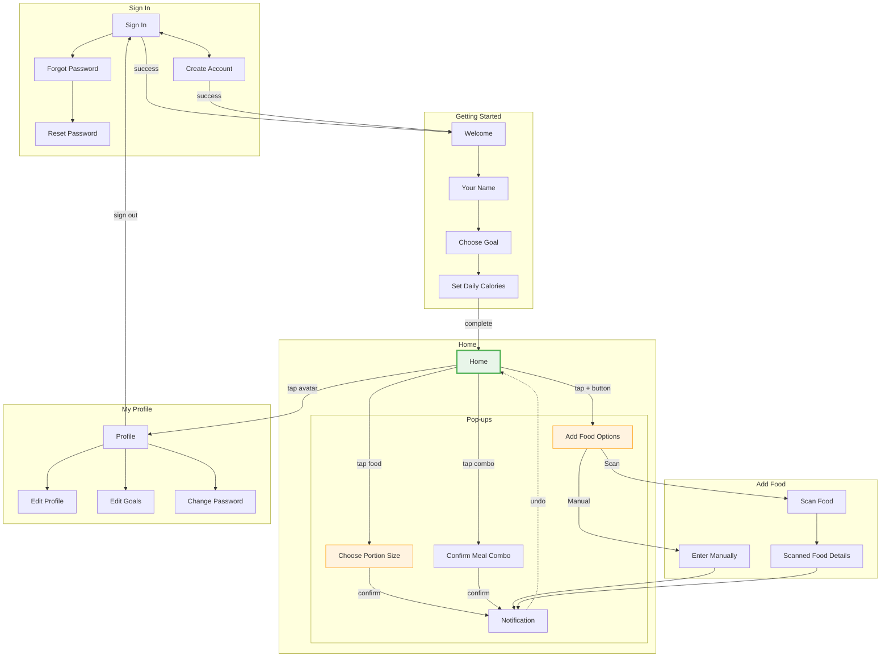

# Screen List - 02-ai-lead (Calo Tracker)

## Screen Identification from Flow Moments

| Flow Moment | Job | Location | Type | Screen | Rationale |
|-------------|-----|----------|------|--------|-----------|
| App entry (not signed in) | J10 | Sign In | Decision | Sign In | Auth gate |
| Create account | J10 | Create Account | Input | Create Account | New user signup |
| Forgot password | - | Forgot Password | Input | Forgot Password | Recovery flow |
| Reset password | - | Reset Password | Input | Reset Password | Set new password |
| Welcome new user | J10 | Getting Started | Decision | Welcome | Onboarding start |
| Enter name | J10 | Getting Started | Input | Your Name | Collect user name |
| Select goal | J10 | Getting Started | Decision | Choose Goal | Weight goal selection |
| Set calories | J10 | Getting Started | Input | Set Daily Calories | Daily target |
| View progress | J7 | Home | View | Today's Progress | Progress ring + macros |
| Browse foods | J1 | Home | View | Food List | Food selection |
| Use favorites | J2 | Home | View | My Favorites | Quick access foods |
| Use combos | J3 | Home | View | Meal Combos | Combo meals |
| Search food | J4 | Home | Input | Search + Results | Find foods |
| View history | J8 | Home | View | Meal History | Food timeline |
| Select portion | J1-J4, J6 | Pop-up | Decision | Choose Portion Size | S/M/L selection |
| Add options | J5, J6 | Pop-up | Decision | Add Food Options | Manual/Scan choice |
| Manual entry | J5 | Enter Manually | Input | Enter Manually | Custom food |
| Scan camera | J6 | Scan Food | Capture | Scan Food | Barcode/label scan |
| Scan results | J6 | Scanned Details | View | Scanned Food Details | Confirm scanned food |
| Confirm combo | J3 | Pop-up | Decision | Confirm Meal Combo | Log combo items |
| Edit combo | J3 | Pop-up | Input | Edit Meal Combo | Modify combo |
| View profile | J11 | Profile | View | Profile | User info |
| Edit profile | - | Edit Profile | Input | Edit Profile | Change name/avatar |
| Edit goals | J11 | Edit Goals | Input | Edit Goals | Change targets |
| Change password | - | Change Password | Input | Change Password | Security |
| Feedback | J1-J9 | Overlay | Feedback | Notification | Confirm actions |
| Confirm sign out | - | Pop-up | Decision | Confirm Sign Out | Sign out confirmation |

---

## Consolidated Screen List

### Sign In Section

| ID | Screen | Route | Jobs | Purpose | Key Elements |
|----|--------|-------|------|---------|--------------|
| S01 | Sign In | /login | J10 | User authentication | Email, Password, Sign In button |
| S02 | Create Account | /register | J10 | New user signup | Email, Password, Confirm Password |
| S03 | Forgot Password | /forgot-password | - | Password recovery | Email, Submit button |
| S04 | Reset Password | /reset-password | - | Set new password | New Password, Confirm Password |

### Getting Started Section

| ID | Screen | Route | Jobs | Purpose | Key Elements |
|----|--------|-------|------|---------|--------------|
| S05 | Welcome | /onboarding/welcome | J10 | Welcome & intro | Illustration, Get Started button |
| S06 | Your Name | /onboarding/name | J10 | Collect display name | Text input, Continue button |
| S07 | Choose Goal | /onboarding/goal | J10 | Select weight goal | Goal cards (Lose/Maintain/Gain) |
| S08 | Set Daily Calories | /onboarding/calories | J10 | Set daily target | Number input, Slider, Finish button |

### Main App Section

| ID | Screen | Route | Jobs | Purpose | Key Elements |
|----|--------|-------|------|---------|--------------|
| S09 | Home | /dashboard | J1-J8 | **Main screen** | Today's Progress, My Favorites, Meal Combos, Food List, Meal History, Search, + button |

### Add Food Section

| ID | Screen | Route | Jobs | Purpose | Key Elements |
|----|--------|-------|------|---------|--------------|
| S10 | Enter Manually | /manual | J5 | Enter custom food | Food name, Calories, Macros |
| S11 | Scan Food | /scan-camera | J6 | Capture food image | Camera view, Capture button |
| S12 | Scanned Food Details | /scan-results | J6 | Confirm scanned food | Food details, Confirm, Edit buttons |

### Profile Section

| ID | Screen | Route | Jobs | Purpose | Key Elements |
|----|--------|-------|------|---------|--------------|
| S13 | Profile | /profile | J11 | View user info | Avatar, User info, Settings list |
| S14 | Edit Profile | /profile/edit | - | Edit name/avatar | Avatar picker, Name input |
| S15 | Edit Goals | /profile/edit-goals | J11 | Edit nutrition goals | Calorie slider, Macro sliders |
| S16 | Change Password | /profile/change-password | - | Change password | Current, New, Confirm password |

---

## Pop-ups & Sheets

| ID | Name | Type | Jobs | Trigger | Purpose |
|----|------|------|------|---------|---------|
| M01 | Choose Portion Size | Bottom sheet | J1-J4, J6 | Tap any food | Select Small/Medium/Large |
| M02 | Add Food Options | Bottom sheet | J5, J6 | Tap + button | Choose add method |
| M03 | Confirm Meal Combo | Bottom sheet | J3 | Tap combo card | Confirm logging all items |
| M04 | Edit Meal Combo | Bottom sheet | J3 | Edit combo action | Modify combo items |
| M05 | Add Custom Food | Pop-up | J5 | No search results | Quick custom food add |
| M06 | Confirm Sign Out | Pop-up | - | Sign Out button | Confirm sign out |
| M07 | Notification | Toast | J1-J9 | After log action | Feedback with undo |

---

## Screen-to-Job Mapping

| Screen | Jobs Directly Supported | Jobs Indirectly Supported |
|--------|------------------------|---------------------------|
| S01 Sign In | J10 | - |
| S02 Create Account | J10 | - |
| S05-S08 Getting Started | J10 | - |
| **S09 Home** | **J1, J2, J3, J4, J7, J8, J9** | J5, J6 (via + button) |
| S10 Enter Manually | J5 | - |
| S11-S12 Scan screens | J6 | - |
| S13 Profile | J11 | - |
| S15 Edit Goals | J11 | - |
| M01 Choose Portion Size | J1, J2, J4, J6 | - |
| M02 Add Food Options | J5, J6 | - |
| M03 Confirm Meal Combo | J3 | - |
| M07 Notification | J9 | J1-J8 (feedback) |

---

## Screen Flow Diagram

---

## Screen Statistics Summary

| Category | Count | Details |
|----------|-------|---------|
| **Total Screens** | 16 | Full-page screens |
| **Pop-ups/Sheets** | 7 | Bottom sheets + Pop-ups + Toast |
| **Sign In Screens** | 4 | Sign In, Create Account, Forgot, Reset |
| **Getting Started Screens** | 4 | Welcome, Name, Goal, Calories |
| **Main App Screens** | 1 | Home |
| **Add Food Screens** | 3 | Enter Manually, Scan, Scanned Details |
| **Profile Screens** | 4 | Profile, Edit, Goals, Password |

---

## Component Reuse Matrix

| Component | Used In Screens |
|-----------|-----------------|
| Button | All screens |
| Text Input | Sign In, Create Account, Forgot/Reset Password, Your Name, Enter Manually, Edit Profile, Change Password |
| Password Input | Sign In, Create Account, Reset Password, Change Password |
| Food Tile | Home (Food List, My Favorites) |
| Progress Ring | Home (Today's Progress) |
| Macro Bar | Home (Today's Progress) |
| Bottom Sheet | Choose Portion Size, Add Food Options, Confirm/Edit Meal Combo |
| Toast | Notification (global) |
| Avatar | Home (header), Profile, Edit Profile |
| Search Input | Home (Search bar) |
| Slider | Set Daily Calories, Edit Goals |
| Timeline Card | Home (Meal History) |
| Combo Card | Home (Meal Combos) |

---

## Implementation Priority

| Priority | Screens | Rationale |
|----------|---------|-----------|
| **P0 - Core** | Home, Choose Portion Size, Notification | Primary user flow |
| **P1 - Auth** | Sign In, Create Account | Gate to app |
| **P2 - Getting Started** | Welcome, Your Name, Choose Goal, Set Daily Calories | New user setup |
| **P3 - Profile** | Profile, Edit Goals | Goal management |
| **P4 - Add Food** | Enter Manually, Add Food Options | Manual entry fallback |
| **P5 - Scan** | Scan Food, Scanned Food Details | Advanced feature |
| **P6 - Secondary** | Forgot/Reset Password, Edit Profile, Change Password, Confirm/Edit Meal Combo | Edge cases |
