# User Flows - 02-ai-lead (Calo Tracker)

## Jobs-to-be-Done Summary

| Job ID | Job Statement | Primary Objects | Location | Key Actions |
|--------|---------------|-----------------|----------|-------------|
| J1 | When I want to track my meal, I want to quickly log food, So that I maintain accurate calorie records | Food Log, Built-in Food | Home | tap food, choose portion, confirm |
| J2 | When I eat a favorite meal, I want to log it with one tap, So that I save time on repetitive logging | Food Log, Favorite | Home | tap favorite, choose portion, confirm |
| J3 | When I eat a combo meal, I want to log multiple items at once, So that I don't log items individually | Food Log, Meal Combo | Home | tap combo, confirm items |
| J4 | When I can't find a food, I want to search for it, So that I can log less common foods | Built-in Food, Custom Food | Home | type search, select result, log |
| J5 | When I eat something not in the database, I want to add it manually, So that I can still track my nutrition | Food Log, Custom Food | Home → Enter Manually | enter details, save |
| J6 | When I have packaged food, I want to scan the barcode/label, So that I get accurate nutrition data | Food Log, Built-in Food | Home → Scan Food | capture, confirm, log |
| J7 | When I want to see my progress, I want to view today's summary, So that I know how much I've eaten | Daily Summary | Home | view ring, view macro bars |
| J8 | When I want to review what I ate, I want to see my timeline, So that I can track my eating patterns | Food Log | Home | scroll to meal history, view entries |
| J9 | When I log something by mistake, I want to undo it, So that my records stay accurate | Food Log | Home (notification) | tap undo |
| J10 | When I'm new to the app, I want to set up my profile, So that I get personalized calorie goals | User | Getting Started | complete steps |
| J11 | When my goals change, I want to update them, So that my targets reflect my current needs | User | Edit Goals | edit goals, save |

---

## Complete Flow Diagram

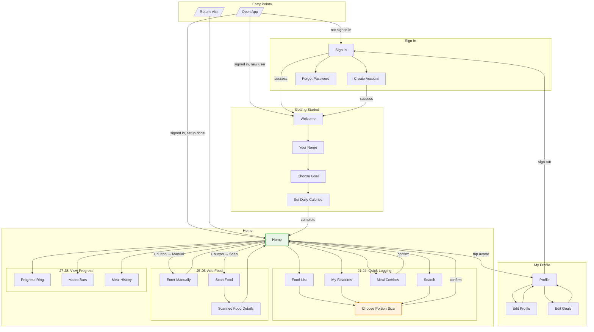

---

## Individual Job Flows

### J1: Quick Food Logging (Primary Flow)

**Job Statement:** When I want to track my meal, I want to quickly log food, So that I maintain accurate calorie records.

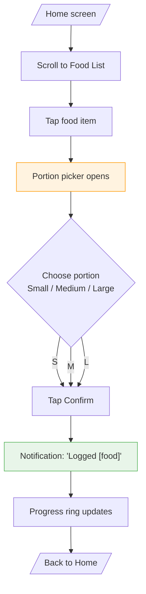

**Steps:** 5 | **Decisions:** 1 (portion size) | **Time:** ~3 seconds

---

### J2: Favorite Quick Logging

**Job Statement:** When I eat a favorite meal, I want to log it with one tap, So that I save time on repetitive logging.

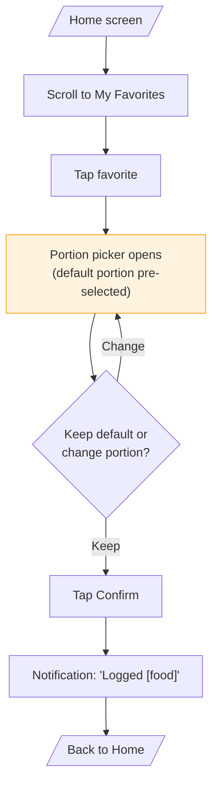

**Steps:** 4 | **Decisions:** 1 | **Time:** ~2 seconds (with default)

---

### J3: Meal Combo Logging

**Job Statement:** When I eat a combo meal, I want to log multiple items at once, So that I don't log items individually.

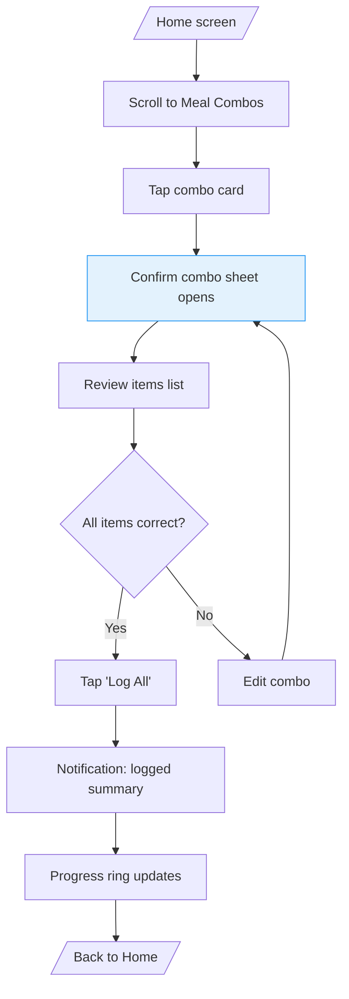

**Steps:** 6 | **Decisions:** 1 | **Time:** ~4 seconds

---

### J4: Search and Log Food

**Job Statement:** When I can't find a food, I want to search for it, So that I can log less common foods.

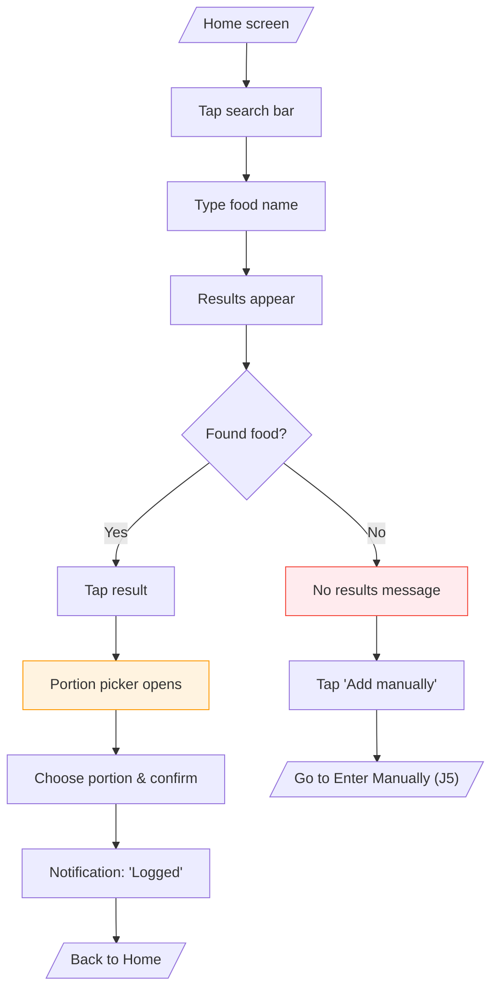

**Steps:** 7 (found) / 5 (not found) | **Decisions:** 1 | **Time:** ~5-8 seconds

---

### J5: Manual Food Entry

**Job Statement:** When I eat something not in the database, I want to add it manually, So that I can still track my nutrition.

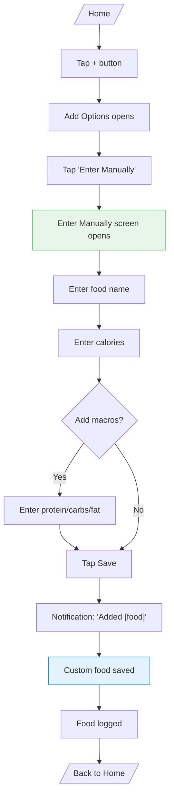

**Steps:** 8-10 | **Decisions:** 1 | **Time:** ~15-30 seconds

---

### J6: Scan Food (Barcode/Label)

**Job Statement:** When I have packaged food, I want to scan the barcode/label, So that I get accurate nutrition data.

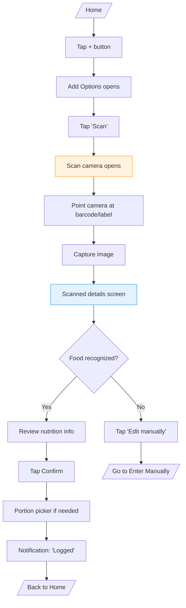

**Steps:** 9-10 | **Decisions:** 1 | **Time:** ~10-20 seconds

---

### J7: View Daily Progress

**Job Statement:** When I want to see my progress, I want to view today's summary, So that I know how much I've eaten.

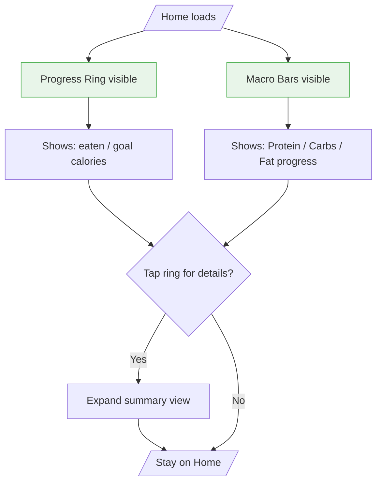

**Steps:** 1 (passive view) | **Decisions:** 0 | **Time:** Instant

---

### J8: Review Meal History

**Job Statement:** When I want to review what I ate, I want to see my timeline, So that I can track my eating patterns.

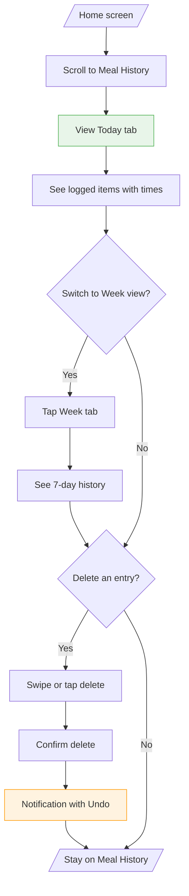

**Steps:** 2-5 | **Decisions:** 2 | **Time:** Variable

---

### J10: New User Setup

**Job Statement:** When I'm new to the app, I want to set up my profile, So that I get personalized calorie goals.

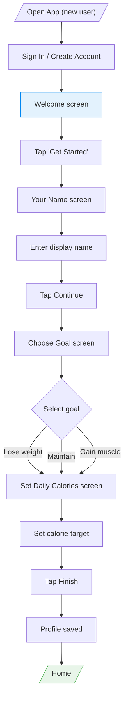

**Steps:** 8 | **Decisions:** 1 (goal selection) | **Time:** ~30-60 seconds

---

### J11: Edit Nutrition Goals

**Job Statement:** When my goals change, I want to update them, So that my targets reflect my current needs.

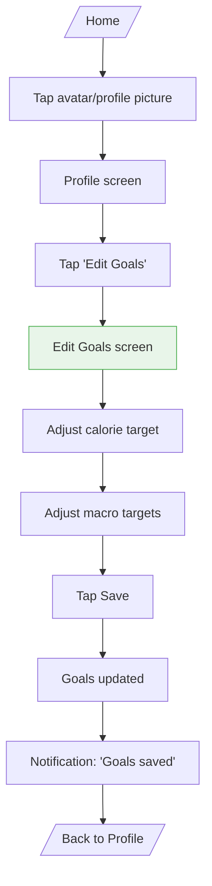

**Steps:** 7 | **Decisions:** 0 | **Time:** ~20-30 seconds

---

## Job Summary

| Job | Entry Point | Steps | Decisions | Exit Point | Frequency |
|-----|-------------|-------|-----------|------------|-----------|
| J1: Quick Log | Home (Food List) | 5 | 1 | Home | Very High |
| J2: Favorite Log | Home (My Favorites) | 4 | 1 | Home | High |
| J3: Combo Log | Home (Meal Combos) | 6 | 1 | Home | Medium |
| J4: Search Log | Home (Search) | 7 | 1 | Home | Medium |
| J5: Manual Entry | Home → + button | 8-10 | 1 | Home | Low |
| J6: Scan Food | Home → + button | 9-10 | 1 | Home | Low |
| J7: View Progress | Home | 1 | 0 | Home | Very High |
| J8: Review History | Home (Meal History) | 2-5 | 2 | Home | Medium |
| J9: Undo Log | Home (notification) | 2 | 1 | Home | Low |
| J10: New User Setup | Sign In → Getting Started | 8 | 1 | Home | Once |
| J11: Edit Goals | Profile | 7 | 0 | Profile | Rare |

---

## Flow Optimization Notes

### High-Frequency Paths (Optimized)
- **J1/J2**: 2-3 taps to log food from Home
- **J7**: Zero taps - progress visible immediately

### Pain Points Identified
- **J5 (Manual Entry)**: Most steps, highest friction - consider inline quick-add
- **J6 (Scan)**: Depends on camera/recognition accuracy

### Cross-Flow Connections
- J4 (Search) → J5 (Manual Entry) when food not found
- J6 (Scan) → J5 (Manual Entry) when recognition fails
- J1/J2/J3/J4 all converge at Choose Portion Size popup
